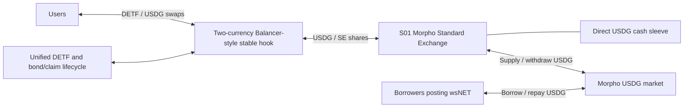

# PRD: NET leverage-demand USDG stable DETF

- Created: 2026-09-06
- Last updated: 2026-09-06
- Status: Initial composition draft. Product intent and topology are specified; economic calibration, component extensions, and deployment validation remain open.
- Product basis: unified `UniswapV4Detf`, with a Balancer-style stable SE-buffer hook and the S01 Morpho lending SE.
- Peg denomination: **1 whole USDG per whole DETF**.
- Strategy specification: [S01 — USDG lending with a liquidity sleeve](../../../../../../../../docs/detf/NET_MORPHO_USDG_LENDING_STRATEGY_PRD.md).
- Research context: [NET/Morpho/Pendle strategy catalog](../../../../../../../../docs/detf/NET_MORPHO_PENDLE_STRATEGY_RESEARCH.md).

Shared lifecycle correction: the owner-approved [funded staking and SY requirements](../../../../../DETF_ALIGNMENT_PRD.md) (D32–D66 / §24) and [implementation plan](../../../../../DETF_FUNDED_STAKING_AND_SY_IMPLEMENTATION_AND_TEST_PLAN.md) govern this composition's DETF behavior. They replace historical LP-backed bond close and claim accounting. This correction preserves the independent composition draft and its open calibration work; it adds no NET-specific completion requirement to the funded-staking release.

## 1. Problem and intended behavior

Create a single-strategy DETF whose external reserve earns USDG lending interest from the NET Loopback Morpho market. Users trade the DETF against USDG through a Balancer-style stable Uniswap V4 hook. The hook targets a price of 1 USDG per DETF; its USDG allocation is held through the S01 Standard Exchange, including that SE's required directly held USDG liquidity sleeve.

The investment thesis is demand for borrowing USDG against wsNET, including leveraged NET staking. The DETF supplies the lending capital and participates in variable borrower interest. Higher leverage demand may improve lending revenue while also increasing utilization, withdrawal pressure, and credit exposure. The DETF itself is supply-only: it does not borrow USDG, post wsNET collateral, or execute the research catalog's self-lending cover strategy.

“Debt-backed stablecoin-style DETF” describes a target-priced token supported by USDG cash and claims on collateralized USDG loans. It does not establish a separate issuer promise to redeem every DETF for exactly 1 USDG. The requested design uses IndexedEx's existing reserve, Policy, bond, and claim lifecycle. Its ability to trade near the target must be demonstrated under specified conditions.

Morpho lending interest compounds in the strategy's asset value. The DETF's unit target remains 1 USDG; growth in strategy assets is not implemented by continually raising that target. Bond rewards and funded expansion follow the current DETF product law.

## 2. Scope and selected composition

### 2.1 Topology



| Role | Selection |
|---|---|
| Reserve host | Uniswap V4 hook using Balancer V3 StableMath |
| Hook currencies | Exactly DETF and USDG; one trading pair |
| External strategy | S01 only |
| External currency binding | USDG maps to the S01 `MorphoBlueStandardExchange` |
| DETF self leg | DETF itself, as required for a true DETF |
| SE receipt | Held/used through the hook and supported DETF routes; not a third pool currency |
| Valuation and peg unit | USDG |
| DETF lifecycle | Unified `UniswapV4Detf`, funded bond NFT escrow, nine-decimal DETF/sDETF, and raw-DETF/staking SY wrappers |
| Price gates | Mandatory primary mint/burn gates with reserve-swap fallback |

This is a deployment-specific composition of the unified DETF, not a new DETF family. The intended hook is the existing package at `contracts/hooks/uniswap/v4/standardExchange/stable/quad/balancer/`, as clarified by the user. That package is intended to support 2–5 currencies; its current fixed-four behavior is a bug. Apply the [general 2–5 token correction PRD](../../../../../../../hooks/uniswap/v4/standardExchange/stable/quad/balancer/UNISWAP_V4_SE_BALANCER_STABLE_BUFFER_HOOK_TOKEN_COUNT_FIX_PRD.md), then configure this DETF with two currencies. This composition does not require a separate hook family or restrict the repaired package to two tokens.

An actual Balancer Vault deployment is outside this composition. “Balancer-style” identifies the pricing math hosted by the Uniswap V4 hook.

### 2.2 First version boundaries

Include S01 deposits, lending accrual, the cash sleeve, stable swaps, bootstrap, primary mint/burn and swap fallback, bonding, linear principal claims, staking rewards, stake/unstake, standard exchange/SY redemption, donations, and funded expansion through the canonical lifecycle.

Additional NET holding, wsNET borrowing, Pendle PT/YT/LP positions, reward-token sale routes, cross-chain activity, and multi-strategy allocation belong in later composition PRDs. There is no new fixed-price redemption facility, external peg oracle, discretionary market maker, withdrawal queue, or administrator-funded rescue mechanism in this first scope.

## 3. Canonical requirements and current implementation gaps

Apply the [IndexedEx agent/product law](../../../../../../../../docs/agent/INDEXEDEX_AGENT_LAW.md), the [unified DETF I/O and reserve contract, especially §15.12 and §16](../../../../../DETF_INSTANCE_IO_ROUTING_PRD.md), and the [protocol-compound and supply-expansion law](../../../../../../../../docs/detf/DETF_Protocol_Compound_And_Supply_Expansion_PRD.md). This PRD selects a composition and adds its acceptance requirements; it does not silently replace common lifecycle semantics.

Source observations below were made on 2026-09-06 against the current workspace. They are not executed integration evidence.

| Dependency | Existing basis | Required work |
|---|---|---|
| S01 Morpho SE | Existing supply-only component and full accrued-value previews | Implement the required cash sleeve. Carry S01's requirements into the [canonical component PRD](../../../../../../standard/exchange/protocols/morpho/blue/MorphoBlueStandardExchange_PRD.md) and its implementation/test plan first. |
| Balancer stable buffered hook | Current implementation requires four currencies and six pair doors; the [corrected product specification](../../../../../../../hooks/uniswap/v4/standardExchange/stable/quad/balancer/UNISWAP_V4_SE_BALANCER_QUAD_STABLE_BUFFER_HOOK_PRD.md) requires the intended 2–5 range | Complete the general token-count bug fix, then use its two-currency configuration here. Do not pad with duplicate tokens, zero-balance legs, or additional assets to satisfy the defective implementation. |
| Unified hook ABI | The [DETF-facing hook interface](../../../../../../../hooks/uniswap/v4/interfaces/IUniswapV4SeBufferHook.sol) and [reserve quote interface](../../../../../../../hooks/uniswap/v4/interfaces/IDetfReserveQuote.sol) already define the integration contract | Bring the Balancer host into conformance, including discovery, owner swaps, reserve quotes, and all operations exercised by the DETF lifecycle. Current quad source does not establish that conformance. |
| Liquidity operations | Current Balancer quad [liquidity target](../../../../../../../hooks/uniswap/v4/standardExchange/stable/quad/balancer/UniswapV4StandardExchangeBalancerQuadStableBufferHookLiquidityTarget.sol) includes operations that revert `InvalidRoute`, including unbalanced joins | Implement and validate the required join/exit surface. An interface name or an always-reverting selector is insufficient; later bonds require an executable unbalanced join. |
| Unified DETF | [Existing deployment arguments and interface](interfaces/IUniswapV4Detf.sol), generic reserve discovery, and Morpho composition test scaffolding | Validate this Balancer host and exact S01 binding across the complete lifecycle. Existing CP/quad tests do not certify this composition. |

The currency-count finding was rechecked against the exact package after the user's clarification. Its [deployment arguments](../../../../../../../hooks/uniswap/v4/standardExchange/stable/quad/balancer/interfaces/IUniswapV4StandardExchangeBalancerQuadStableBufferHookPackage.sol) declare `address[4] tokens`. Its [argument validation](../../../../../../../hooks/uniswap/v4/standardExchange/stable/quad/balancer/UniswapV4StandardExchangeBalancerQuadStableBufferHookDFPkg.sol) iterates all four slots, rejects zero addresses, and requires distinct ascending tokens. The first liquidity deposit rejects a zero amount in any of the four legs, and [the invariant implementation](../../../../../../../hooks/uniswap/v4/standardExchange/stable/quad/balancer/UniswapV4StandardExchangeBalancerQuadStableBufferHookMath.sol) rejects any zero reserve. These are executable restrictions, independent of the directory name. The package requires at least one SE, not four SEs; currency count and SE count are separate constraints.

The user subsequently confirmed that the intended range is 2–5 tokens. The findings above describe the implementation defect; they no longer define the accepted product requirement. The hook's correction PRD and amended parent/staged specifications govern its remediation.

Consequently, this first DETF is economically simple but is not currently just a deployment configuration. The sleeve and correction of the specified Balancer package are prerequisites.

## 4. Market and deployment binding

Use the S01 market binding as the single source of truth. The intended deployment is Robinhood Chain mainnet, chain ID `4663`:

| Field | Intended value |
|---|---|
| USDG | `0x5fc5360D0400a0Fd4f2af552ADD042D716F1d168` |
| Morpho Blue | `0x9D53d5E3bd5E8d4Cbfa6DB1ca238AEA02E651010` |
| Market ID | `0xaa586d26a6fe62d9c0f0948fede6e2130500ac7a655587447e2d4a37e6330589` |
| Borrower collateral | wsNET: `0x63C12667638f2Ae6fC6ae09B43D98Ec84a8586eA` |
| SE rate asset and `asset()` | USDG |
| Expected decimal configuration | USDG: 6; DETF: 18; confirm deployed SE share decimals explicitly |

Read and record the complete market parameters, market ID derivation, deployed dependencies, token behavior, and block/hash before treating the integration as validated. The market is a raw Morpho Blue market; the SE supplies its own position rather than assuming the application link is an ERC-4626 vault.

The DETF consumes USDG and the SE through supported interfaces. It does not interpret NET's backing NAV as the value of its USDG lending claim. Borrower collateral prices and liquidation mechanics affect recovery risk; wsNET and NET are not configured reserve currencies in this product.

## 5. Peg, pricing, and valuation

### 5.1 Fixed target and opening configuration

| Parameter | Requirement |
|---|---|
| Target | 1 whole DETF targets 1 whole USDG |
| `creationPairPerDetfWad` | `[1e18]`, for the sole external currency USDG |
| `openingPairPerDetfWad` | Explicitly `[1e18]` |
| Threshold mode | `Policy`; fixed at deployment under common law |
| Additional rate provider | None required for external USD valuation; SE valuation comes from the SE's USDG-denominated claim |

The two WAD arrays describe whole-token ratios. They must not contain `1e6` merely because USDG has six decimals. Scaling must make `1e18` raw DETF and `1e6` raw USDG comparable at the intended opening ratio.

Opening configuration governs bootstrap. Once live, quotes use current reserves, rates, fees, and StableMath; a missing or zero live quote must fail under canonical rules rather than fall back to the opening price.

USDG is the numeraire. A DETF remaining at 1 USDG can still lose dollar value if USDG loses its dollar peg. There is no independent USD price feed or dollar-denominated redemption promise in this design.

### 5.2 Quantities that must remain distinct

| Quantity | Meaning and required treatment |
|---|---|
| SE value per share | Full USDG claim on directly held cash plus accrued Morpho supply assets, after applicable accounting and losses |
| Stable-swap quote | Executable trade quote for a specified amount and direction; affected by imbalance, amplification, fees, and available settlement liquidity |
| Synthetic price | Canonical DETF reserve-backed ratio used by Policy, with the creation ratio and fully diluted context, including pending expansion |
| External asset backing | Look-through USDG cash and loan claims attributable to the relevant reserve ownership; excludes treating DETF's own token as an independent external asset |
| Immediate USDG exit capacity | Cash reachable through the actual complete route now, after ownership limits, fees, rounding, and policy conditions |

For strategy accounting:

```text
S01 asset value = direct USDG cash + expected accrued USDG supply assets

S01 available assets <= direct USDG cash
                     + min(owned supply assets, available market liquidity)
```

These expressions describe the SE, not an additional DETF valuation engine. The DETF must use canonical hook reserve quotes and SE interfaces. A reporting calculation must respect LP ownership and bond/claim attribution; it must not add the entire SE, its underlying loans, and its receipt value together, or count the same LP principal for multiple holders.

SE shares must be valued at their current USDG conversion rate. A share need not equal 1 USDG as interest accrues. Moving assets between cash and loans, or changing the number of receipt units held for the same economic claim, must not create a pricing gain. Conversely, actual interest or recognized lending losses must reach reserve valuation exactly once.

### 5.3 Stable curve and Policy behavior

Use Balancer V3 StableMath, with its amplification precision and rounding, for two normalized reserve currencies. The existing local Balancer math uses `AMP_PRECISION = 1e3`. Pin the implementation reference and test the two-token integration; copying a four-token reserve book and deleting two entries is not sufficient. The upstream [StableMath](https://github.com/balancer/balancer-v3-monorepo/blob/main/pkg/solidity-utils/contracts/math/StableMath.sol) and [StablePool](https://github.com/balancer/balancer-v3-monorepo/blob/main/pkg/pool-stable/contracts/StablePool.sol) are primary references for invariant and amplification behavior.

Amplification makes the curve suitable for trading assets around an intended ratio. It does not create cash, erase bad debt, or force every trade to execute at 1. Fees and imbalance move actual quotes away from the target.

Policy must retain the canonical strict gates: primary mint is permitted above the mint synthetic threshold, and primary burn below the burn synthetic threshold. Equality is not permitted by the corresponding gate. First bond remains the canonical ungated bootstrap. The common `1.05e18` mint / `0.95e18` burn defaults are a calibration baseline only; they are synthetic thresholds, not a promise of a five-percent AMM price band.

Use the canonical expansion-aware synthetic context consistently in previews, gates, and execution. Natural expansion occurs under the existing Policy eligibility and epoch/catch-up rules; no new continuous price controller is specified here.

The economics study must establish how secondary trading, primary gates, bonding, supply expansion, and protocol compounding interact. It must explicitly examine a market discount when synthetic backing remains inside or above the burn gate: a holder cannot assume a primary burn is available merely because the market price is below 1.

## 6. Capital, earnings, and user lifecycle

### 6.1 Separate token flows

| Category | Tokens / accounting | Required behavior |
|---|---|---|
| Increase the earning position | USDG; supported routes may accept the bound S01 SE shares | USDG is allocated between sleeve cash and Morpho supply. Pre-existing SE shares contribute their actual USDG claim. |
| S01 yield production | No separately claimable yield token; interest is embedded in USDG supply value | Retain interest in the position, subject to the sleeve policy. Do not schedule a fictitious coupon harvest. |
| DETF reward production | DETF credited by existing seigniorage and eligible expansion rules | Account separately from borrower interest. Minting reward tokens alone is not new external investment income. |
| Reduce the earning position | Consume SE shares to obtain USDG | Cash first, then permitted Morpho withdrawal; loan withdrawal realizes both principal and embedded earnings. |
| Exit DETF exposure | Trade DETF for USDG, or use an allowed primary burn route | Respect actual quotes, policy, slippage, and liquidity. Supported SE-share output is a claim on the position, not immediately received USDG. |

A secondary swap can transfer existing DETF inventory without increasing total strategy capital. Reports must distinguish deposits, issuance, swaps, borrower interest, fees, and losses.

### 6.2 Bootstrap and subsequent participation

1. Deploy and wire the SE, hook, unified DETF, bond NFT, and claim dependencies through canonical registry/package flows. Establish the DETF self leg and USDG-to-SE binding; do not expose a live partially configured reserve.
2. First bond uses the canonical full-book bootstrap, accounting for both DETF and USDG legs and the selected opening ratio. Required external capital is USDG or supported bound SE shares; the DETF self leg is handled by the existing first-bond issuance/join flow. Satisfy minimum liquidity and decimal checks. Pre-live primary mint/burn remains unavailable.
3. Once live, primary mint uses the canonical single-asset capital join and seigniorage accounting. It must not join newly minted DETF into the reserve as an extra live-mint capital leg. User output follows the reserve quote and applicable fees, not a hard-coded 1:1 conversion.
4. Primary burn uses the canonical owned-LP allocation, proportional exit, DETF-leg rejoin, and output conversion. It must not substitute a single-asset DETF exit or a fixed USDG payout. Pending expansion and all effects required by common law must be reflected consistently.
5. Later funded bonds separately issue the proportional liquidity DETF leg and the duration-bonus purchased allocation. The purchased principal is immediately minted and staked in bond escrow, then vests linearly. Own-reserve LP payments follow the canonical non-DETF valuation and `G = 0` rules.
6. Bond principal and funded staking rewards are claimed as sDETF; rewards remain claimable during vesting. Seigniorage distributes immediately, and automatic expansion settles at fixed eight-hour boundaries anchored by the first bond. Rebase eligible stake before issuing the funded fee/creator receipts. Holding free DETF alone does not grant a staking distribution.
7. Staking redemption exchanges sDETF for held DETF 1:1, independently of pool liquidity and price gates. A bond can retire after its principal and attributed rewards are fully claimed. The obsolete mature-close basket, close configuration and LP-principal entitlement are removed. Standard exchange/SY routes handle subsequent DETF redemption or conversion; this creates no par USDG redemption right.

Use default canonical I/O route discovery for USDG and its bound SE receipt, including the shared Standard Exchange exact-input/exact-output and SY surfaces. Any custom route would require its own later specification. Preserve their actual slippage, recipient, funding and liquidity requirements.

USDG payout routes must be validated through the full hook and DETF path. A direct SE withdrawal test does not establish DETF burn/swap-fallback or SY redemption availability during lending illiquidity. Demonstrate any SE-share output route against its actual liquidity requirements before advertising it as an exit option.

## 7. Cash sleeve and liquidity stress

The S01 sleeve is mandatory for this DETF. It is real, unencumbered USDG held directly by the SE. The hook's SE buffer, virtual reserves, and accrued loan value do not themselves satisfy this cash requirement.

| ID | Requirement |
|---|---|
| L01 | Maintain the S01 non-zero cash target under the specified allocation/replenishment policy; show actual cash separately from target cash. |
| L02 | Fill sleeve shortfalls from measured new USDG deposits before supplying the remainder, using consistent post-deposit accounting. Preserve atomic failure if a required supply fails. |
| L03 | Permit a funded withdrawal to consume or exhaust the sleeve. Do not block it because the target would be breached or replenishment cannot succeed. |
| L04 | Withdraw only the unmet payout from Morpho. If the complete payout cannot be funded, revert atomically with no partial share burn, orphaned LP movement, or stranded user capital. |
| L05 | Bound maintenance by owned assets, the target shortfall/excess, and available market liquidity. Keep it on the bound market, with no borrowing or arbitrary recipients. |
| L06 | Preserve full-value ordinary SE previews. Report liquidity limits separately; transition simulations must reflect sleeve allocation and actual executable withdrawals. |
| L07 | Ensure cash-to-loan reallocation alone cannot change economic reserve quotes or synthetic backing beyond documented rounding. The hook must continue to treat the SE opaquely. |
| L08 | Test repeated USDG exits with zero Morpho free cash, exhaustion, new-deposit recovery, restored market liquidity, interest accrual, and realized bad debt. |

The sleeve is sized at the SE level. If other DETFs or direct users hold the same SE, they share access to that cash under its withdrawal rules; this DETF does not own the entire sleeve. Deployment design must choose a dedicated S01 SE instance or explicitly model concurrent withdrawals from a shared instance.

A finite sleeve creates finite exit capacity and reduces the allocation earning Morpho interest. A prolonged run can deplete it. Lending losses can leave cash withdrawals concentrating the remaining loan exposure among later holders. The stable curve must not conceal these conditions by continuing to display a guaranteed cash redemption value.

## 8. Requirements and acceptance evidence

| ID | Requirement | Acceptance evidence |
|---|---|---|
| D01 | One true DETF with DETF/USDG currencies and S01 as the only external strategy | Deployed discovery, bindings, first bond, and live reserve inventory match section 2. |
| D02 | Target and opening are 1 whole USDG per DETF | Six/eighteen-decimal bootstrap and quote tests; WAD configuration checked independently of raw units. |
| D03 | Balancer math and two-currency host are complete | Differential math tests against the pinned Balancer reference and production-host tests for the required ABI, joins/exits, fees, limits, and rounding. |
| D04 | SE growth reaches reserve valuation without moving the configured peg | Time/accrual scenario shows SE value and relevant backing increase; target stays `1e18`; no double credit. |
| D05 | Principal movements are not reported as yield | Deposit, donation, sleeve rebalance, LP transfer, and withdrawal scenarios reconcile external flows and per-share performance. |
| D06 | Policy and lifecycle use consistent current state | Below/equal/above-threshold tests, pending expansion, first-bond exception, mint/burn and bond/claim quote-execution parity. |
| D07 | Rewards preserve their canonical recipients and asset units | Funded sDETF reward claims during vesting, linear principal claims, immediate seigniorage, eight-hour expansion, stake/unstake, SY redemption and standing-recipient tests. |
| D08 | Full-value quotes and cash capacity remain distinct | L01–L08 across direct SE and complete DETF/hook routes, including independently unavailable primary burn and exhausted liquidity. |
| D09 | Losses propagate honestly | Realized Morpho bad debt reduces SE/reserve value as appropriate; no fixed-rate receipt assumption, artificial replenishment, or false par payout. |
| D10 | No circular or duplicate backing claim | Reconcile external assets and owned LP against DETF supply, pending expansion, and bond/claim interests; self-token inventory is separately identified. |
| D11 | Peg performance is measured under explicit conditions | Economic scenarios report spot and size-dependent executable quotes, gate state, cash use, deviation duration, and recovery assumptions. |
| D12 | The exact live market is validated | S01 evidence names the intended market and reproducible block context, without fallback to a neighboring liquid USDG market. |
| D13 | Deployment obeys immutable package boundaries | Registry-created vault/DETF instances, proper hook factory/permission flags, one-time wiring, and rejection of unauthorized configuration or fund movement. |
| D14 | Users can distinguish ownership forms and exits | Observations identify free DETF, linearly vesting principal, funded sDETF, claimable staking rewards, SY positions, USDG quotes, and route-specific availability. |

Required scenario coverage must include balanced and imbalanced reserves, small and large trades, low/high utilization, no interest, positive interest, bad debt, USDG depeg, and zero free Morpho liquidity. Include fee/slippage costs and adversarial timing around interest, donation, policy evaluation, expansion, and cash depletion. A successful profitable round trip created solely by accounting or rounding is a failure.

The implementation must establish the hook's separation of inventory accounting from value/rate scaling for two legs. Verify both real rate changes and equal-value cash/share reshuffling. Existing four-leg tests and superficially balanced examples are insufficient.

## 9. Parameters and research decisions still required

These are calibration and evidence questions within the selected product, not permission to silently choose arbitrary launch settings.

| ID | Decision / question | Required result |
|---|---|---|
| Q01 | What amplification and trading fee support the intended trade sizes? | Compare depth, imbalance, fee revenue, cash depletion, and loss scenarios; select fixed deployment values and supported math bounds. |
| Q02 | What deviations and trade/withdrawal sizes define acceptable peg performance? | Specify normal-condition price tolerance, notional/depth, observation window, and stress scenarios. Report failures rather than promising unconditional stability. |
| Q03 | Which Policy thresholds and expansion epoch/rate/catch-up parameters fit this reserve? | Model the common threshold baseline and alternatives, including spot/synthetic divergence and expansion's effect on backing and rewards; record final values. |
| Q04 | What sleeve target, bands, and maintenance rules meet the liquidity objective? | Resolve S01 V09–V11, including permissionless bounded execution and withdrawal access during losses. |
| Q05 | Is this a dedicated or shared SE deployment? | Specify ownership, exposure to other users' withdrawals, and reachable cash used in the peg/depletion model. |
| Q06 | What initial reserve size, first-bond amount, lock terms, and fee settings are needed? | Reproducible bootstrap configuration, canonical fee-oracle treatment, reward allocation, and initial executable depth. |
| Q07 | Does the complete lifecycle remain usable during SE illiquidity? | Record each route's behavior, including primary gates and swap fallback, cash exhaustion, share outputs, funded bond claims, stake/unstake and standard exchange/SY redemption. |
| Q08 | Is the thesis viable after costs and reserve dilution? | Attribute net borrower-interest earnings, cash drag, SE/DETF/hook fees, realized losses, and reward issuance separately; avoid treating expansion as borrower income. |
| Q09 | Which component specifications need amendment? | Complete the sleeve amendment and the hook's general 2–5 token correction plan; separately resolve unified ABI and current stubbed-operation requirements before declaring this DETF implementation ready. |

Name and symbol remain deployment choices; no ticker is reserved by this draft. Exact addresses for newly deployed components and a launch block do not yet exist in this specification.

## 10. Completion criteria and implementation sequence

1. Resolve the sleeve and Balancer host component specifications and the numeric acceptance envelope in section 9. Preserve links from these decisions to their source evidence.
2. Implement and validate the S01 SE extension and the Balancer hook's general 2–5 token correction through their canonical packages. Configure the corrected hook with two currencies and complete its DETF host integration. Reuse unified DETF machinery; change shared interfaces only if a demonstrated gap requires a separately documented amendment.
3. Validate D01–D14 and L01–L08 through the production deployment path and exact-market evidence, including the complete bond/claim lifecycle and stress scenarios. Record test commands, revisions, block context, and limitations.
4. Produce a concrete deployment configuration with chosen amplification, fees, Policy/expansion settings, sleeve policy, bootstrap size, metadata, and component bindings. Do not describe an unresolved parameter set as launch-ready.

Follow current repository build/test rules when code work begins: production contract edits require `forge build` before `forge test`; default tests are hermetic, and fork testing uses `FOUNDRY_PROFILE=fork`. This PRD is documentation work; no contracts were modified, no tests were run, and no deployment was performed for this draft.

## 11. Evidence and reuse in later DETFs

The [Morpho variable-rate market documentation](https://docs.morpho.org/learn/concepts/blue/) supports the underlying supply/borrow and liquidity model. Target-market facts and oracle/recovery research remain in S01 and the research catalog. Those sources must be refreshed at a recorded block during implementation; this document makes no numerical current-yield claim.

S01 remains reusable in later DETFs as a USDG earning position with explicit value and liquidity semantics. Reusable outputs of this work are the sleeve behavior, stable-host conformance, lifecycle evidence, and separation of loan earnings from token reward issuance. A later multi-strategy composition must define its own allocation, reinvestment routes, risk aggregation, and peg or accumulation objective; it cannot assume this DETF's target transfers to every basket.

## 12. Change log

| Date | Change |
|---|---|
| 2026-09-06 | Initial PRD for the user-requested S01 stablecoin-style DETF. Selected a 1 USDG target, two-currency Balancer-style Uniswap V4 host, Policy mode, and the existing unified DETF lifecycle. Recorded the cash-sleeve requirement, current four-currency/ABI/liquidity-operation gaps, valuation and exit semantics, calibration questions, and acceptance evidence. |
| 2026-09-06 | Rechecked the exact Balancer package at the user's request. Recorded executable four-currency validation, bootstrap, and invariant restrictions, separately from the one-SE minimum. Clarified that the intended integration extends the specified existing package and does not require a separate hook family. |
| 2026-09-06 | User confirmed the intended hook range is 2–5 tokens. Reclassified fixed-four behavior as a bug and linked the general correction PRD. This DETF consumes its n=2 configuration; ABI/lifecycle completeness and the S01 sleeve remain separate dependencies. |
