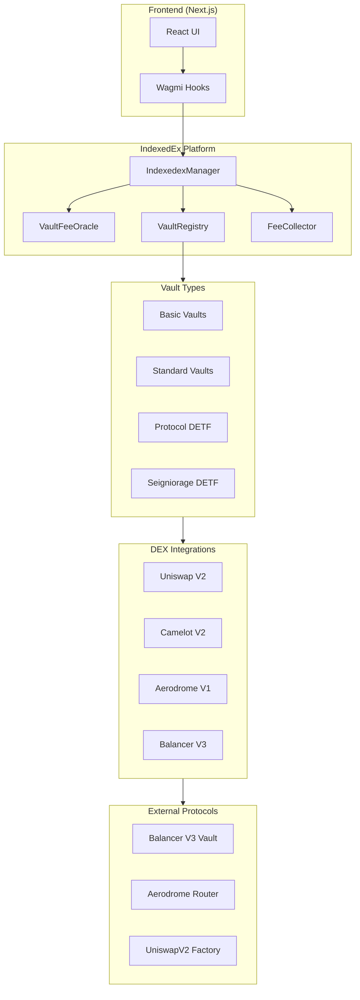
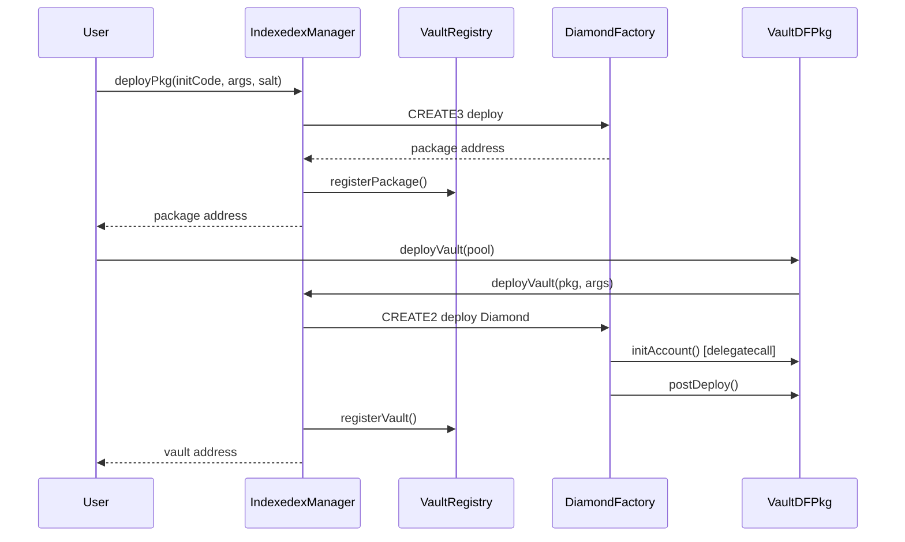
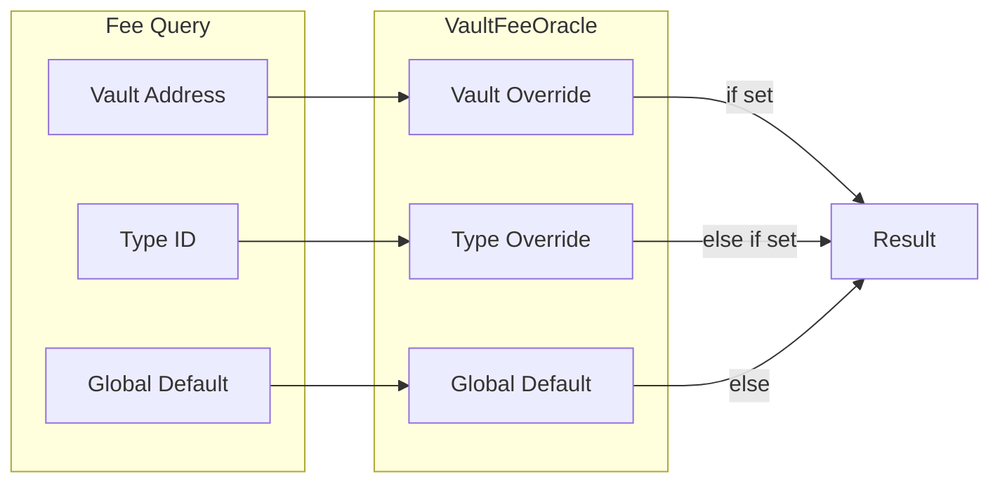
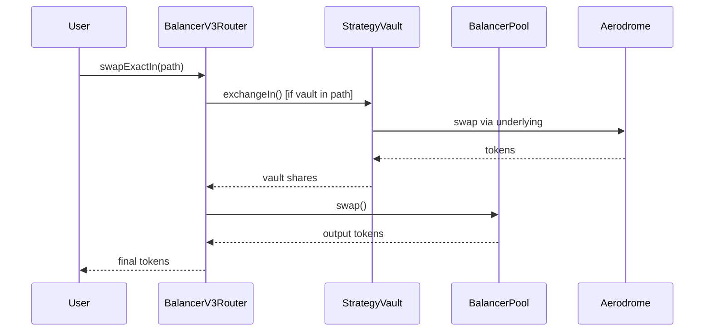

# IndexedEx Codebase Map

> Auto-generated by Cartographer. Last mapped: 2026-01-13

## System Overview

IndexedEx is **modular DeFi vault infrastructure** using the **Diamond Pattern (EIP-2535)** with a **3-tier deployment architecture** (Facets → Packages → Proxies). All deployments use **CREATE3** for deterministic cross-chain addresses.

**Stack**: Solidity 0.8.30, Foundry, Next.js 14, Wagmi/Viem, Balancer V3, Aerodrome, Uniswap V2, Camelot V2



## Directory Structure

```
indexedex/
├── contracts/                    # Smart contracts (Solidity)
│   ├── constants/               # Global configuration constants
│   ├── fee/collector/           # Fee collection system (DFPkg + Facets)
│   ├── interfaces/              # All contract interfaces
│   │   └── proxies/             # Composite proxy interfaces
│   ├── manager/                 # IndexedexManager orchestrator
│   ├── oracles/fee/             # Fee oracle system (Query + Manager)
│   ├── protocols/dexes/         # DEX protocol integrations
│   │   ├── aerodrome/v1/        # Aerodrome (Base DEX)
│   │   ├── balancer/v3/         # Balancer V3 with batch routing
│   │   │   ├── pools/           # Pool implementations
│   │   │   ├── routers/         # Swap routing
│   │   │   │   ├── batch/       # Multi-hop batch swaps
│   │   │   │   └── prepay/      # Prepaid settlement
│   │   │   ├── rateProviders/   # Price oracles
│   │   │   └── vaults/          # Seigniorage vaults
│   │   ├── camelot/v2/          # Camelot V2 (Arbitrum)
│   │   └── uniswap/v2/          # Uniswap V2 compatible
│   ├── registries/vault/        # Vault registry system
│   ├── script/                  # Base deployment scripts
│   ├── test/                    # Test infrastructure
│   └── vaults/                  # Vault implementations
│       ├── basic/               # Simple reserve vaults
│       ├── protocol/            # Protocol DETF (CHIR/RICH/RICHIR)
│       ├── seigniorage/         # Seigniorage DETF (RBT/sRBT)
│       └── standard/            # Fee-aware standard vaults
├── frontend/                    # Next.js React application
│   ├── app/                     # App Router pages
│   │   ├── addresses/           # Deployment addresses (JSON)
│   │   ├── components/          # React components
│   │   └── lib/                 # Utilities and token lists
│   └── public/                  # Static assets
├── scripts/                     # Deployment and utility scripts
│   ├── foundry/                 # Foundry deployment scripts
│   │   ├── local/               # Local Anvil deployments
│   │   │   └── segmented/       # Modular deployment sequence
│   │   └── base_main/           # Base mainnet deployments
│   ├── shell/                   # Bash deployment runners
│   └── wt-*.sh                  # Worktree management
├── test/foundry/                # Foundry test suite
│   ├── spec/                    # Specification tests (mocks)
│   └── fork/                    # Fork tests (Base mainnet)
├── lib/daosys/                  # Crane framework (submodule)
│   └── lib/crane/               # Diamond + Factory infrastructure
├── docs/                        # Documentation
├── tasks/                       # Task management
├── AGENTS.md                    # AI agent instructions
├── PRD.md                       # Product requirements
└── README.md                    # Project overview
```

## Module Guide

### 1. IndexedexManager (`contracts/manager/`)

**Purpose**: Central orchestrator for vault deployment, fee configuration, and registry management.

**Entry point**: `IndexedexManagerDFPkg.sol`

**Key files**:
| File | Purpose | Tokens |
|------|---------|--------|
| `IndexedexManagerDFPkg.sol` | Diamond package bundling 9 facets | 2,737 |
| `IndexedexManagerFactoryService.sol` | CREATE3 deployment helpers | 1,785 |

**Exports**: `IIndexedexManagerProxy` composite interface with:
- `IDiamondCut` - Diamond upgrades
- `IMultiStepOwnable` - Ownership management
- `IVaultFeeOracleQuery/Manager` - Fee configuration
- `IVaultRegistryDeployment` - Package/vault deployment
- `IVaultRegistryVaultQuery/PackageQuery` - Discovery queries

**Dependencies**: Crane Framework, VaultFeeOracleRepo, VaultRegistry facets, FeeCollector

---

### 2. Fee Oracle (`contracts/oracles/fee/`)

**Purpose**: Centralized fee configuration with hierarchical overrides (Global → Type → Vault).

**Key files**:
| File | Purpose | Tokens |
|------|---------|--------|
| `VaultFeeOracleRepo.sol` | Storage for fee configurations | 3,373 |
| `VaultFeeOracleQueryFacet.sol` | Read-only fee queries | 2,172 |
| `VaultFeeOracleManagerFacet.sol` | Admin fee management | 987 |

**Fee Types**: Usage, DEX Swap, Bond Terms, Seigniorage Incentive, Lending

**Query Hierarchy**:
```
Vault Override → Type Override → Global Default
```

---

### 3. Vault Registry (`contracts/registries/vault/`)

**Purpose**: Multi-dimensional vault/package indexing for efficient discovery.

**Key files**:
| File | Purpose | Tokens |
|------|---------|--------|
| `VaultRegistryVaultRepo.sol` | Vault indexing storage | 4,152 |
| `VaultRegistryVaultPackageRepo.sol` | Package indexing storage | 2,420 |
| `VaultRegistryVaultQueryTarget.sol` | Query implementation | 2,373 |
| `VaultRegistryDeploymentFacet.sol` | Deployment interface | 813 |

**Index Dimensions**: Token, Type ID, Contents ID, Package, Fee Type

**Queries**:
- `vaultsOfToken(address)` - Vaults accepting token
- `vaultsOfType(bytes4)` - Vaults implementing interface
- `vaultsOfTokenOfTypeId(bytes4, address)` - Combined filter
- `packagesOfTypeId(bytes4)` - Packages by vault type

---

### 4. DEX Protocol Integrations (`contracts/protocols/dexes/`)

**Purpose**: Standardized exchange interfaces for Uniswap V2, Camelot V2, Aerodrome, and Balancer V3.

**Pattern**: Each DEX follows:
```
*StandardExchangeInFacet.sol   → IStandardExchangeIn
*StandardExchangeOutFacet.sol  → IStandardExchangeOut
*StandardExchangeCommon.sol    → Shared utilities
*StandardExchangeDFPkg.sol     → Vault package
*_Component_FactoryService.sol → CREATE3 deployment
```

#### Uniswap V2 Integration
| File | Purpose | Tokens |
|------|---------|--------|
| `UniswapV2StandardExchangeInTarget.sol` | Swap token → vault shares | 9,130 |
| `UniswapV2StandardExchangeOutTarget.sol` | Swap vault shares → token | 6,949 |
| `UniswapV2StandardExchangeDFPkg.sol` | Vault package | 6,212 |

#### Balancer V3 Integration (Most Complex)
| File | Purpose | Tokens |
|------|---------|--------|
| `BalancerV3StandardExchangeRouterExactInSwapTarget.sol` | Exact-in swaps | 7,019 |
| `BalancerV3StandardExchangeRouterExactOutSwapTarget.sol` | Exact-out swaps | 7,304 |
| `BalancerV3StandardExchangeRouterDFPkg.sol` | Router package | 3,151 |
| `TestBase_BalancerV3StandardExchangeRouter.sol` | Test base | 6,879 |

**Special Features**: Batch routing, prepaid settlement, 80/20 weighted pools

---

### 5. Vault Implementations (`contracts/vaults/`)

#### Basic Vaults (`contracts/vaults/basic/`)
**Purpose**: Simple reserve tracking without complex mechanics.

| File | Purpose | Tokens |
|------|---------|--------|
| `MultiAssetBasicVaultRepo.sol` | Multi-token reserve storage | 862 |
| `BasicVaultCommon.sol` | Transfer/burn utilities | 750 |

#### Protocol DETF (`contracts/vaults/protocol/`)
**Purpose**: CHIR/RICH/WETH three-token system with synthetic price oracle and RICHIR rebasing token.

| File | Purpose | Tokens |
|------|---------|--------|
| `ProtocolDETFDFPkg.sol` | CHIR vault package | 5,136 |
| `ProtocolDETFRepo.sol` | DETF state storage | 3,061 |
| `ProtocolDETFCommon.sol` | Synthetic price, seigniorage logic | 3,792 |
| `ProtocolNFTVaultRepo.sol` | Bond position storage | 4,500 |
| `RICHIRRepo.sol` | Rebasing token storage | 1,989 |
| `TestBase_ProtocolDETF.sol` | Test infrastructure | 4,429 |

**Architecture**:
```
CHIR (Protocol DETF)
├── Reserve Pool (80/20 Balancer V3)
│   ├── 80% CHIR/WETH Standard Exchange Vault
│   └── 20% RICH/CHIR Standard Exchange Vault
├── RICH Token (static supply, rewards)
├── Protocol NFT Vault (bond positions)
└── RICHIR (rebasing redemption token)
```

#### Seigniorage DETF (`contracts/vaults/seigniorage/`)
**Purpose**: Generic reserve-backed DETF with seigniorage token (sRBT).

| File | Purpose | Tokens |
|------|---------|--------|
| `SeigniorageDETFDFPkg.sol` | RBT vault package | 6,054 |
| `SeigniorageDETFExchangeInTarget.sol` | Mint RBT logic | 7,029 |
| `SeigniorageDETFCommon.sol` | Price calculation, seigniorage | 5,260 |
| `Seigniorage_Component_FactoryService.sol` | Deployment helpers | 3,030 |

---

### 6. Frontend (`frontend/`)

**Purpose**: Next.js React application for vault interaction.

**Stack**: Next.js 14, TypeScript, Wagmi 3.0, Viem, TailwindCSS

**Key pages**:
| Page | Purpose | Lines |
|------|---------|-------|
| `app/swap/page.tsx` | Single-token swap interface | 1,129 |
| `app/batch-swap/page.tsx` | Multi-path routing | 806 |
| `app/vaults/page.tsx` | Strategy vault inspection | 479 |
| `app/create/page.tsx` | Factory-based vault creation | - |

**Contract integration**: Generated hooks via `wagmi.config.ts` from Foundry ABIs

---

### 7. Test Suite (`test/foundry/`)

**Spec tests** (35 files): Business logic validation with mocks
**Fork tests** (25 files): Integration with Base mainnet at block 40,446,736

**Test base hierarchy**:
```
CraneTest → IndexedexTest → TestBase_VaultComponents
  → TestBase_[Protocol]StandardExchange → Specific Tests
```

**Fork test infrastructure**:
- `TestBase_BaseFork.sol` - Base mainnet fork setup
- `TestBase_AerodromeFork.sol` - Aerodrome integration
- `TestBase_BalancerV3Fork.sol` - Balancer V3 integration
- `TestBase_SeigniorageDETF_Fork.sol` - Full DETF testing

---

## Data Flow

### Vault Deployment Flow



### Fee Configuration Flow



### Exchange Flow



## Conventions

### Naming Conventions

| Pattern | Usage | Example |
|---------|-------|---------|
| `*Repo.sol` | Storage library with Diamond slots | `VaultFeeOracleRepo.sol` |
| `*Target.sol` | Implementation contract with logic | `VaultRegistryDeploymentTarget.sol` |
| `*Facet.sol` | Diamond facet exposing interface | `VaultFeeOracleQueryFacet.sol` |
| `*DFPkg.sol` | Diamond Factory Package | `IndexedexManagerDFPkg.sol` |
| `*FactoryService.sol` | CREATE3 deployment helpers | `IndexedexManagerFactoryService.sol` |
| `*AwareRepo.sol` | Dependency injection storage | `VaultFeeOracleQueryAwareRepo.sol` |
| `*Common.sol` | Shared utilities | `AerodromeStandardExchangeCommon.sol` |
| `*Service.sol` | Stateless business logic library | `AerodromeCompoundService.sol` |
| `TestBase_*.sol` | Test base contract | `TestBase_ProtocolDETF.sol` |
| `I*.sol` | Interface definition | `IStandardExchange.sol` |

### Storage Slot Naming

Hierarchical dot-notation:
- `"indexedex.manager"` - IndexedEx core features
- `"indexedex.oracles.fee"` - Fee oracle system
- `"indexedex.registries.vault"` - Vault registry
- `"indexedex.vaults.protocol.detf"` - Protocol DETF
- `"protocols.dexes.balancer.v3"` - Protocol integrations

### Function Conventions

| Pattern | Usage |
|---------|-------|
| `_layout()` | Storage access (default slot) |
| `_layout(bytes32 slot)` | Storage access (custom slot) |
| `_initialize()` | Storage setup |
| `_onlyXxx()` | Guard functions in Repos |
| `onlyXxx` | Modifiers (thin delegation) |
| `param_` | Function parameters |

## Gotchas

### 1. CREATE3 Deployment Required
**NEVER use `new` to deploy contracts.** All deployments must go through CREATE3 for deterministic cross-chain addresses.

```solidity
// WRONG - breaks cross-chain determinism
MyContract c = new MyContract();

// CORRECT - deterministic deployment
myFacet = factory.deployFacet(
    type(MyFacet).creationCode,
    abi.encode(type(MyFacet).name)._hash()
);
```

### 2. Vault Deployment via IndexedexManager
**Never deploy vaults directly via DiamondFactory.** Always go through `IndexedexManager.deployVault()` to ensure registry tracking.

### 3. No viaIR Compilation
**NEVER enable `via_ir` in foundry.toml.** Use structs to avoid "stack too deep" errors:
```solidity
struct SwapParams { ... }
function swap(SwapParams memory params) external { ... }
```

### 4. Fee Denominations
Fees are in PPM (parts per million):
- 1,000 = 0.1%
- 10,000 = 1%
- 100,000 = 10%
- 1,000,000 = 100%

### 5. RICHIR Incompatibility
RICHIR is intentionally incompatible with AMMs, lending protocols, and yield aggregators. `balanceOf()` changes dynamically based on redemption rate.

### 6. Synthetic Price Thresholds
Protocol DETF uses asymmetric operations:
- Above peg (> 1.005) → Allow minting
- Below peg (< 0.995) → Allow burning/redemption

### 7. Permit2 Approval Flow
Frontend requires two-step approval:
1. Token → Permit2 (`approve()`)
2. Permit2 → Router (`approve()` with expiration)

### 8. Fork Test Block
Fork tests use Base mainnet block **40,446,736**. Configure via `BASE_FORK_BLOCK` env var.

## Navigation Guide

**To add a new DEX integration**:
1. Create directory: `contracts/protocols/dexes/{protocol}/{version}/`
2. Implement: `*StandardExchangeInFacet/Target.sol`, `*StandardExchangeOutFacet/Target.sol`
3. Create: `*StandardExchangeDFPkg.sol`, `*_Component_FactoryService.sol`
4. Add test base: `TestBase_*StandardExchange.sol`
5. Add fork tests: `test/foundry/fork/base_main/{protocol}/`

**To add a new vault type**:
1. Create directory: `contracts/vaults/{type}/`
2. Implement: `*Repo.sol`, `*Common.sol`, `*Facet.sol`, `*Target.sol`, `*DFPkg.sol`
3. Define interface: `contracts/interfaces/I{Type}.sol`
4. Add proxy interface: `contracts/interfaces/proxies/I{Type}Proxy.sol`
5. Register fee type in: `VaultFeeTypes.sol`

**To modify fee configuration**:
1. Read: `contracts/oracles/fee/VaultFeeOracleRepo.sol`
2. Query facet: `contracts/oracles/fee/VaultFeeOracleQueryFacet.sol`
3. Manager facet: `contracts/oracles/fee/VaultFeeOracleManagerFacet.sol`

**To add frontend functionality**:
1. Add page: `frontend/app/{feature}/page.tsx`
2. Update nav: `frontend/app/components/layout/Header.tsx`
3. Add addresses: `frontend/app/addresses/sepolia/*.json`
4. Regenerate hooks: `npm run hooks`

**To deploy locally**:
1. Start Anvil: `scripts/shell/dev_anvil_bg.sh`
2. Run deployment: `scripts/shell/local.sh`
3. Start frontend: `cd frontend && npm run dev`

**To run tests**:
```bash
# All tests
forge test

# Spec tests only
forge test --match-path "test/foundry/spec/**"

# Fork tests only
forge test --match-path "test/foundry/fork/**"

# Specific protocol
forge test --match-path "*balancer*"
```

## Key Interfaces

### IStandardExchange
```solidity
// Exchange with exact input
function exchangeIn(
    IERC20 tokenIn,
    uint256 amountIn,
    IERC20 tokenOut,
    uint256 minAmountOut,
    address recipient,
    bool pretransferred,
    uint256 deadline
) external returns (uint256 amountOut);

// Exchange with exact output
function exchangeOut(
    IERC20 tokenIn,
    uint256 maxAmountIn,
    IERC20 tokenOut,
    uint256 amountOut,
    address recipient,
    bool pretransferred,
    uint256 deadline
) external returns (uint256 amountIn);
```

### IStandardVaultPkg
```solidity
struct VaultPkgDeclaration {
    string name;           // Package name for registry
    bytes32 vaultFeeTypeIds;  // Packed fee type IDs
    bytes4[] vaultTypes;   // Supported interface IDs
}

function vaultDeclaration() external view returns (VaultPkgDeclaration memory);
```

### IVaultRegistryDeployment
```solidity
// Deploy vault package via CREATE3
function deployPkg(
    bytes calldata initCode,
    bytes calldata initArgs,
    bytes32 salt
) external returns (address pkg);

// Deploy vault instance
function deployVault(
    IStandardVaultPkg pkg,
    bytes calldata pkgArgs
) external returns (address vault);
```
