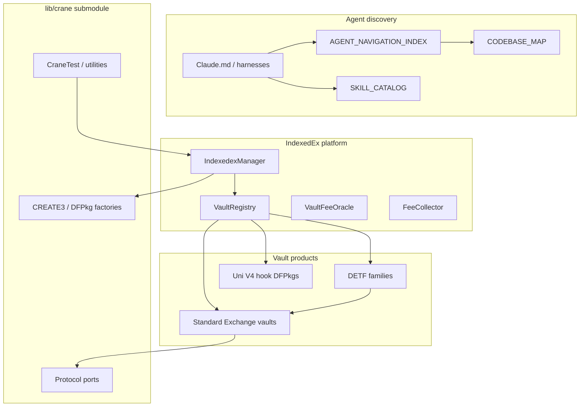

# IndexedEx Codebase Map

> Primary agent/human architecture map. Regenerated 2026-08-09 from live trees + Cartographer (`.cartographer/`: ~5408 files, 7264 nodes, 10320 edges).  
> Task routing: [`docs/agent/AGENT_NAVIGATION_INDEX.md`](agent/AGENT_NAVIGATION_INDEX.md) · Package index: [`docs/agent/INDEXEDEX_CONTENT_INVENTORY.md`](agent/INDEXEDEX_CONTENT_INVENTORY.md) · Skills: [`docs/agent/SKILL_CATALOG.md`](agent/SKILL_CATALOG.md) · Law: [`docs/agent/INDEXEDEX_AGENT_LAW.md`](agent/INDEXEDEX_AGENT_LAW.md)  
> Crane: [`lib/crane/docs/CODEBASE_MAP.md`](../lib/crane/docs/CODEBASE_MAP.md) · [`lib/crane/docs/agent/CRANE_CAPABILITY_INVENTORY.md`](../lib/crane/docs/agent/CRANE_CAPABILITY_INVENTORY.md)

## System overview

IndexedEx is **modular DeFi vault infrastructure** on the **Diamond pattern (EIP-2535)** with a **3-tier deploy model** (Facets → Packages/DFPkgs → Proxies). Deterministic addresses use **CREATE3** (Crane factories). Vault and DETF packages deploy through the **IndexedEx manager vault registry** — never bare `diamondPackageFactory.deploy` for registered packages.

**Stack:** Solidity 0.8.x (see `foundry.toml`), Foundry, Next.js multi-app frontend, Wagmi/Viem, Balancer V3, Uniswap (V2–V4), Aerodrome/Slipstream, Camelot, Aave (via Crane ports + IX adapters).


```mermaid
graph TB
  subgraph Agents["Agent discovery"]
    Harness[Claude.md / harnesses]
    Nav[AGENT_NAVIGATION_INDEX]
    Map[CODEBASE_MAP]
    Skills[SKILL_CATALOG]
  end
  subgraph Platform["IndexedEx platform"]
    Mgr[IndexedexManager]
    Reg[VaultRegistry]
    FeeO[VaultFeeOracle]
    FeeC[FeeCollector]
  end
  subgraph Products["Vault products"]
    SE[Standard Exchange vaults]
    DETF[DETF families]
    Hooks[Uni V4 hook DFPkgs]
  end
  subgraph Crane["lib/crane submodule"]
    C3[CREATE3 / DFPkg factories]
    Ports[Protocol ports]
    CT[CraneTest / utilities]
  end
  Harness --> Nav --> Map
  Harness --> Skills
  Mgr --> Reg
  Reg --> SE
  Reg --> DETF
  Reg --> Hooks
  SE --> Ports
  DETF --> SE
  Mgr --> C3
  CT --> Mgr
```

## Directory tree (agent-relevant)

```
indexedex/
├── Claude.md / CLAUDE.md          # Always-on lean router (byte-identical)
├── docs/
│   ├── CODEBASE_MAP.md            # THIS file — primary map
│   ├── agent/                     # Law, navigation, inventories, skill catalog
│   ├── detf/                      # Shared DETF programs (compound/expansion)
│   └── …                          # Product/process PRDs
├── contracts/
│   ├── manager/                   # IndexedexManager DFPkg + FactoryService
│   ├── registries/vault/          # Package register / deploy / query / disable
│   ├── oracles/fee/               # Vault fee oracle
│   ├── oracles/uniswap/v4/twap/   # Multi-pool V4 poke TWAP DFPkg (instance per PoolManager; not a hook)
│   ├── fee/collector/             # Fee collector package
│   ├── constants/ · interfaces/
│   ├── vaults/
│   │   ├── basic/ · standard/erc4626/ · slipstream/
│   │   └── detf/
│   │       ├── common/            # core, claimToken, bondNft, inventory, factory
│   │       └── protocols/dexes/
│   │           ├── balancer/v3/   # SE single, multi-vault-weighted, mixedBuffer, stable, crossVersion
│   │           └── uniswap/v4/    # SE single/CP/weighted/orbital + common nft/rebasing
│   ├── hooks/uniswap/v4/          # Hook diamond packages + factory
│   ├── protocols/                 # IX product adapters (dexes, lending, staking)
│   ├── routers/                   # e.g. BalancerV3–UniswapV4 coordinator
│   └── test/                      # IndexedexTest + gold TestBases
├── test/foundry/                  # spec / fork / debug
├── scripts/                       # install-cartographer, skill sync, foundry/shell/node
├── frontend/                      # ROADMAP + apps monorepo
├── research/                      # scenario PRDs
├── .cartographer/                 # committed graph (verify --fresh)
└── lib/crane/                     # Crane submodule (canonical framework map inside)
```

## Platform core

| Module | Path | Role |
|--------|------|------|
| Manager | `contracts/manager/` | `IndexedexManagerDFPkg`, `IndexedexManagerFactoryService` — platform diamond package |
| Vault registry | `contracts/registries/vault/` | Deploy facets/targets/repos for package lifecycle and vault queries |
| Fee oracle | `contracts/oracles/fee/` | Fee queries for vaults/DETFs |
| Uni V4 TWAP oracle | `contracts/oracles/uniswap/v4/twap/` | Poke TWAP DFPkg; diamond instance per `PkgArgs.poolManager`. Not a hook or vault. PRD co-located. |
| Fee collector | `contracts/fee/collector/` | Collection package |
| Constants / interfaces | `contracts/constants/`, `contracts/interfaces/` | Shared config + `IDetf*`, proxy interfaces |

**Deploy law:** facets via CREATE3; vault/DETF DFPkgs via `indexedexManager.deploy*DFPkg` + registry; `PkgInit`/`PkgArgs` on interfaces.

## Vaults & Standard Exchange

| Area | Path | Notes |
|------|------|-------|
| Basic vaults | `contracts/vaults/basic/` | Non-DETF vault packages |
| ERC-4626 SE | `contracts/vaults/standard/erc4626/` | `ERC4626StandardExchangeDFPkg` |
| Slipstream | `contracts/vaults/slipstream/` | Slipstream-related vault support |
| Shared components | `contracts/vaults/*VaultComponent*` | Component factory/repo helpers |

Underlying **standardExchangeVault** / **vaultShare** terminology is mandatory in DETF-facing copy (not product brands).

## DETF families

Shared expectations (thresholds, bond maturity → claim, immutable instances, fee oracle): [`docs/agent/INDEXEDEX_AGENT_LAW.md`](agent/INDEXEDEX_AGENT_LAW.md). Shared compound/expansion: `docs/detf/`.

### Common building blocks

`contracts/vaults/detf/common/{core,claimToken,bondNft,inventory,factory}/` — claim token, bond NFT, inventory, factories.

### Balancer V3

| Family | Path |
|--------|------|
| Single SE DETF | `…/balancer/v3/standardExchange/single/` |
| Multi-vault weighted | `…/balancer/v3/multi-vault-weighted/` |
| Mixed buffer multi-vault stable | `…/balancer/v3/mixedBuffer/` |
| Composed stable common | `…/balancer/v3/stable/common/` |
| Dual-liquidity cross-version Uni | `…/balancer/v3/uniswap/v4/crossVersion/v2/` |

### Uniswap V4

| Family | Path | Co-located PRD |
|--------|------|----------------|
| Single SE constant product | `…/uniswap/v4/standardExchange/constantProduct/single/` | `UniswapV4SingleStandardExchangeDETF_PRD.md` |
| SE weighted | `…/uniswap/v4/standardExchange/weighted/` | `UniswapV4StandardExchangeWeightedDETF_PRD.md` |
| SE orbital | `…/uniswap/v4/standardExchange/orbital/` | `UniswapV4StandardExchangeOrbitalDETF_PRD.md` |
| Shared NFT / rebasing claim | `…/uniswap/v4/common/{nft,rebasing}/` | — |

**Removed:** listing-family draft at `…/uniswap/v4/standardExchange/single/` (hooks=`0` listing pool; no liquidity-holding reserve).

## Uniswap V4 hooks

Skill: `indexedex-uniswap-v4-hook-packages`. Pattern: **package → Vault Registry → hook factory** (`contracts/hooks/uniswap/v4/factory/`).

Families under `contracts/hooks/uniswap/v4/`:

- `standardExchange/constantProduct/single`, `standardExchange/single`, `dual`, `weighted`, `orbital`
- `standardExchange/stable/quad/{curve,balancer}`
- `stable/quad/{curve,balancer}`, `weighted`, `orbital`

Each package typically has co-located `*_PRD.md` and `*DFPkg.sol`.

## Protocols & routers (IndexedEx)

- **Balancer V3 pools** (buffer / multi-vault): `contracts/protocols/dexes/balancer/v3/pools/**` + pool PRDs  
- **Uni V3/V4 SE products:** `contracts/protocols/dexes/uniswap/{v3,v4}/`  
- **LST SE vaults:** `contracts/protocols/staking/{lido,etherfi,rocket-pool}/`  
- **Lending adapters / loops:** `contracts/protocols/lending/**` + TestBases under `contracts/test/bases/`  
- **Coordinator router:** `contracts/routers/balancerV3-uniswapV4/`

Crane owns **framework ports** (Morpho, Olympus, Aave vendor trees, etc.) under `lib/crane/contracts/protocols/**` and `lib/crane/contracts/external/**` — see Crane capability inventory.

## Testing

| Layer | Path |
|-------|------|
| CraneTest | `lib/crane/contracts/test/CraneTest.sol` |
| IndexedexTest | `contracts/test/IndexedexTest.sol` |
| Gold TestBases | `contracts/test/bases/`, co-located `TestBase_*` on packages |
| Specs | `test/foundry/spec/` |
| Fork / debug | `test/foundry/fork/`, `test/foundry/debug/` |

**Rules:** production-first; no mocks of SUT (vaults, DETF, manager, registry, fee oracle, facets, DFPkgs). Hermetic = default `forge test`; fork = `FOUNDRY_PROFILE=fork`. Skills: `crane-testing`, `indexedex-testing`, adversarial twins.

## Frontend

| Path | Role |
|------|------|
| `frontend/ROADMAP.md` | Active UI product roadmap (not root `PROGRESS.md`) |
| `frontend/apps/dtf` | The only Next app (`@indexedex/app-dtf`, port 3002) |
| Plans / PRDs | `frontend/*PRD*`, redesign plans |

Skills: `indexedex-ui-refactor`, `indexedex-product-voice`.

## Scripts & agent ops

| Script | Role |
|--------|------|
| `scripts/install-cartographer.sh` | Install `$HOME/bin/cartographer` wrapper (PATH hint only; no shell rc edits) |
| `scripts/sync-crane-skills.sh` | Mirror Crane skills → `.claude/.grok/.opencode` |
| `scripts/sync-bankr-skills.sh` | Bankr → **parent** workspace only |
| `scripts/foundry/`, `shell/`, `node/` | Deploy & tooling |

## Libs

| Path | Role |
|------|------|
| `lib/crane/` | Git submodule — framework SoT |
| Other `lib/*` | Dependencies / tools (not agent skill homes) |

**Bankr / Godot:** not installed into IndexedEx skill trees.

## Cartographer

```bash
export PATH="$HOME/bin:$PATH"   # after ./scripts/install-cartographer.sh
cartographer index --root . --out .cartographer --force
cartographer verify --root . --out .cartographer --fresh
cartographer view --out .cartographer
```

Graphs (including `graph.sqlite`) are **committed** without Git LFS. Re-index after large structural merges; update `last_reviewed` / `git_sha` on this map.

## Where to go next

| Question | Answer |
|----------|--------|
| “Where is package X?” | Content inventory → this map → path |
| “Which skill?” | Skill catalog + navigation index |
| “What is product law?” | Agent law + family `*_PRD.md` |
| “What does Crane provide?” | Crane capability inventory + Crane map |
| “How do I run cartographer?” | Installer + section above |
