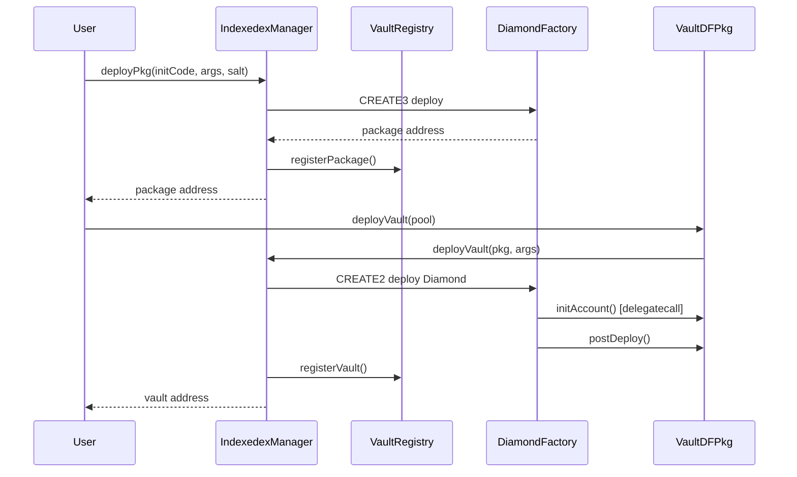
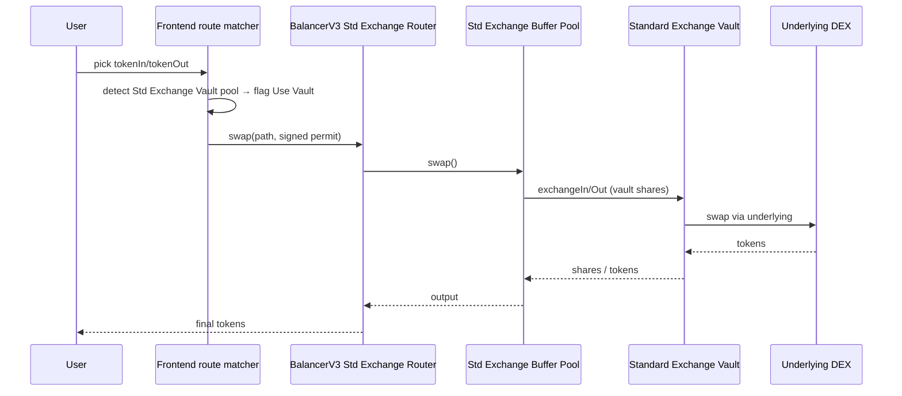
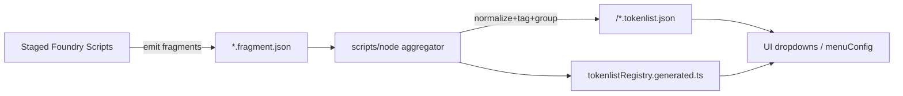

# IndexedEx Codebase Map

> Refreshed 2026-06-21 from the Cartographer code-graph CLI (`.cartographer/graph.sqlite`,
> 2351 files / 3070 nodes / 3554 edges) plus targeted structural reads. The previous map
> (2026-01-13) was ~99 commits stale; this revision captures the Standard Exchange Buffer
> Pool, the Aave V3 Stata lending integration, the DETF restructure, the Token List
> pipeline, and the staged deploy scripts.
>
> Regenerate the graph with `cartographer index` (or `cartographer update`); query it with
> `cartographer brief` / `slice` / `impact` / `context` / `preflight`.

## System Overview

IndexedEx is **modular DeFi vault infrastructure** using the **Diamond Pattern (EIP-2535)** with a **3-tier deployment architecture** (Facets → Packages → Proxies). All deployments use **CREATE3** for deterministic cross-chain addresses.

**Stack**: Solidity 0.8.30, Foundry, Next.js 14, Wagmi/Viem, Balancer V3, Aerodrome (V1 + Slipstream), Uniswap (V2 + V4), Camelot V2, Aave V3 (Stata/ERC-4626).

```mermaid
graph TB
    subgraph Frontend["Frontend (Next.js)"]
        UI[React UI]
        Wagmi[Wagmi Hooks]
        Lists[Token List Registry]
    end

    subgraph Pipeline["Off-chain Pipeline"]
        Scripts[Staged Foundry Scripts]
        TLAgg[Token List Aggregator (scripts/node)]
    end

    subgraph Indexedex["IndexedEx Platform"]
        Manager[IndexedexManager]
        FeeOracle[VaultFeeOracle]
        Registry[VaultRegistry]
        FeeCollector[FeeCollector]
    end

    subgraph Vaults["Vault Types"]
        Basic[Basic / Standard Vaults]
        DETF[DETF — composed / dual]
        Seigniorage[Seigniorage DETF + Bond NFT]
        BufferPool[Std Exchange Buffer Pool]
    end

    subgraph Integrations["Protocol Integrations"]
        UniV2[Uniswap V2]
        UniV4[Uniswap V4]
        Camelot[Camelot V2]
        Aerodrome[Aerodrome V1]
        Slipstream[Aerodrome Slipstream]
        Balancer[Balancer V3]
        Aave[Aave V3 Stata]
    end

    UI --> Wagmi
    UI --> Lists
    Wagmi --> Manager
    Scripts --> TLAgg --> Lists
    Manager --> FeeOracle
    Manager --> Registry
    Manager --> FeeCollector
    Registry --> Vaults
    Vaults --> Integrations
    BufferPool --> Balancer
```

## Directory Structure

```
indexedex/
├── contracts/                          # Smart contracts (Solidity 0.8.30) — 332 .sol files
│   ├── constants/                      # Global configuration constants
│   ├── fee/collector/                  # Fee collection (DFPkg + Facets)
│   ├── interfaces/                     # All contract interfaces (+ proxies/)
│   ├── manager/                        # IndexedexManager orchestrator
│   ├── oracles/fee/                    # Fee oracle (Query + Manager + AwareRepo)
│   ├── registries/vault/               # Vault / package registry
│   ├── protocols/
│   │   ├── dexes/
│   │   │   ├── aerodrome/v1/           # Aerodrome V1 + exchange vaults
│   │   │   ├── aerodrome/slipstream/   # Aerodrome Slipstream (concentrated liquidity)
│   │   │   ├── balancer/v3/
│   │   │   │   ├── pools/constProd/    # Constant-product pool + Standard Vault pkg
│   │   │   │   │   └── standardExchange/   # ★ Standard Exchange Buffer Pool (hook+facets)
│   │   │   │   ├── rateProviders/standardExchange/  # Rate providers (+ wrapped/)
│   │   │   │   ├── routers/{batch,prepay}/          # Swap routing + prepaid settlement
│   │   │   │   ├── vaults/             # Balancer-backed exchange vaults
│   │   │   │   └── utils/
│   │   │   ├── camelot/v2/             # Camelot V2 (Arbitrum)
│   │   │   ├── uniswap/v2/             # Uniswap V2 + exchange vaults
│   │   │   └── uniswap/v4/             # Uniswap V4 (test bases)
│   │   └── lending/aave/v3.6/          # ★ Aave V3 Stata (ERC-4626) Standard Exchange
│   ├── vaults/
│   │   ├── basic/                      # Basic + ERC4626 + multi-asset reserve vaults
│   │   ├── standard/                   # Fee-aware standard vaults (+ exchange/)
│   │   ├── slipstream/                 # Slipstream reserve vault repo
│   │   ├── detf/                       # ★ DETF system (common + host-backed families)
│   │   │   ├── common/                 #   Shared true-DETF infrastructure
│   │   │   │   ├── core/               #     Libs (threshold, compound, expansion, bond math)
│   │   │   │   ├── bondNft/            #     Shared DETF bond NFT package
│   │   │   │   ├── claimToken/         #     Rebasing claim token package
│   │   │   │   ├── inventory/          #     Inventory policy interfaces
│   │   │   │   └── factory/            #     Detf*FactoryService (+ nft/)
│   │   │   └── protocols/dexes/        #   Host-backed DETF family packages
│   │   │       ├── balancer/v3/        #     True DETFs (Single SE, multi-vault, mixedBuffer, stable)
│   │   │       └── uniswap/v4/         #     Placeholder (empty)
│   │   ├── protocol/                   # Protocol NFT vault + RICHIR
│   │   └── seigniorage/                # Seigniorage DETF + Bond NFT (nft/)
│   └── test/                           # In-contract test infra (bases, handlers, helpers)
├── frontend/                           # Next.js React app (38 .tsx)
│   ├── app/
│   │   ├── {swap,batch-swap,vaults,detf,detfs,seigniorage,
│   │   │   staking,mint,portfolio,insights,token-info,create}/   # page.tsx routes
│   │   ├── addresses/<env>/*.tokenlist.json   # Chain-keyed token lists
│   │   ├── components/                 # React components
│   │   └── lib/                        # tokenlistRegistry, menuConfig, swap/ (route matcher)
│   └── public/
├── scripts/
│   ├── foundry/<env>/                  # Staged deploy scripts Script_00..Script_99
│   │   ├── anvil_base_main/            #   Full local Base staged sequence (00–23)
│   │   ├── anvil_sepolia/              #   Sepolia staged sequence
│   │   └── README.md, TOKENLIST_PIPELINE_CONTEXT.md
│   ├── node/src/                       # ★ Token List aggregator (TS): build/normalize/registry
│   └── shell/                          # local_testing.sh, supersim, anvil runners
├── test/foundry/                       # Foundry tests — 181 .sol (120 spec, 31 fork)
│   ├── spec/                           # Mock-based unit + invariant + comparative
│   └── fork/base_main/                 # Base mainnet fork integration
├── deployments/<env>/                  # Per-environment deployment artifacts (JSON)
├── lib/daosys/lib/crane/               # Crane framework (Diamond + Factory) submodule
├── .cartographer/                      # Code-graph artifacts (graph.sqlite, briefs, map)
├── docs/                               # Documentation (this map, components, reviews)
├── prds/ , PRD.md                      # Product requirements
└── AGENTS.md                           # AI agent instructions
```

## Module Guide

### 1. IndexedexManager (`contracts/manager/`)

**Purpose**: Central orchestrator for vault deployment, fee configuration, and registry management.
**Entry point**: `IndexedexManagerDFPkg.sol` (bundles the manager facets); `IndexedexManagerFactoryService.sol` for CREATE3 helpers.
**Exports**: `IIndexedexManagerProxy` composite — `IDiamondCut`, `IMultiStepOwnable`, `IVaultFeeOracleQuery/Manager`, `IVaultRegistryDeployment`, `IVaultRegistryVaultQuery/PackageQuery`.
**Dependencies**: Crane Framework, `VaultFeeOracleRepo`, VaultRegistry facets, FeeCollector.

---

### 2. Fee Oracle (`contracts/oracles/fee/`)

**Purpose**: Centralized fee configuration with hierarchical overrides (Vault → Type → Global).
**Key files**: `VaultFeeOracleRepo.sol` (storage), `VaultFeeOracleQueryFacet.sol` (reads), `VaultFeeOracleManagerFacet.sol` (admin), `VaultFeeOracleQueryAwareRepo.sol` (dependency-injection storage for consumers).
**Fee types** (`contracts/interfaces/VaultFeeTypes.sol`): Usage, DEX Swap, Bond Terms, Seigniorage Incentive, Lending. Denominated in PPM.

---

### 3. Vault Registry (`contracts/registries/vault/`)

**Purpose**: Multi-dimensional vault/package indexing for discovery.
**Index dimensions**: Token, Type ID, Contents ID, Package, Fee Type.
**Queries**: `vaultsOfToken`, `vaultsOfType`, `vaultsOfTokenOfTypeId`, `packagesOfTypeId`.

---

### 4. DEX & Lending Integrations (`contracts/protocols/`)

**Purpose**: Standardized exchange interfaces across DEXes and (new) lending wrappers.

**Standard Exchange pattern** (per integration):
```
*StandardExchangeInFacet/Target.sol   → IStandardExchangeIn  (token → vault shares)
*StandardExchangeOutFacet/Target.sol  → IStandardExchangeOut (vault shares → token)
*StandardExchangeCommon.sol           → shared utilities
*StandardExchangeDFPkg.sol            → vault package
*_Component_FactoryService.sol        → CREATE3 deployment
```

**Integrations now present** (`protocols/dexes/` + `protocols/lending/`):
- **Uniswap V2** (`uniswap/v2/`) — exchange vaults under `vaults/exchange/standard/detf/dual/embedded/`.
- **Uniswap V4** (`uniswap/v4/`) — test bases; Protocol DETF auction now routes through Uniswap V4.
- **Camelot V2** (`camelot/v2/`) — fee-on-transfer / asymmetric-fee DEX.
- **Aerodrome V1** (`aerodrome/v1/`) — exchange + DETF dual/embedded vaults.
- **Aerodrome Slipstream** (`aerodrome/slipstream/`) — concentrated-liquidity integration; reserve repo at `vaults/slipstream/`.
- **Balancer V3** (`balancer/v3/`) — most complex; pools, routers (batch + prepay), rate providers, buffer pool (below).
- **Aave V3 Stata** (`protocols/lending/aave/v3.6/`) — ★ NEW. ERC-4626 static-aToken wrapper exposed as a Standard Exchange: `AaveV3StataStandardExchange{In,Out}{Facet,Target}.sol`, `AaveV3StataStandardExchangeDFPkg.sol`, `AaveV3StataMarkerFacet/Target.sol`, `AaveV3Stata_Component_FactoryService.sol`. Interface: `IAaveV3StataStandardVault.sol`.

---

### 5. Standard Exchange Buffer Pool (`.../balancer/v3/pools/constProd/standardExchange/`) ★ NEW

**Purpose**: A Balancer V3 constant-product pool wrapped as a Standard Exchange buffer — lets a Standard Exchange Vault sit inside a Balancer pool route so swaps auto-route through vault shares while preserving const-product pricing parity with a reference pool.

**Key files**:
| File | Purpose |
|------|---------|
| `StandardExchangeBufferPoolTarget.sol` | Pool math / swap implementation |
| `StandardExchangeBufferPoolRepo.sol` | Buffer pool storage |
| `StandardExchangeBufferPoolFacet.sol` | Pool facet |
| `StandardExchangeBufferPoolLiquidity{Facet,Target}.sol` | Add/remove liquidity |
| `StandardExchangeBufferHookTarget.sol` | Balancer hook (register, pre-seat, post-swap, LP add) |
| `StandardExchangeHookFacet.sol` | Hook facet wiring |
| `StandardExchangeBufferPoolStandardVaultPkg.sol` | Vault package |
| `StandardExchangeBufferPool_FactoryService.sol` | CREATE3 deployment |
| `IStandardExchangeBufferPool.sol` | Interface |

**Supporting**: `pools/constProd/BalancerV3ConstantProductPoolStandardVaultPkg.sol` + facets (`DefaultPoolInfoFacet`, `StandardSwapFeePercentageBoundsFacet`, `StandardUnbalancedLiquidityInvariantRatioBoundsFacet`); rate providers under `rateProviders/standardExchange/` (+ `wrapped/` for wrapped-share rate providers).

**Tests** (`test/foundry/spec/.../constProd/standardExchange/`): hook unit suites (`_Registration`, `_PreSeat`, `_PostSwap`, `_LPAdd`, `_LPProportional`), `StandardExchangeBufferPool.spec.t.sol`, `.invariant.t.sol` + `Handler_*`, `StandardExchangeBufferPoolLiquidityTarget.t.sol`, a **comparative** suite (`comparative/StandardExchangeBufferPool_Comparative.spec.t.sol` with `bases/` + `behaviors/`) verifying swap & spot-price parity vs a reference const-product pool, and a fork suite (`fork/base_main/balancer/v3/Fork_StandardExchangeBufferPool.t.sol`).

---

### 6. Vault Implementations (`contracts/vaults/`)

**Shared**: `ConstProdReserveVaultRepo.sol`, `VaultComponentFactoryService.sol`, `TestBase_VaultComponents.sol`.

#### Basic & Standard (`vaults/basic/`, `vaults/standard/`)
Reserve tracking without complex mechanics. Basic: `BasicVault{Repo,Common,Facet,Target}`, `MultiAssetBasicVault*`, `ERC4626BasedBasicVaultFacet`. Standard (fee-aware): `StandardVault{Repo,Target}`, `ERC4626StandardVaultFacet`, `MultiAssetStandardVaultFacet`, `WeightedPoolReserveVaultRepo`, with `standard/exchange/IStandardExchange{In,Out}.sol`.

#### DETF (`vaults/detf/`) ★ RESTRUCTURED (2026-07-31 directory reorg)
Two-axis layout (see `DETF_DIRECTORY_REORGANIZATION_PRD.md` + `AGENTS.md`):

- **`common/`** — shared true-DETF infrastructure:
  - **`common/core/`** — libs: `DETFBondLifecycleLib`, `DETFBondNFTMathLib`, `DETFMintSplitLib`, `DETFPreviewLib`, `DETFThresholdPolicy`, `DETFUsageFeeLib`, `DETFProtocolCompoundLib`, `DETFNaturalExpansionLib`, `DETFBalancerScaleLib`, `DETFSafeTransferLib`.
  - **`common/bondNft/`**, **`common/claimToken/`**, **`common/inventory/`**, **`common/factory/`** (was `reusable/`; `Detf{Component,Facet,Pkg}FactoryService` + `nft/`).
- **`protocols/dexes/balancer/v3/`** — Balancer V3–backed production families:
  - **`standardExchange/single/`** — Single SE DETF (gold pathfinder) + `TestBase_SingleStandardExchangeDETF`.
  - **`multi-vault-weighted/`** — MultiVault weighted DETF.
  - **`mixedBuffer/`** — Mixed-buffer multi-vault stable DETF.
  - **`stable/common/`** — Composed stable common DETF + family-local bond NFT / `RebasingDETFToken*`.
- **`protocols/dexes/uniswap/v4/`** — empty placeholder for a future host family (not SE legs).
- **Removed:** empty dual DETF shells, `DETFCommon`, co-located family PRD/plan markdown (product law under `docs/detf/` + AGENTS).
- Planning law: `docs/detf/` (compound/expansion PRD/PROGRAM + mirrored family stages).

#### Protocol (`vaults/protocol/`)
`ProtocolNFTVault*` (bond positions: repo, common, facet, target, service, pkg) and `RICHIR*` (rebasing redemption token: repo, facet, target, pkg).

#### Seigniorage (`vaults/seigniorage/`)
`SeigniorageDETF*` (exchange in/out, underwriting facet/target, repo, common, pkg), `SeigniorageNFTVault*`, and `nft/SeigniorageBondNFT*` (dedicated bond NFT). `Seigniorage_Component_FactoryService.sol`.

---

### 7. Token List Pipeline (`scripts/node/src/` + `frontend/app/lib/`) ★ NEW

**Purpose**: Deploy scripts emit per-stage Token List **fragments**; a TS aggregator composes them into chain-keyed lists the UI consumes — replacing the old env-layered hardcoded dropdowns.

**Aggregator** (`scripts/node/src/`): `readFragments` → `normalize` → `deriveTags` → `groupByList` → `buildList`/`writeList` → `generateRegistry` (+ `bumpVersion`, `migrateLegacy`, `schema`, `types`). Run via `npm run build-tokenlists` (`tsx src/main.ts`).
**Output**: `frontend/app/addresses/<env>/*.tokenlist.json` and `frontend/app/lib/tokenlistRegistry.generated.ts`, composed at runtime by `tokenlistCompose.ts` / `tokenlistRegistry.ts`. The UI's pool/token dropdowns and `menuConfig.ts` are fully list-driven and chain-keyed (`chainPlatformOverrides.generated.ts`).

---

### 8. Staged Deployment Scripts (`scripts/foundry/<env>/`) ★ RESTRUCTURED

**Purpose**: Replaced the old `local/segmented` flow with explicitly ordered `Script_00..Script_99` stages per environment (`anvil_base_main`, `anvil_sepolia`, …), each writing a `ManifestEntry` and emitting Token List fragments.

Representative `anvil_base_main` sequence: `01_DeployFactories` → `02_DeploySharedFacets` → `03_DeployCoreProxies` → `04_DeployDEXPackages` → `05_DeployTestTokens` → `06_DeployPools` → `07/08_DeployStrategyVaults` → `09_DeployBalancerConstProdPools` → `10_DepositBaseLiquidity` → `11_DeployStandardExchangeRateProviders` → `12/13_BalancerVaultTokenPools (+seed)` → `14_ERC4626PermitVaults / ExportTokenlists` → `15_SeigniorageDETFs` → `16_ProtocolDETF` → `17..23_WethTtc*` → `99_Sweep`. Drivers: `deploy_all.sh`, `DeploymentBase.sol`. See `scripts/foundry/README.md` and `TOKENLIST_PIPELINE_CONTEXT.md`.

---

### 9. Frontend (`frontend/`)

**Stack**: Next.js 14, TypeScript, Wagmi 3.0, Viem, TailwindCSS. 14 `page.tsx` routes: `swap`, `batch-swap`, `vaults`, `detf`, `detfs`, `seigniorage`, `staking`, `mint`, `portfolio`, `insights`, `token-info`, `create`, `test`, root.

**Swap auto-routing** (`app/lib/swap/` + `swapBuilders.ts`/`swapAbis.ts`): Balancer pools that wrap a Standard Exchange Vault are auto-routed through the vault; the route matcher auto-flags "Use Token In/Out Vault", short-circuits the WETH wrap/unwrap sentinel, ties signed-permit accurate quotes into the Amount-Out preview, and surfaces guard/approval failures explicitly. Unit-tested via `vitest` (`npm test`).
**Contract integration**: generated hooks via `wagmi.config.ts` (`npm run hooks` → `wagmi generate`). Permit2 two-step approval handled in `permit2-signature.ts` / `permit2-nonce.ts`.

---

### 10. Test Suite (`test/foundry/`)

181 `.sol` test files: **120 spec** (mock-based unit/invariant/comparative) under `spec/`, **31 fork** under `fork/base_main/`.

**Base hierarchy**: `CraneTest → IndexedexTest → TestBase_VaultComponents → TestBase_[Protocol]StandardExchange → specific tests`. Invariant suites pair a `*.invariant.t.sol` with a `Handler_*.sol`. Comparative suites add `bases/` + `behaviors/` and assert parity against a reference implementation.
**Fork infra**: `TestBase_BaseFork`, `TestBase_AerodromeFork`, `TestBase_BalancerV3Fork`, `TestBase_SeigniorageDETF_Fork`. Fork tests pin a Base mainnet block (`BASE_FORK_BLOCK`).

---

## Data Flow

### Vault Deployment Flow


```mermaid
sequenceDiagram
    participant User
    participant Manager as IndexedexManager
    participant Registry as VaultRegistry
    participant Factory as DiamondFactory
    participant Package as VaultDFPkg

    User->>Manager: deployPkg(initCode, args, salt)
    Manager->>Factory: CREATE3 deploy
    Factory-->>Manager: package address
    Manager->>Registry: registerPackage()
    Manager-->>User: package address

    User->>Package: deployVault(pool)
    Package->>Manager: deployVault(pkg, args)
    Manager->>Factory: CREATE2 deploy Diamond
    Factory->>Package: initAccount() [delegatecall]
    Factory->>Package: postDeploy()
    Manager->>Registry: registerVault()
    Manager-->>User: vault address
```

### Buffer-Pool Auto-Route Exchange Flow


```mermaid
sequenceDiagram
    participant User
    participant UI as Frontend route matcher
    participant Router as BalancerV3 Std Exchange Router
    participant Pool as Std Exchange Buffer Pool
    participant Vault as Standard Exchange Vault
    participant DEX as Underlying DEX

    User->>UI: pick tokenIn/tokenOut
    UI->>UI: detect Std Exchange Vault pool → flag Use Vault
    UI->>Router: swap(path, signed permit)
    Router->>Pool: swap()
    Pool->>Vault: exchangeIn/Out (vault shares)
    Vault->>DEX: swap via underlying
    DEX-->>Vault: tokens
    Vault-->>Pool: shares / tokens
    Pool-->>Router: output
    Router-->>User: final tokens
```

### Token List Pipeline


```mermaid
graph LR
    S[Staged Foundry Scripts] -->|emit fragments| F[*.fragment.json]
    F --> A[scripts/node aggregator]
    A -->|normalize+tag+group| L[<env>/*.tokenlist.json]
    A --> R[tokenlistRegistry.generated.ts]
    L --> UI[UI dropdowns / menuConfig]
    R --> UI
```

## Conventions

### Naming Conventions

| Pattern | Usage |
|---------|-------|
| `*Repo.sol` | Storage library with Diamond slots |
| `*Target.sol` | Implementation contract with logic |
| `*Facet.sol` | Diamond facet exposing an interface |
| `*DFPkg.sol` | Diamond Factory Package |
| `*_Component_FactoryService.sol` / `*_Facet_FactoryService.sol` / `*_Pkg_FactoryService.sol` | Three-tier CREATE3 deployment helpers |
| `*AwareRepo.sol` | Dependency-injection storage |
| `*Common.sol` | Shared utilities |
| `*Service.sol` / `*Lib.sol` | Stateless business-logic libraries (`core/` DETF libs) |
| `TestBase_*.sol` | Test base contract |
| `Handler_*.sol` | Invariant-test handler |
| `Behavior_*.sol` | Reusable behavior assertions (comparative suites) |
| `I*.sol` | Interface definition |

### Storage Slot Naming
Hierarchical dot-notation, e.g. `"indexedex.manager"`, `"indexedex.oracles.fee"`, `"indexedex.registries.vault"`, `"indexedex.vaults.detf.*"`, `"protocols.dexes.balancer.v3.*"`, `"protocols.lending.aave"`.

### Function Conventions

| Pattern | Usage |
|---------|-------|
| `_layout()` / `_layout(bytes32 slot)` | Storage access (default / custom slot) |
| `_initialize()` | Storage setup |
| `_onlyXxx()` | Guard functions in Repos |
| `onlyXxx` | Modifiers (thin delegation) |
| `param_` | Function parameters |

## Gotchas

### 1. CREATE3 Deployment Required
**Never use `new` to deploy.** All deployments go through CREATE3 (or CREATE2 for Diamonds) for deterministic cross-chain addresses, via the Crane factory / `*FactoryService` helpers.

### 2. Vault Deployment via IndexedexManager
Never deploy vaults directly via DiamondFactory — always `IndexedexManager.deployVault()` so the registry tracks them.

### 3. No viaIR Compilation
Never enable `via_ir` in `foundry.toml`. Use structs (e.g. param structs) to avoid "stack too deep".

### 4. Crane's IERC20 is canonical
Import `IERC20` from `@crane/contracts/interfaces/IERC20.sol`, **not** OpenZeppelin. Interfaces alias it as `OZIERC20` (legacy name, still Crane's type). Solidity treats same-signature interfaces from different paths as distinct types.

### 5. Fee Denominations
Fees are in PPM: 1,000 = 0.1%, 10,000 = 1%, 100,000 = 10%, 1,000,000 = 100%.

### 6. RICHIR / Rebasing DETF Token Incompatibility
RICHIR (and the generalized `RebasingDETFToken`) are intentionally incompatible with AMMs/lending/yield aggregators — `balanceOf()` changes dynamically with redemption rate.

### 7. Synthetic Price Thresholds
DETF threshold policy (`core/DETFThresholdPolicy.sol`) is asymmetric: above peg (>1.005) allow minting, below peg (<0.995) allow burning/redemption.

### 8. Buffer Pool ↔ reference parity
The Standard Exchange Buffer Pool must keep swap and spot-price parity with a matched reference const-product pool (matched init reserves + equalized fees). The comparative suite enforces this — changing pool math or fee handling will break those parity assertions.

### 9. Token Lists are generated, not hand-edited
UI dropdowns derive from `frontend/app/addresses/<env>/*.tokenlist.json` + `tokenlistRegistry.generated.ts`, produced by `scripts/node` from deploy-script fragments. Edit fragments / the aggregator, then regenerate — don't hand-edit the JSON. Lists are chain-keyed; the UI reads the active chain's facade.

### 10. Permit2 Approval Flow
Two-step: Token → Permit2 (`approve()`), then Permit2 → Router (`approve()` with expiration). Signed-permit mode also feeds the accurate swap quote.

### 11. Anvil Sepolia fork drain bots
Public Anvil dev accounts inherit live drain-bot EIP-7702 designators on Sepolia forks, breaking Permit2 signed mode unless `sanitize_dev_accounts` runs at fork startup.

## Navigation Guide

**Add a new DEX/lending integration**:
1. `contracts/protocols/{dexes|lending}/{protocol}/{version}/`
2. Implement `*StandardExchange{In,Out}{Facet,Target}.sol`, `*StandardExchangeCommon.sol`
3. Add `*StandardExchangeDFPkg.sol` + `*_Component_FactoryService.sol`
4. Test base `TestBase_*StandardExchange.sol`; fork tests under `test/foundry/fork/base_main/{protocol}/`

**Add a new DETF variant**:
1. Reuse `vaults/detf/common/core/*` libs and `vaults/detf/common/factory/*` factory services
2. Place family packages under `vaults/detf/protocols/dexes/<host>/…` (today Balancer V3) with `*Repo/Common/Facet/Target/DFPkg` + three-tier `_Component_/_Facet_/_Pkg_` factory services — do **not** subclass another family’s concrete contracts
3. Define inventory policy via `vaults/detf/common/inventory/` interfaces
4. Put planning docs under `docs/detf/` (mirrored for family stages); do not co-locate PRDs under the package
5. Register fee type in `contracts/interfaces/VaultFeeTypes.sol` when needed

**Work on the Buffer Pool**:
1. Pool math/storage: `.../constProd/standardExchange/StandardExchangeBufferPool{Target,Repo}.sol`
2. Hook behavior: `StandardExchangeBufferHookTarget.sol` + `StandardExchangeHookFacet.sol`
3. Validate with `comparative/StandardExchangeBufferPool_Comparative.spec.t.sol` and the invariant/handler suite

**Regenerate token lists for the UI**:
1. Ensure deploy scripts emit fragments (`Script_*_ExportTokenlists` / per-stage fragment writes)
2. `cd scripts/node && npm run build-tokenlists`
3. Confirm `frontend/app/addresses/<env>/*.tokenlist.json` + `tokenlistRegistry.generated.ts` updated

**Deploy locally**:
1. Start Anvil: `scripts/shell/dev_anvil_bg.sh` (or `local_testing.sh` / supersim variant)
2. Run staged scripts: `scripts/foundry/anvil_base_main/deploy_all.sh`
3. `cd frontend && npm run dev` (set `NEXT_PUBLIC_DEFAULT_DEPLOYMENT_ENVIRONMENT=local_testing`)

**Run tests**:
```bash
forge test                                   # all
forge test --match-path "test/foundry/spec/**"   # spec only
FOUNDRY_PROFILE=fork forge test                  # fork tests
forge test --match-path "*BufferPool*"           # buffer pool
cd frontend && npm test                          # UI route-matcher unit tests (vitest)
```

## Using the Cartographer Graph

The `.cartographer/` artifacts are the machine-readable companion to this prose map:
- `cartographer view` — graph totals & node/edge kinds
- `cartographer brief` — bounded agent-facing orientation
- `cartographer slice <selector>` / `impact <path>` / `context <path>` — dependency neighborhoods
- `cartographer preflight` — compact pre-edit context
- `cartographer mcp` — expose the graph to MCP clients

Rebuild after structural changes with `cartographer update`, then refresh this map's changed sections.

## Key Interfaces

### IStandardExchange (`contracts/interfaces/IStandardExchange*.sol`)
```solidity
function exchangeIn(
    IERC20 tokenIn, uint256 amountIn,
    IERC20 tokenOut, uint256 minAmountOut,
    address recipient, bool pretransferred, uint256 deadline
) external returns (uint256 amountOut);

function exchangeOut(
    IERC20 tokenIn, uint256 maxAmountIn,
    IERC20 tokenOut, uint256 amountOut,
    address recipient, bool pretransferred, uint256 deadline
) external returns (uint256 amountIn);
```

### IStandardVaultPkg (`contracts/interfaces/IStandardVaultPkg.sol`)
```solidity
struct VaultPkgDeclaration {
    string name;              // package name for registry
    bytes32 vaultFeeTypeIds;  // packed fee type IDs
    bytes4[] vaultTypes;      // supported interface IDs
}
function vaultDeclaration() external view returns (VaultPkgDeclaration memory);
```

### IVaultRegistryDeployment (`contracts/interfaces/IVaultRegistryDeployment.sol`)
```solidity
function deployPkg(bytes calldata initCode, bytes calldata initArgs, bytes32 salt)
    external returns (address pkg);
function deployVault(IStandardVaultPkg pkg, bytes calldata pkgArgs)
    external returns (address vault);
```
