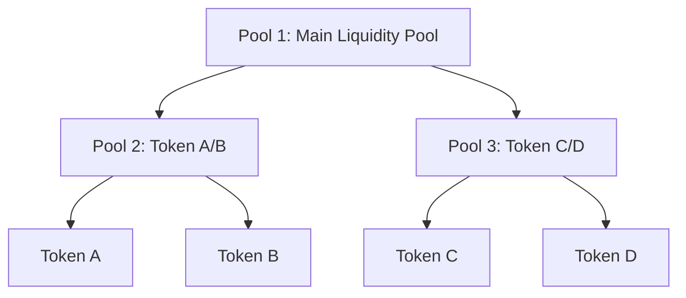

# Nested Liquidity Pools Diagram

This diagram illustrates a structure of nested liquidity pools, where a main pool contains two sub-pools, each associated with specific token pairs.

## Description

Pool 1: The top-level liquidity pool that encompasses the sub-pools.
Pool 2: A sub-pool containing the trading pair Token A and Token B.
Pool 3: A sub-pool containing the trading pair Token C and Token D.
The arrows (-->) indicate the hierarchical relationship, where Pool 1 contains Pool 2 and Pool 3, and each sub-pool contains its respective tokens.

To visualize this diagram, copy the Mermaid code above into a Mermaid-compatible tool, such as the Mermaid Live Editor.
