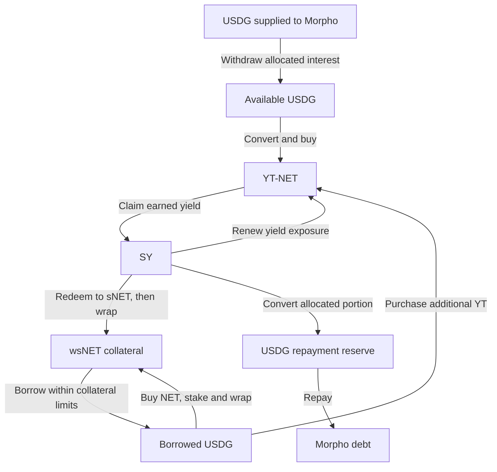

# NET, Morpho, and Pendle: DETF strategy research

- Created: 2026-09-06
- Last updated: 2026-09-08
- Status: Working research and strategy catalog; implementation design remains open.
- Research chain: Robinhood Chain mainnet, chain ID `4663`.

This document preserves the protocol research and strategy discussion for continued iteration. It covers the NET/USDG/wsNET ecosystem and the specific Morpho and Pendle markets linked below. It does not enumerate every product offered by these protocols.

Protocol mechanics are distinguished from proposed compositions and unresolved integration questions. Observations of deployments and application data are dated research findings, not a substitute for reading the deployment state when implementing or executing a strategy. No protocol transactions, integration implementation, or strategy profitability tests were performed as part of this research.

## 1. Working objectives and terminology

The intended abstraction is a compounding strategy: retain an underlying economic position, earn value, and use some or all of that value to increase the selected position. Several strategies may be composed into one or more DETFs.

The discussion established these working requirements:

1. Give each strategy an explicit accumulation target and valuation method.
2. Record tokens that increase the position, tokens produced as yield, and tokens produced by reducing the position in distinct lists.
3. Distinguish separately claimable income from earnings embedded in a position's redemption value.
4. Treat borrowing as financing and proceeds from selling a position as capital realization.
5. Preserve earned YT claims after maturity; schedule claims to support compounding, while separately managing replacement of expired yield exposure.
6. Measure growth per share and after accounting for liabilities. Increasing gross inventory through deposits or borrowing does not by itself demonstrate compounding performance.
7. Prefer strategies that acquire NET or DETF from the market and retain them in productive positions, and that retain newly issued rewards. Measure how much is retained, for how long, and under what conditions tokens can return to market.

Terms used here:

| Term | Meaning |
|---|---|
| NET | NetNet's reserve-backed token; market price can differ materially from protocol backing per token |
| sNET | Rebasing staked NET |
| wsNET | Static wrapper around sNET; collateral in the linked Morpho market |
| SY | Pendle's standardized-yield wrapper for this NET staking integration |
| PT-NET / YT-NET | Shorthand for the principal/yield tokens of the linked Pendle market; actual token identity includes the maturity |
| Accumulation target | The position or exposure the strategy intends to increase |
| Valuation unit | The unit in which assets and liabilities are compared; distinct from the accumulation target |
| Complementary strategies | Strategies whose outputs fund one another or whose timing/exposures fit together; this does not imply independent risks or guaranteed additional return |
| Yield realization | A claim, or an explicitly budgeted withdrawal/sale of embedded earnings; these operations must remain distinguishable in accounting |

The generic compounding model in this document does not redefine IndexedEx's existing DETF protocol-compound or supply-expansion mechanics.

First concrete strategy draft: [S01 — USDG lending to the NET Loopback Morpho market](NET_MORPHO_USDG_LENDING_STRATEGY_PRD.md). S01 is the recommended starting point because it builds on the existing supply-only SE and keeps entry, value, and exit in USDG. The user subsequently required a managed USDG liquidity sleeve, so the strategy now needs that extension to the existing implementation. Its requirement/evidence register records sleeve sizing/replenishment decisions and the remaining deployment-specific work, including the absence of Loopback from the current Robinhood fork suite's candidate list.

First DETF composition draft: [NET leverage-demand USDG stable DETF](../../contracts/vaults/detf/protocols/dexes/uniswap/v4/detf/NET_MORPHO_USDG_BALANCER_STABLE_DETF_PRD.md). It uses S01 as its sole external strategy, the unified DETF lifecycle, and a two-currency Balancer-style stable Uniswap V4 hook targeting 1 USDG per DETF. The draft distinguishes accrued loan backing, actual cash, swap prices, Policy gates, and DETF rewards. Implementation requires the S01 sleeve and a complete two-currency Balancer host; current quad-hook code is not a deployment-ready substitute. Numeric peg/liquidity calibration and exact-market validation remain open. Later compositions may combine S01 with other strategies under separate PRDs.

Hook correction: the user confirmed that the existing Balancer SE-buffered hook is intended to support **2–5 currencies**. Its fixed-four implementation and former specification are defects. The [token-count fix PRD](../../contracts/hooks/uniswap/v4/standardExchange/stable/quad/balancer/UNISWAP_V4_SE_BALANCER_STABLE_BUFFER_HOOK_TOKEN_COUNT_FIX_PRD.md) requires the complete range, Balancer math parity, variable pair initialization, and LP/SE accounting. The first DETF uses the repaired hook with two currencies; later compositions can use the other supported counts.

### 1.1 Token retention as a strategy objective

On 2026-09-07, the user clarified the broader purpose: NET and Policy DETFs both have conditional supply expansion, and strategies should create demand for their tokens while keeping acquired tokens productively committed. Yield, financing, and liquidity should be evaluated partly by how they support that retention. This is a proposed strategy-selection objective; it does not change existing expansion or bond mechanics.

The expansion triggers remain distinct. NET's documented emission mechanism uses market premium over NAV; Policy DETFs use their canonical reserve-backed synthetic threshold. A market purchase must not be assumed to activate either mechanism automatically. See section 3.1 and the [DETF compound/expansion law](DETF_Protocol_Compound_And_Supply_Expansion_PRD.md).

Track three different quantities: existing tokens acquired from the market and retained; new emissions retained instead of sold; and net asset value after debt and costs. Growing a staking index can increase retained NET without representing a new market purchase. Multiple wrappers, PT/YT claims, and collateral records backed by the same NET must not count as multiple removals of NET.

| Strategy role | Contribution to the objective | Release mechanism to model |
|---|---|---|
| S01 USDG lending | Provides financing capacity for borrowers who acquire and collateralize NET; does not directly acquire NET itself | Borrowers' repayment/unwind and lending liquidity; market usage is not restricted to NET purchases |
| Acquire NET, stake, wrap, post wsNET collateral | Purchases NET and restricts withdrawal of the posted exposure while supporting borrowing; borrowed USDG can finance further purchases | Collateral withdrawable within health limits, debt repayment, liquidation, and subsequent sale of released collateral |
| Retain/reinvest staking and YT income | Keeps earned NET exposure committed and can add wsNET collateral | Debt service, expenses, discretionary realization, and YT-series renewal |
| Fresh Pendle PT/YT issuance backed by newly acquired NET exposure | Separates principal and income claims, potentially financing continued retention of the underlying | Recombining PT/YT before expiry, principal redemption after expiry, and the resulting SY/underlying redemption path |
| Purchase an existing PT or YT | Transfers an existing claim; net new underlying commitment depends on the actual execution path | Resale, redemption, or collateral release; a claim purchase alone does not prove new NET was locked |
| Liquidity provision and DETF bonds | Commits capital and can deepen liquidity or reserve ownership | Underlying tokens remain tradable through an AMM even when LP principal is locked; bond maturity and canonical claim/close paths also matter |

The NET loop's acquisition and collateral sequence is supported by the local [Turbo router](../../lib/crane/contracts/protocols/pol/net/src/lending/TurboRouter.sol). Its unwind path also illustrates the reverse flow: repay debt, release collateral, unwrap/unstake, and sell NET to fund repayment. Evaluate both directions rather than treating collateral as a permanent removal.

Pendle's principal/yield split can help finance a retained underlying position, but it is not by itself an unconditional time lock: paired PT/YT can redeem before expiry, and PT alone can redeem after expiry. Tokenized claims also remain transferable. [Pendle yield-tokenization contracts](https://docs.pendle.finance/pendle-v2-dev/Contracts/YieldTokenization)

For each proposed composition, report:

- NET and DETF acquired and retained, separately from retained emissions and net of releases; distinguish direct tokens from underlying-equivalent claims.
- Net accumulation per DETF share and per unit of external capital, alongside liabilities and remaining liquid resources.
- Withdrawal constraints, maturity/rollover dates, and conditions that permit voluntary or forced release.
- Debt-service cash requirements and any NET/DETF sales needed to meet them, including a period of zero expansion rewards.
- Exposure to correlated unwind: liquidation or refinancing pressure can return multiple linked positions to market at once.

Reduced readily available supply is an economic objective, not proof of higher sustainable value or a guaranteed price effect. Design borrowing and renewal policies to support durable positions under adverse conditions. No leverage target, forced user reward reinvestment, new collateral market, or new lock mechanism is selected by this framing.

### 1.2 Retention reliability and recapture as measures of strategic value

The subsequent discussion extended the objective from retaining tokens to **reliably retaining or reacquiring them after release**, including liquidation. The user considers a strategy potentially worthwhile even when it is not the highest-yielding alternative, if it supports durable NET/DETF commitment. Treat that as a strategic objective alongside net equity, liquidity, and costs. It is not evidence that a particular debt ratio or implementation is already viable.

Evaluate each strategy against direct unborrowed staking using the same initial capital. Report retained token exposure over time, net market acquisitions, emissions retained, debt-service costs, expected release conditions, and the amount of independent liquid capital available to reacquire released tokens. A useful additional measure is token-days retained, with wrapper claims counted once. Scenario assumptions must be explicit; no retention probability or recapture guarantee has been measured yet.

Distinguish three recovery outcomes: **debt extinguished**, **capital recovered as spendable cash**, and **NET/DETF reacquired into the intended custody**. A strategy can achieve the first without the second or third. Recapture requires a specified actor, funding source, executable route, custody destination, price/size limits, and behavior when a competing liquidator or buyer acts first.

### 1.3 Current DETF specification versus earlier discussion

Repository inspection during this update found a newer authoritative [funded staking and SY specification](../../contracts/vaults/detf/DETF_ALIGNMENT_PRD.md), D32–D66 and §24, linked by [CLAUDE.md](../../CLAUDE.md). Its accepted requirements supersede conflicting earlier DETF lifecycle assumptions: DETF and sDETF use 9 decimals; sDETF is backed by held DETF with 1:1 stake/unstake and funded rebases; staking uses a non-rebasing SY wrapper for integrations; bonds vest principal linearly and pay sDETF; reserve LP belongs to the DETF collectively; blocked primary price gates route to reserve swaps.

These are current design requirements, not proof that every implementation or deployment is complete. Earlier composition PRD descriptions of 18-decimal DETF, LP-backed claim tokens, bond-owned redeemable LP, and gate failure behavior need reconciliation with this authority before implementation. Ordinary staking by itself does not create a time lock: collateral restrictions, vesting, or another specified mechanism provide any retention constraint. This research update does not modify the separate PRDs or authorize withdrawing collective protocol reserves.

### 1.4 Fee-accrual DETF follow-up

The [fee-accrual DETF Pendle/Morpho research note](FEE_ACCRUAL_DETF_PENDLE_MORPHO_RESEARCH.md) records a separate candidate for later consideration: regular ETH donations from liquidated fees of other DETFs, staking-SY principal/yield separation, PT collateral with retained YT, and ETH financing for DTF acquisition and strategy-owned base liquidity. It uses common components and the existing unified V4 DETF lifecycle. DTF, this fee-accrual DETF, and the NET-specific positions in this catalog remain distinct. Recording the candidate is not acceptance of an implementation design.

## 2. Research entry points and deployment identity

Original links:

- [NetNet manifesto](https://app.netnet.capital/#/manifesto)
- [Pendle NET market](https://app.pendle.finance/trade/markets/0x23c68474e3cd533a2f952a0fb998f1867e57d27f/swap?view=pt&chain=robinhood)
- [Morpho USDG/wsNET market](https://app.morpho.org/robinhood-chain/variable/0xaa586d26a6fe62d9c0f0948fede6e2130500ac7a655587447e2d4a37e6330589/usdg-wsnet#market)

The Morpho link identifies a raw Blue isolated lending market. It is not itself an ERC-4626 vault. An SE can represent a position supplying USDG to that market.

Addresses recorded during the research:

| Component | Address / identifier |
|---|---|
| USDG | `0x5fc5360D0400a0Fd4f2af552ADD042D716F1d168` |
| NET | `0xCA9c78Dd337A67F6e0077F65F5E9218719d30eDf` |
| sNET | `0xb773ec2C326B7f98a5a83fc098825492F020a4c7` |
| wsNET | `0x63C12667638f2Ae6fC6ae09B43D98Ec84a8586eA` |
| NET staking | `0xB078cc304A0B264C5F3680DC0488954ACcd02E87` |
| Canonical NET/USDG V2 pair | `0x59F95461E68e0c77605299791E1449f175165B54` |
| Morpho Blue | `0x9D53d5E3bd5E8d4Cbfa6DB1ca238AEA02E651010` |
| Morpho market ID | `0xaa586d26a6fe62d9c0f0948fede6e2130500ac7a655587447e2d4a37e6330589` |
| Loopback oracle | `0xCDE9599059f8Ae6D6B9F33A0aF7877827ec75F16` |
| Loopback Turbo router | `0x4638617808e3f1Cf237c0d33Ae818126D5C77E17` |
| Pendle market / LP token | `0x23c68474e3cd533a2f952a0fb998f1867e57d27f` |
| Pendle SY | `0x5d446a2be952f4f9ba241b382a73ad3b1819aaf5` |
| Pendle PT | `0x72b8e8c226848ceb35ba51d193f4f962dee957c1` |
| Pendle YT | `0xfb2d72fc9c378a73b4e03abac48194367447fa5a` |
| SY implementation observed | `0xAdAb46E7024d34E18BeBB058D374aa1069DB461E` |

The recorded Pendle expiry is Unix timestamp `1789603200`: **2026-09-17 00:00:00 UTC**, displayed as September 16 in Pacific time. A subsequent market must be discovered and assessed before assuming a rollover is possible.

Net and Morpho addresses have a repository reference in [Robinhood mainnet constants](../../lib/crane/contracts/constants/networks/ROBINHOOD_MAIN.sol). Pendle identity was inspected through the application and its [market data endpoint](https://api-v2.pendle.finance/bff/v3/4663/markets/0x23c68474e3cd533a2f952a0fb998f1867e57d27f). That endpoint is mutable. Live rates, depths, prices, and incentive amounts are deliberately not frozen as strategy assumptions here.

## 3. Protocol mechanics that determine feasible strategies

### 3.1 Net staking, acquisition, and backing

NET stakes into sNET. sNET balances rebase; wsNET balances stay static while their sNET backing increases with the staking index. NET and sNET use 9 decimals; wsNET uses 18. wsNET is a wrapper, not an ERC-4626 vault.

The documented epoch is eight hours. Emissions depend on market premium over NAV, reaching a maximum of 0.45% per epoch at a premium of at least 1.75 times NAV and zero at or below NAV, subject to reserve constraints and oracle availability. Growth is in NET units and does not establish a USDG return. [Net mechanism](https://docs.netnet.capital/mechanism)

Relevant acquisition and exit features:

- The canonical NET AMM route applies a 5% NET transfer tax on applicable buys/sells, separate from AMM fees and slippage. Wrapper conversions should not be modeled as equivalent to a taxed market trade. [Fee schedule](https://docs.netnet.capital/FEES.HTM)
- Standard bond markets accept USDG or eligible NET/USDG LP tokens. Price is bounded below by NAV; LP payment uses protocol RFV accounting rather than the LP's full market valuation. NET is realized through vesting. Compare the effective acquisition price, foregone staking during vesting, and capacity against spot acquisition. [Bond implementation](../../lib/crane/contracts/protocols/pol/net/src/BondDepository.sol)
- Inverse bonds buy NET for USDG at a discount to protocol NAV, with a limited per-epoch capacity. This is not an unlimited instant redemption guarantee. [Inverse-bond implementation](../../lib/crane/contracts/protocols/pol/net/src/InverseBond.sol)
- Treasury backing, liquid reserves, and market capitalization are different quantities. Treasury allocations to Morpho Vault V2 are distinct from USDG lending to the wsNET Loopback market. RWA exposure should be assessed from actual holdings and custody arrangements; the manifesto alone does not establish the asset backing of a strategy. [Treasury](https://docs.netnet.capital/treasury), [RWA desk](https://docs.netnet.capital/rwa-desk)
- pTEAM exercise can dilute backing per circulating token and consequently affect the collateral valuation used by Loopback. [pTEAM implementation](../../lib/crane/contracts/protocols/pol/net/src/PTeam.sol)

Sources for wrapper/index operations: [Staking](../../lib/crane/contracts/protocols/pol/net/src/Staking.sol), [WrappedStakedNET](../../lib/crane/contracts/protocols/pol/net/src/perp/WrappedStakedNET.sol), and [Net staking service](../../lib/crane/contracts/protocols/pol/net/services/NetNetStakingService.sol).

### 3.2 Morpho USDG/wsNET

Lenders supply USDG. Borrowers post wsNET and borrow USDG. Collateral retains staking exposure through the wrapper index but earns no additional lending coupon merely by being posted.

The market LLTV is 62.5%. The Net Turbo router applies a lower terminal target of 53.125%. Collateral credit is based on:

```text
credited value per wsNET = clamp(0.90 × NET TWAP, NAV, 5 × NAV) × staking index
```

This is a schematic economic expression; implementation must use contract units and scaling. Oracle credit is not an executable sale price. A stale TWAP or divergence guard can block oracle-dependent operations. Borrow rates are floating and utilization dependent. [Loopback documentation](https://docs.netnet.capital/lending), [Morpho interest model](https://docs.morpho.org/learn/concepts/irm/)

Important integration consequences:

- PT, YT, SY, and LP tokens are not eligible collateral in this market.
- Morpho's supply position is internal share accounting; there is no native ERC-20 supply receipt for a raw Blue market.
- Supply interest is embedded in expected supplied assets. Withdrawals require sufficient market cash.
- The supplied USDG balance does not offset the borrower's wsNET health calculation.
- Turbo uses borrowed USDG to buy NET, stake, wrap, and add wsNET collateral. Buying Pendle positions with that debt requires another composed execution path.
- Core repayment does not require an oracle price. Adding collateral also does not require a price; full repayment can permit collateral withdrawal without a remaining debt health check. An oracle failure should therefore not be described as blocking every possible recovery operation.

References: [Morpho Blue concepts](https://docs.morpho.org/learn/concepts/blue/), [Loopback oracle](../../lib/crane/contracts/protocols/pol/net/src/lending/LoopbackOracle.sol), [Turbo router](../../lib/crane/contracts/protocols/pol/net/src/lending/TurboRouter.sol), and [Morpho core](../../lib/crane/contracts/external/morpho/blue/Morpho.sol).

### 3.3 Pendle denomination, conversions, and maturity

PT represents NET-denominated principal in this market. Its fixed return is not a fixed USDG return and is not a promise to redeem one wsNET per PT. YT represents income until its series expires. The pool contains PT and SY; YT trades are routed through the shared liquidity mechanism. [PT mechanics](https://docs.pendle.finance/pendle-v2/ProtocolMechanics/YieldTokenization/PT), [Pendle AMM](https://docs.pendle.finance/pendle-v2/ProtocolMechanics/LiquidityEngines/AMM)

Inspection of the deployed `PendleStakedNetSY` implementation established these route distinctions:

- SY deposits and redemptions support NET and sNET, not wsNET directly.
- `SY → sNET → wsNET` connects YT receipts to Morpho collateral.
- `wsNET → sNET → SY` connects released collateral to Pendle.
- `SY → YT` is a native Pendle router trade; claimed SY need not make a USDG round trip to acquire more YT.
- Metadata wrappers appearing in `assetInfo()` or `yieldToken()` are not a substitute for the supported input/output token lists.
- Rebase synchronization and rounding need explicit integration validation; do not assume unconditional one-for-one SY/wsNET conversion.
- The SY was observed behind an upgradeable proxy. Its implementation includes ownership/pause controls. Immutability of Net core components does not extend automatically to this wrapper.

References: [verified SY implementation](https://sourcify.dev/server/v2/contract/4663/0xAdAb46E7024d34E18BeBB058D374aa1069DB461E?fields=all), [verified SY proxy](https://sourcify.dev/server/v2/contract/4663/0x5d446a2be952f4f9ba241b382a73ad3b1819aaf5?fields=all), [SY standard](https://docs.pendle.finance/pendle-v2-dev/Contracts/StandardizedYield), and [SY/YT router operations](../../lib/crane/contracts/protocols/perps/pendle/router/ActionSwapYTV3.sol).

**YT maturity does not erase earned pre-maturity income.** Future earning rights end, while accrued interest remains claimable. Pendle pays YT interest in SY. The core claim entry point is not restricted to pre-expiry execution. Previously earned account claims must remain in accounting even after expiry or disposal of the token balance. They do not automatically follow a YT transfer to its purchaser. [YT documentation](https://docs.pendle.finance/pendle-v2/ProtocolMechanics/YieldTokenization/YT), [YieldTokenization](https://docs.pendle.finance/pendle-v2-dev/Contracts/YieldTokenization), [PendleYieldToken](../../lib/crane/contracts/protocols/perps/pendle/core/YieldContracts/PendleYieldToken.sol), [InterestManagerYT](../../lib/crane/contracts/protocols/perps/pendle/core/YieldContracts/InterestManagerYT.sol)

This supports flexible claim scheduling, not an assumption that expired YT continues earning. Nor does it establish an unlimited claim period for unrelated off-chain points or incentive campaigns. Fees, rounding, wrapper availability, and actual claim ownership still matter. The inspected NET SY had no separate external reward-token list; do not assume that holding YT earns PENDLE merely because LP incentives exist.

Claim frequency should compare execution cost and reinvestment opportunity. Already accrued interest is accounted for in SY units; it should not automatically be modeled as economically inert cash. Renewing YT exposure is a separate decision from collecting an existing claim.

### 3.4 Custom Morpho vaults and Pendle collateral

Morpho offers two distinct extension points. Blue markets select a loan token, one collateral token, and an oracle, using an enabled interest-rate model and LLTV. Vault V2 allocates assets through permitted adapters and aggregates their reported value. A custom SE can also manage a position directly without being a Morpho Vault V2. Creating a vault does not automatically make its receipt accepted collateral: a suitable market, oracle, liquidity, and liquidation path are still required. [Market creation](https://docs.morpho.org/curate/tutorials-market-v1/creating-market/), [Vault V2](https://docs.morpho.org/learn/concepts/vault-v2/)

For Pendle, distinguish these candidate integrations:

| Candidate | Collateral / route | Work to establish feasibility |
|---|---|---|
| Income to existing collateral | Claim SY, convert through supported sNET/wsNET routes, post wsNET in Loopback | Claim ownership, conversions, debt management, and reinvestment/renewal budget |
| Direct PT loop | Post PT-NET, borrow USDG, purchase additional PT | Market accepting the exact series; oracle, funding, liquidation, maturity, and rollover policy |
| Split principal and income | Acquire underlying exposure, mint PT/YT, post PT, retain YT, borrow to acquire additional underlying | Same PT market requirements plus separate YT claim attribution and income allocation |
| Pendle LP strategy wrapper | Post transferable shares representing a managed LP position | Reward collection, valuation, share ownership, liquidity, and liquidation/redemption mechanics |
| YT strategy wrapper | Post shares representing remaining YT rights plus retained assets/claims | Declining remaining term, post-expiry claims, replacement costs, and conservative recoverable collateral value |

Pendle documents PT looping through supported Morpho pairings. This establishes the general pattern, not availability for PT-NET on Robinhood Chain. No new PT-NET, YT, LP, or DETF collateral market has been verified or deployed in this research. PT-NET principal is NET-denominated; it is not a fixed USDG claim. [Pendle PT looping](https://docs.pendle.finance/pendle-v2/AppGuide/PTLooping)

The existing USDG/wsNET market cannot accept a different collateral token by adding it to an existing position. Raw and wrapped collateral in separate Blue markets have separate debt/health calculations; adding collateral to one does not improve another's LTV. A single market holding a common strategy wrapper would need a separately specified wrapper and oracle. Liquidation suitability requires that seized shares retain a usable redemption or sale path and that accrued rewards are not incorrectly assumed to follow a transferred PT/YT/LP token. [Morpho core](../../lib/crane/contracts/external/morpho/blue/Morpho.sol)

## 4. Strategy building blocks: increase inputs

IDs in this document are stable references for future discussion. Inputs below describe protocol-native economic routes. A quoted conversion from another token remains an additional operation with its own cost and compatibility requirements.

| ID | Position | Tokens / assets used to increase it | Accumulation measure |
|---|---|---|---|
| S01 | Morpho USDG lending | USDG supplied to the linked market | Accrued USDG supply assets per share |
| S02 | Staked NET via wsNET | sNET wrapped into wsNET; NET may first be staked | Underlying staked NET per share; wrapper quantity separately |
| S03 | Staked NET via SY | Supported NET or sNET deposits into SY | Underlying staked NET per share; SY quantity separately |
| S04 | YT-NET | SY exchanged for YT; supported token routes may mint SY first | Remaining yield exposure, tracked by series and maturity |
| S05 | PT-NET | SY exchanged for PT | NET principal claims, tracked by maturity |
| S06 | Pendle PT/SY LP | PT + SY; single-token entry can perform internal conversions | LP ownership and underlying component values |
| S07 | NET/USDG V2 LP | NET + USDG through a compatible liquidity route | LP ownership and component exposure |
| S08 | NET bond acquisition | USDG or eligible NET/USDG LP payment | Vested and unvested NET entitlement, separately |
| S09 | Leveraged wsNET | wsNET collateral plus borrowed USDG converted into additional collateral | Gross staked NET, debt, and net equity, separately |
| S10 | Cash / unstaked spot inventory | USDG or NET acquired or retained | Token inventory per share |

Wrapping, staking, borrowing, and splitting SY into PT/YT are operations that change the form or financing of a position. They must not each be booked as independent sources of income on the same capital.

## 5. Strategy building blocks: yield production

This table is intentionally separate from position reduction.

| ID | Separately claimable yield tokens | Embedded earnings | How earnings can fund another strategy |
|---|---|---|---|
| S01 | None in the core supply position | USDG lending interest | Withdraw a budgeted amount of supplied USDG; this consumes supply shares |
| S02 | None from ordinary wsNET holding | Increasing sNET/NET backing per wsNET | Unwrap/sell a budgeted quantity; the wrapper inventory falls |
| S03 | None from the inspected SY's ordinary staking exposure | Increasing underlying value per SY | Redeem/sell a budgeted SY quantity |
| S04 | SY interest; separate external rewards only if the integration actually supports them | Changes in market value of the remaining yield right | Claim SY without selling YT, then allocate it |
| S05 | None | Discount accretion toward NET principal | Sell PT or redeem at maturity; attribute principal and return separately |
| S06 | Accrued PENDLE incentives where emitted; other rewards only if supported | Trading fees, SY growth, PT accretion | Claim actual incentives; realizing embedded returns requires LP reduction |
| S07 | None for ordinary V2 fee accrual | AMM fees retained in reserves | Remove a budgeted LP quantity; NET's transfer tax is not the LP's fee income |
| S08 | None | Potential acquisition discount | Vested NET is realization of the purchased bond, not an additional coupon |
| S09 | None inherently | Gross collateral staking growth, offset by debt costs | Realize collateral earnings, direct other claims to it, or borrow; distinguish these routes |
| S10 | None | Market-price changes, if any | Selling inventory realizes capital/value changes |

Core lending and staking may already compound through their accounting. A harvest transaction is not required merely to make that embedded growth exist. Pendle LP rewards are distinct from pool-held SY/PT value; the local [Pendle gauge](../../lib/crane/contracts/protocols/perps/pendle/core/Market/PendleGauge.sol) tracks reward distributions.

## 6. Strategy building blocks: position reduction

| ID | Direct reduction outputs | Constraints / accounting treatment |
|---|---|---|
| S01 | USDG | Market cash limits immediate withdrawal, even when the full accrued value exists |
| S02 | sNET; then NET if unstaked | Unwrapping decreases wsNET inventory |
| S03 | NET or sNET | Respect supported redemption tokens, pause state, index synchronization, and rounding |
| S04 | SY from pre-expiry sale | Expired YT has no remaining sale value; earned claims remain separately accounted for |
| S05 | SY from sale; SY from protocol redemption after expiry | Before expiry, redemption of paired principal/yield requires the matching YT; selling PT alone is different |
| S06 | PT + SY through proportional LP removal | A router can consolidate proceeds; matured PT can be redeemed |
| S07 | NET + USDG | Transfer taxes and withdrawal execution affect actual receipts |
| S08 | Vested NET | No assumed immediate realization of unvested entitlement |
| S09 | Released wsNET; residual USDG if collateral is sold and debt settled | Debt repayment and health constraints determine available equity |
| S10 | The held token, or another token after a trade | No separate yield claim is created by a sale |

Router convenience does not change the distinction between claiming income and selling/redeeming a position. References for PT/YT minting, trading, liquidity entry, and exit: [Pendle integration guide](https://docs.pendle.finance/pendle-v2-dev/Contracts/PendleRouter/ContractIntegrationGuide).

## 7. Complementary strategy catalog

The following are proposed economic compositions. Their identifiers do not imply that a corresponding SE already exists or that a fixed allocation has been selected.

| ID | Combination | Reinvestment path | Intended accumulation / rationale |
|---|---|---|---|
| C01 | USDG lending → staking | Realize allocated lending interest → acquire wsNET | Build staked NET from an earning USDG allocation |
| C02 | USDG lending → YT → staking | Lending interest purchases YT; YT receipts become wsNET | Maintain a lending base while acquiring renewable income and staked NET |
| C03 | YT → YT | Claim SY → purchase additional YT | Reinvest within Pendle; measure remaining exposure rather than raw YT count |
| C04 | YT → YT + wsNET | Split SY between renewal and wrapping into wsNET | Convert part of a temporary income entitlement into an ongoing staking position |
| C05 | Staking → YT → staking | Realize a budgeted portion of staking growth → buy YT; receipts return to wsNET | Add yield-price exposure to a staking base |
| C06 | PT rollover → YT | At maturity, roll the designated principal allocation into another PT; allocate realized accretion to YT | Fund yield acquisition from periodic principal realizations |
| C07 | YT → PT | Buy PT using claimed SY | Convert variable receipts into dated NET principal claims |
| C08 | Pendle LP → YT / wsNET | Convert claimed incentives; optionally realize budgeted embedded LP earnings | Direct liquidity earnings into yield exposure or staked NET |
| C09 | Pendle LP + retained YT | Enter using Keep YT; allocate LP rewards and YT receipts | Retain yield entitlement associated with the PT minted for liquidity |
| C10 | Retain YT, sell minted PT → lending | Split SY into PT/YT; sell PT; convert and lend proceeds | Keep future income while selling the corresponding principal claim |
| C11 | Retain PT, sell minted YT → staking / lending | Split SY; sell YT; allocate proceeds elsewhere | Monetize future income upfront while retaining NET principal |
| C12 | Bond acquisition → staking / Pendle | Claim vested NET, then stake or acquire PT/YT/LP | Use a potentially favorable acquisition route, subject to effective price and vesting |
| C13 | NET/USDG LP → staking / Pendle | Realize budgeted LP value and route proceeds | Connect spot liquidity returns to another accumulation target |
| C14 | PT / YT / LP rotation | Reallocate using remaining-term yield expectations and executable prices | Adjust fixed principal, variable income, and liquidity exposures |
| C15 | USDG self-lending with collateral coverage and re-entry | Pair USDG supply with wsNET-backed borrowing; size debt against stressed collateral recovery; recover USDG on unwind and optionally reacquire NET/Pendle positions | Proposed debt-coverage and re-entry policy; the existing oracle does not provide automatic liquidation at buyback NAV |
| C16 | LP capital → lending + DETF collateral → acquisition/staking | Withdraw an eligible LP position, lend the capital token, collateralize DETF exposure, borrow capital to buy and stake more DETF, and post accepted staking exposure | Retention/recapture objective; collateral routing, reserve ownership, LTV evolution, and repayment funding remain to be validated |
| C17 | Pendle principal collateral + retained yield | Acquire NET exposure, split SY into PT/YT, collateralize PT, retain YT, and use borrowing/income for further accumulation or debt service | Separates financing from income rights while retaining underlying exposure; requires a new suitable PT market and maturity policy |

These combinations are policy families. For example, C04 can allocate all income to renewal, all to wsNET, or a variable split subject to a renewal budget. A maturity ladder is conditional on multiple suitable series being available.

### Capital conservation in PT/YT combinations

For C09, Keep YT converts a portion of SY into PT and YT, contributes PT plus remaining SY to the pool, and retains YT. The retained YT is funded by the original capital. Pendle describes this as balancing the short-yield exposure associated with the PT allocation; it is not a USDG capital guarantee. [Keep YT explanation](https://docs.pendle.finance/pendle-academy/yield-trading-deep-dives/chapter-7-providing-liquidity-while-trading-yield)

For C10, selling PT releases capital by surrendering principal. For C11, selling YT releases capital by surrendering future income. The relative execution cost should be compared with buying the desired final position directly. Holding a matched PT/YT pair broadly reconstructs the underlying economic claim, subject to fees and mechanics; it does not duplicate the capital. [Yield tokenization](https://docs.pendle.finance/pendle-v2-dev/Contracts/YieldTokenization)

### Common exposure

Combining these positions can improve cash-flow routing without diversifying the underlying source of risk. wsNET, SY, PT-NET, YT-NET, NET liquidity, and wsNET-backed lending can all be affected by NET price, emissions, and exit liquidity. In particular, PT's fixed NET principal and YT's variable NET income are not a USDG hedge for one another.

## 8. Borrowing as a funding choice

Borrowing against wsNET can fund multiple destinations. It creates USDG debt regardless of the destination's token denomination.

| ID | Borrowed USDG destination | Strategy created | Economic comparison |
|---|---|---|---|
| L01 | Additional wsNET | Leveraged staking | Staking and NET price performance versus financing and conversion costs |
| L02 | YT-NET | Collateral-backed yield acquisition | Remaining YT receipts versus acquisition cost, borrowing cost, and fees |
| L03 | PT-NET | Collateral-backed principal acquisition | NET-denominated PT return versus USDG financing cost and NET price movement |
| L04 | Pendle LP | Collateral-backed liquidity provision | Total LP return versus financing, entry, and exit costs |
| L05 | Another lending allocation | Lending spread strategy | Net lender return versus borrowing cost, plus liquidity and credit exposures |

L05 requires identifying and assessing another suitable market/vault. The existence of other Morpho products does not establish a profitable spread or compatible SE integration.

### Lending and borrowing in the same market

For a portfolio that supplies and borrows USDG in the linked market:

```text
net USDG interest contribution = interest earned on supply - interest accrued on debt
```

Some of its own borrowing payments return to its lending position. Borrowing and resupplying into the same market does not create an independent source of external yield. The supply return depends on utilization and fees; a circular position is not a basis for adding gross lending and staking APYs while omitting debt cost. [Morpho interest mechanics](https://docs.morpho.org/learn/concepts/irm/)

Keep these quantities separate: supplied USDG, liquid USDG, wsNET collateral, and debt. The lending allocation does not provide an immediately available repayment reserve when market cash is insufficient, and it does not net against collateral health.

### C15: self-lending as collateral coverage and a re-entry policy

The proposed composition is to supply USDG, borrow USDG to acquire more NET/wsNET collateral, and size collateral so a decline toward the buyback level results in repayment of the borrowing position. The lending allocation could then be withdrawn and redeployed into NET, staking, or Pendle liquidity. The objective is coherent, but liquidation timing and recovery need a different specification from an assumed liquidation price equal to buyback NAV.

The following conclusions are derived from the inspected oracle, Morpho liquidation accounting, and inverse-bond implementation. They are not a numerical strategy simulation.

**The oracle floor prevents the proposed price trigger.** Let `q` be the current NET-equivalent quantity backing all posted wsNET, `N` be current backing per NET, `P` be NET TWAP, and `D` be accrued USDG debt. Ignoring integer rounding, oracle guards, and changes to `q`, `N`, or `D` during the comparison:

```text
credited collateral = q × clamp(0.90 × P, N, 5 × N)
healthy when D <= 0.625 × credited collateral
```

Consequently, if `D <= 0.625 × q × N`, a market-price decline alone cannot make the position liquidatable: credited value stops falling at NAV. Exact equality is healthy apart from implementation rounding; a buffer is needed for an operational policy. Debt interest, changes in backing, and the staking index still change the condition over time.

If debt is above that floor-based bound, the price-sensitive liquidation boundary is `P = D / (0.5625 × q)`, where the oracle is between its floor and cap. This boundary is above `N / 0.90`, rather than at the inverse-bond payout of `0.985 × N`. An eligible liquidation can execute later than the boundary, or not execute, depending on prices, guards, and liquidator economics.

Illustration: at `N = 10 USDG` and collateral representing `100 NET`, the floor-based debt boundary is `625 USDG`. With other quantities held fixed, debt of `600 USDG` does not become liquidatable merely as spot/TWAP falls through NAV. Debt of `630 USDG` has a TWAP health boundary of `11.20 USDG`, while the buyback quote is `9.85 USDG`. These are schematic numbers, not live position quotes. [Loopback oracle](../../lib/crane/contracts/protocols/pol/net/src/lending/LoopbackOracle.sol), [Morpho health calculation](../../lib/crane/contracts/external/morpho/blue/Morpho.sol)

**Supplying and borrowing does not establish a bilateral loan.** Morpho pools the market's USDG. Repayment adds cash to that pool and reduces borrower debt; it is not a transfer earmarked for the same party's supply position. A supplier remains exposed to other borrowers' bad debt and to competing uses of pool liquidity. In the idealized sole-lender/sole-borrower case, a full external repayment would restore the cash needed to withdraw the matching supply, but the linked public market does not reserve that relationship.

**Matched USDG assets and debt do not hedge the NET price.** For collateral market value `C`, accrued supply value `L`, and accrued debt `D`, consolidated equity is `C + L - D`, before any other assets or liabilities. If `L = D`, equity equals `C`. The matched lending/debt balances can offset USDG financing exposure; the collateral still bears NET price changes. Subsequent liquidation changes the asset mix, with a cost.

**Liquidation pays an external party to take collateral.** At this market's LLTV, the liquidation factor is approximately `1.12676056`. Repayment of `1,000 USDG` can therefore seize collateral with about `1,126.76 USDG` of oracle value, subject to actual available collateral and rounding. The lender claim does not receive that bonus. Remaining collateral is not guaranteed to cover a desired capital floor, and repayment can be partial. [Morpho liquidation mechanics](https://docs.morpho.org/learn/concepts/liquidation/)

**Buyback value and immediate liquidity differ.** The inverse bond pays `98.5%` of current backing per NET and has a global capacity of `1%` of liquid treasury reserves per eight-hour epoch. Its oracle gate must also be live. Remaining wsNET must be released, unwrapped, and unstaked before NET can be sold into available buyback capacity. Neither that capacity nor a third-party liquidation is reserved for the DETF. [Buyback program](https://docs.netnet.capital/treasury), [inverse-bond source](../../lib/crane/contracts/protocols/pol/net/src/InverseBond.sol)

Two policies should be modeled separately: (a) borrow conservatively enough to remain healthy under a stressed backing/index scenario and retain collateral through the drawdown; (b) deliberately convert part of the collateral into USDG and repay when a chosen condition is met, then withdraw/redeploy the lending allocation where liquidity permits. The latter needs an explicit execution and liquidity plan; eligibility for third-party liquidation is not an automatic stop order. Whether either policy improves on holding the same net assets directly remains an open comparison.

### C16: convert liquidity into lending, collateral, and further DETF accumulation

The user's proposed sequence is:

1. Withdraw liquidity from a position the strategy is entitled to redeem, receiving a capital token and DETF. Capital token means the proposed Morpho loan/debt asset, such as USDG; it is not a debt-receipt token.
2. Supply the capital token to the selected lending market and post the DETF exposure as collateral under a supported binding.
3. Borrow capital and buy additional DETF from the market.
4. Stake the acquired DETF, wrap the staking exposure into a supported static collateral token where needed, and add it to the debt-bearing position through a valid route.
5. Retain funded staking growth and choose whether to hold debt fixed, repay it, or make another bounded acquisition. Track any later liquidation/unwind and an explicit recapture policy.

**Ownership and market routing are unresolved requirements.** Redeeming a strategy-owned LP position is different from removing collective DETF reserve LP. Under current funded-staking law, a bond holder does not own redeemable reserve LP. A protocol strategy that reallocates collective reserves needs its own product requirements and pricing/withdrawal accounting. Also, a Blue market cannot accept both DETF and a different staking token as interchangeable collateral. The implementation must either use one accepted wrapped form from entry, perform a health-preserving refinancing between markets, or use a separately designed common collateral wrapper. None of those paths is automatic.

**Adding debt-funded collateral does not automatically lower LTV.** At fixed oracle prices and before fees, if existing collateral is worth `V`, debt is `D`, and borrowing `b` buys collateral worth `b`, the new LTV is `(D + b) / (V + b)`. For an initially overcollateralized position (`D < V`), this is higher than `D / V`. Posting the bought collateral improves health relative to borrowing and leaving the proceeds outside collateral, but the completed loop increases LTV relative to the pre-borrow position. Fees can make that increase larger. Retained funded rewards can lower LTV at fixed debt only if their oracle-recognized value grows faster than debt and is not offset by price declines. Staking conversion alone does not create new collateral value.

**Recovery and recapture must be separately funded.** In standard Morpho liquidation, the liquidator supplies the debt asset to repay debt and receives seized collateral. Morpho does not first sell collateral on an AMM on the borrower's behalf. Repayment restores market cash, without earmarking it for this strategy's lender position; collateral may subsequently be sold or redeemed by the liquidator. Acting as the liquidator could acquire collateral for a funded recapture vehicle, or a strategy could later buy released tokens, but both require an explicit execution/funding design and neither has priority over competing actors. Own-position liquidation cannot be counted as a free gain when assets, debt, funding, and seized collateral belong to the same consolidated portfolio. [Morpho liquidation implementation](../../lib/crane/contracts/external/morpho/blue/Morpho.sol)

**Value includes retention and its cost.** Compare C16 with keeping the LP, directly staking DETF without debt, and staking with externally sourced borrowing. Report retained DETF per unit of initial external capital, time retained, net equity, lending income less debt interest, conversion costs, liquidity lost from the original pool, and the independently spendable capital available for debt service and recapture. Deposits into the same public lending market are not reserved repayment cash. Removing liquidity may reduce the depth needed for subsequent purchases and liquidation recovery. Self-issued DETF or staking receipts must not be counted as new independent external backing of their own issuer.

Stress cases include zero expansion rewards, rising borrow rates, lower collateral prices, oracle staleness, exhausted lending cash, reduced AMM depth, failed wrapper exits, partial liquidation, and competing liquidation/recapture transactions. A lower-profit strategy can still meet the user's retention objective, but its budget and these constraints must be modeled before it is described as a validated deployment strategy. No numeric allocation, target LTV, liquidation probability, or guaranteed recapture outcome has been established.

## 9. Worked composition: USDG lender + YT + wsNET borrowing

The user's example combines S01, S04, and S09. The missing link is renewal of YT exposure. Initial lending capital and initial YT acquisition also require an explicit capital allocation; future receipts do not fund the initial purchase retroactively.



The graph shows alternative allocations, not a requirement to execute every branch. Conversions must use executable, compatible routes with explicit costs.

| Variant | YT acquisition funding | YT receipt destination | Principal design question |
|---|---|---|---|
| W01: lending-funded renewal | Allocated USDG lending interest | wsNET accumulation and debt service | How much YT exposure can the lending income support without spending the designated lending base? |
| W02: SY-funded renewal | A portion of claimed SY traded directly for YT | Remaining SY becomes wsNET or repayment funds | What renewal budget leaves positive accumulation after replacing the expiring entitlement? |
| W03: borrowing-funded renewal | USDG borrowed against wsNET | Renewal, collateral, or repayment according to policy | Does the acquired income justify additional debt and reduced borrowing headroom? |

A hybrid can combine W01–W03. Record the source of every YT purchase so debt-funded expansion remains distinguishable from income-funded reinvestment.

A provisional allocation model for net claimed SY is:

```text
renewal allocation + collateral allocation + repayment/liquidity allocation = 100%
```

No numerical percentages are selected. The policy may prioritize debt service, reserve a budget for the next maturity, and allocate the remainder to the chosen target. Additional borrowing is a separate financing decision.

Continuous operation requires both a cash-flow budget and a replacement-series policy. Earned claims survive expiry; future YT income does not. If no suitable successor exists, the strategy needs a defined fallback such as retaining SY/wsNET or converting to USDG. A fallback selection is still open.

## 10. Opportunistic strategies

These may contribute proceeds to the accumulation strategies but should not be assumed to generate recurring income.

| ID | Opportunity | Input and outcome | Conditions |
|---|---|---|---|
| O01 | NET buyback arbitrage | Acquire NET, sell into inverse bonds, receive USDG | Executable proceeds exceed total acquisition costs; capacity and oracle availability permit settlement |
| O02 | Pendle mint/redeem arbitrage | Trade between SY and corresponding PT/YT claims | A realizable pricing discrepancy survives fees, slippage, and execution costs |
| O03 | Morpho liquidation execution | Repay another borrower's debt with USDG, receive wsNET | Borrower is liquidatable, oracle permits execution, and collateral recovery exceeds costs |

Liquidation incentives are gross compensation before execution costs and collateral-price risk. Permissionless maintenance calls such as checkpointing or triggering premium sales do not automatically pay the caller a reward. [Morpho liquidation mechanics](https://docs.morpho.org/learn/concepts/liquidation/), [Net protocol sources](../../lib/crane/contracts/protocols/pol/net/src/)

## 11. Valuation and compounding accounting

### Separate the target from the valuation unit

A strategy may target staked NET accumulation while reporting its assets and debt in USDG. A USDG mark can fall while NET exposure grows. Both observations matter; neither should be substituted for the other.

Proposed position valuation framework:

| Position | Value components | Additional operational metric |
|---|---|---|
| Morpho supply | Accrued expected USDG assets | Immediately withdrawable USDG |
| wsNET / SY | Underlying exposure from the relevant index, converted into the selected valuation unit | Wrapper quantity, supported conversions, executable proceeds |
| PT | Current principal-token value; at maturity, actual redemption entitlement | NET principal and time to maturity |
| YT | Current value of remaining entitlement plus separately attributable accrued claims | Notional and remaining term by series |
| Pendle LP | Value of underlying PT/SY components plus separately attributable rewards | Exit depth and reward conversion liquidity |
| NET/USDG LP | Claim on reserves plus any distinct claim actually supported | Tax-adjusted exit proceeds |
| Bond entitlement | Vested and unvested NET claims valued with their constraints | Vesting schedule and immediately claimable amount |
| Leveraged position | Asset values less accrued USDG debt | Oracle health, repayment liquidity, gross exposure |

The valuation method is an open SE design choice. A spot execution quote, an accounting mark, and an oracle's collateral credit serve different purposes. A selected method must fit the existing SE/DETF pricing architecture and resist manipulation; the table is not an oracle specification.

### Avoid double counting

```text
strategy equity value
  = position values
  + idle assets
  + separately accrued claims not already included in position values
  - accrued liabilities
```

Accounting requirements for later design:

- Count Morpho interest once, inside accrued supply value.
- Count staking growth once, through the wrapper/index value.
- Count PT accretion once, through PT value.
- Count LP reserve growth once; separately add only rewards outside that value.
- Add YT claims belonging to the strategy separately from the purchased token's remaining yield entitlement.
- A claim moves an asset from receivable to inventory. It is not new profit at the moment of collection if already accrued in value.
- Debt-funded purchases increase assets and liabilities together. External deposits increase capital and share supply rather than investment return.
- Compare periods after accounting for external flows, fees, taxes, debt interest, and share dilution.

For example, if expired YT has no remaining entitlement but the strategy owns a net claim to 3 SY, the claim still contributes 3 SY of assets. After collection, the same value appears as SY inventory. This is an illustrative accounting example, not a market observation.

### YT renewal is a capital budget

Gross YT receipts include recovery of the capital used to purchase an expiring income entitlement. Growing raw YT quantity near maturity can coincide with declining remaining value. A compounding policy may reinvest gross receipts, but performance reporting must reflect the consumed entitlement and remaining asset value.

Track both exposure and equity per share. For wsNET, static token count alone misses index growth. For YT, token count alone misses expiry. For leverage, gross collateral alone misses debt. These metrics should be available for comparing W01, W02, and W03 without assuming they have equivalent economics.

## 12. Candidate SE responsibilities and repository fit

The following are capability candidates, not a commitment to one package per row:

| Capability | Responsibilities |
|---|---|
| USDG lending | Supply/withdraw the linked Morpho market and value accrued supply |
| NET staking conversions | Handle eligible static wrapper surfaces, index accounting, and protocol conversions |
| Pendle PT | Acquire, value, sell, redeem, and manage maturity |
| Pendle YT | Acquire, value remaining exposure, preserve and claim earned income, and renew positions |
| Pendle LP | Enter/exit liquidity, value components, claim actual rewards, optionally retain YT |
| Collateral and debt | Supply wsNET collateral, borrow/repay USDG, unwind, and enforce configured constraints |
| Composite compounding | Attribute receipts, allocate renewal/accumulation/repayment, and account for multiple positions |

Repository findings as of this research:

- The existing [Morpho Blue SE PRD](../../contracts/vaults/standard/exchange/protocols/morpho/blue/MorphoBlueStandardExchange_PRD.md) specifies one market, supply-only behavior, accrued loan-token value, and liquidity-limited withdrawals. Its current no-sleeve/full-supply behavior must be revised for the user-required sleeve in the [S01 strategy PRD](NET_MORPHO_USDG_LENDING_STRATEGY_PRD.md). Borrowing, collateral operations, and external reward harvesting remain outside S01. Sleeve support is a documented requirement, not an implemented capability.
- Crane already contains Net staking, spot, bond, and Turbo [services](../../lib/crane/contracts/protocols/pol/net/services/), with a [vendor provenance record](../../lib/crane/contracts/protocols/pol/net/VENDOR.md).
- Crane contains [Pendle core and router sources](../../lib/crane/contracts/protocols/perps/pendle/). The specific deployed `PendleStakedNetSY` adapter was researched through verified deployment source; it was not found in that local tree during this review.
- No dedicated NetNet or Pendle Standard Exchange package was identified in the inspected Standard Exchange tree. This is an inventory observation, not a test or deployment certification.

Existing product constraints continue to apply:

- DETFs interact with opaque SE interfaces; protocol-specific calls and position accounting belong behind that interface.
- DETF instances are immutable and unowned. Renewal and route-selection policies must be designed compatibly with that lifecycle.
- Fee-on-transfer configured tokens and rebasing underlyings are forbidden by current token law. Raw NET/sNET cannot simply become configured SE underlyings, `rateAsset`, or `pairToken` where those rules prohibit them. Static wrappers are candidates, subject to integration review. This research does not authorize an exception or assume a wrapper makes every transit route supported.
- Non-18-decimal tokens require correct scaling; they are not categorically forbidden.
- A strategy valuation model must not silently replace the DETF reserve-host pricing model with an unrelated off-pool FX ledger.

References: [agent router](../../CLAUDE.md), [IndexedEx product law](../agent/INDEXEDEX_AGENT_LAW.md), [codebase map](../CODEBASE_MAP.md), and [DETF compound/expansion program](DETF_Protocol_Compound_And_Supply_Expansion_PROGRAM.md).

## 13. Open questions for the next iteration

| ID | Question / next decision | Why it matters |
|---|---|---|
| Q01 | Which accumulation target defines each proposed DETF? | USDG, staked NET, dated principal, and YT exposure require different success metrics |
| Q02 | What starts each allocation, and what may be spent thereafter? | Separates seed capital, earnings, realization of principal, and borrowing |
| Q03 | How is YT renewal budgeted by remaining term? | Prevents expiring exposure from being mistaken for perpetual productive capital |
| Q04 | Which successor series are eligible, and what is the fallback? | Continuous YT operation requires available replacement markets |
| Q05 | How are claims triggered and batched? | Balances execution cost, position scale, and reinvestment opportunity |
| Q06 | What quote/oracle method values each position? | Controls share pricing, manipulation exposure, and comparisons across assets |
| Q07 | What borrowing limit, repayment priority, and cash reserve apply? | Establishes the difference between accumulation and debt-funded expansion |
| Q08 | How should same-market lending and borrowing be allocated? | Their interest flows partly offset and their liquidity constraints are coupled |
| Q09 | Which exact entry/exit routes satisfy token policy? | NET transfer taxes and raw sNET rebasing constrain implementation choices |
| Q10 | How should pending rebases, decimals, and rounding be handled across SY/wsNET? | Nominally equivalent exposure does not establish exact conversion amounts |
| Q11 | What reward tokens and liquid conversion routes actually exist? | Claimable token balances need executable destinations to compound |
| Q12 | What are the live SY proxy implementation, controls, and limits? | Wrapper behavior and availability may change independently of the Net core |
| Q13 | What liquidation/unwind behavior occurs under oracle guards and thin liquidity? | Accounting value and recoverable USDG can diverge |
| Q14 | How are vested/unvested bonds compared against direct spot/Pendle acquisition? | Discounts can be outweighed by valuation conventions, vesting, and missed yield |
| Q15 | Which responsibilities share an SE, and which are composed through separate SEs? | Determines ownership of claims, liabilities, maturity policy, and share accounting |
| Q16 | For C15, are we targeting debt coverage through a drawdown or conversion to USDG near a chosen price? | The oracle floor prevents a simple buyback-NAV liquidation trigger; explicit unwind, pool liquidity, and buyback capacity require separate modeling |
| Q17 | How much NET/DETF does each composition acquire and retain, for how long, and what releases it? | Distinguishes market purchases from retained emissions, avoids counting the same underlying through multiple claims, and connects debt service, maturity, AMM availability, and liquidation to the token-retention objective |
| Q18 | Which collateral token and exact market support C16/C17, and how is migration between raw and wrapped positions executed? | Blue health is per market; another market's collateral does not improve the existing debt position |
| Q19 | What LP capital may the strategy redeem, and what remains available for trading and user exits afterward? | Strategy-owned liquidity and collective DETF reserve LP have different ownership and accounting requirements |
| Q20 | Who funds and executes recapture, into whose custody, and at what price/size limits? | Debt reduction and restored lending cash do not guarantee reacquisition of seized tokens |
| Q21 | What retention benefit justifies the net carrying cost under stress? | Compare token-days and net acquisitions against capital cost, debt growth, loss scenarios, and unborrowed alternatives |
| Q22 | Which prior DETF composition requirements must be reconciled with funded staking/SY law D32–D66? | Current 9-decimal tokens, funded sDETF, collective LP ownership, vesting, and swap fallback supersede older assumptions; current implementation readiness remains to be checked |

A useful first modeling comparison is W01 versus W02 versus W03 under identical initial equity, with staked NET per share, remaining YT exposure, net equity, and repayment liquidity reported together. No allocation, return estimate, or preferred leverage level has yet been selected.

## 14. Source register and evidence maintenance

Primary sources used in the discussion include the linked applications, official documentation, verified deployed source accessed through Sourcify/Blockscout, and the existing repository protocol ports. Source links near each finding identify the relevant evidence. Repository source inspection does not by itself prove that every current deployment matches the local port.

Additional reference pages:

- Net: [documentation](https://docs.netnet.capital/), [official channels and addresses](https://docs.netnet.capital/official-channels), [risks](https://docs.netnet.capital/risks).
- Morpho: [oracle concepts](https://docs.morpho.org/learn/concepts/oracle/), [vault mechanics](https://docs.morpho.org/developers/earn/concepts/vault-mechanics/).
- Pendle: [PT/LP oracle integration](https://docs.pendle.finance/pendle-v2-dev/Oracles/HowToIntegratePtAndLpOracle), [pool application guide](https://docs.pendle.finance/pendle-v2/AppGuide/Pool).
- Verified Loopback source: [oracle](https://sourcify.dev/server/v2/contract/4663/0xCDE9599059f8Ae6D6B9F33A0aF7877827ec75F16?fields=all).

Documentation uncertainty retained from research: Net's fee and risk pages gave differing descriptions of how transfer-tax treatment could apply to Uniswap V4 singleton routes. Do not base an acquisition strategy on an assumed V4 tax exemption or future tax mapping without checking the actual deployed route.

When updating this document:

1. Preserve the stable S/C/L/W/O/Q identifiers; mark superseded entries rather than silently reusing IDs.
2. Add evidence and an observation date when changing a protocol fact or market identity.
3. Distinguish a proposed allocation from an accepted design decision and from implemented behavior.
4. Record live prices, rates, fees, and capacity with timestamp/block context when they become inputs to a numerical model.
5. Resolve open questions with links to the resulting specification, experiment, or implementation evidence.
6. Append a change-log entry and update the last-updated date.

## 15. Change log

| Date | Change |
|---|---|
| 2026-09-06 | Created the working research document from the protocol investigation and strategy discussion. Recorded separate increase/yield/reduction catalogs, complementary combinations, borrowing variants, the worked lender/YT/wsNET composition, YT maturity handling, valuation requirements, SE integration boundaries, source links, and open questions. |
| 2026-09-06 | Added C15 and Q16 for the proposed self-lending cover/re-entry strategy. Derived the NAV-floor health condition and price-sensitive liquidation boundary; recorded pooled repayment, consolidated equity, liquidation cost, and buyback-capacity limits. |
| 2026-09-06 | Linked the initial S01 strategy PRD as the recommended first concrete specification. Recorded existing component reuse and the distinction between generic Robinhood fork coverage and exact Loopback validation. |
| 2026-09-06 | Recorded the user-required S01 USDG liquidity sleeve and linked its allocation, replenishment, withdrawal, quote, and validation requirements. Current implementation remains without a managed sleeve. |
| 2026-09-06 | Linked the first DETF composition PRD: S01 lending plus cash sleeve, a 1 USDG target, Policy mode, and a two-currency Balancer-style stable hook. Recorded host implementation gaps and the separation of strategy earnings, DETF rewards, backing, and executable liquidity. |
| 2026-09-06 | Linked the Balancer hook's general 2–5 token correction PRD after the user confirmed the intended range. Recorded that fixed-four behavior is a bug and the first DETF selects the corrected n=2 configuration. |
| 2026-09-07 | Added the user's token-retention objective, section 1.1, and Q17. Distinguished acquired tokens from retained emissions; mapped financing, collateral, Pendle claims, AMM liquidity, and DETF bonds to retention and release conditions. Preserved separate NAV/debt accounting and existing expansion/bond law. |
| 2026-09-07 | Consolidated subsequent discussions: retention reliability and recapture criteria; custom Morpho vault/market distinctions; Pendle collateral candidates; C16 liquidity-to-lending/DETF collateral loop and C17 PT collateral with retained YT; Q18–Q22. Clarified debt-funded LTV changes, separate-market health, LP ownership, actual liquidation cash flows, and recapture funding. Flagged newer funded-staking/SY law for reconciliation of earlier DETF PRD assumptions. Documentation only; no strategy execution or deployment validation. |
| 2026-09-08 | Linked the separate fee-accrual DETF Pendle-before-Morpho candidate, recorded at the user's request for later consideration. Preserved the existing catalog identifiers and NET market research. No implementation decision or deployment validation. |
