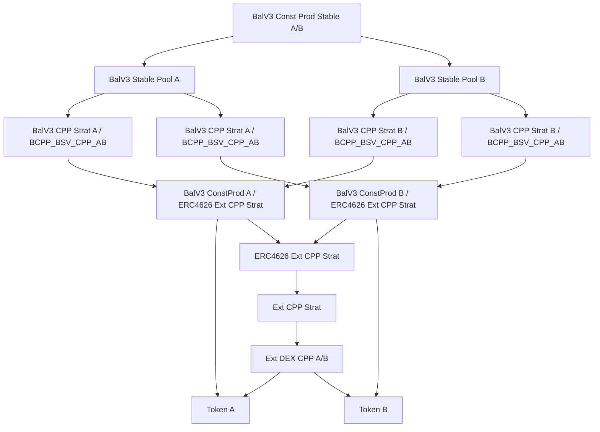

# Nested Liquidity Pools with Balancer V3 Configurations

This document describes a DeFi system integrating external Constant Product DEX liquidity pools into Strategy Vaults, wrapped in ERC4626 vault tokens, and managed by Balancer V3 pools. Two configurations are presented: Configuration 1 uses one external pool (A/B) with a final Constant Product pool, while Configuration 2 uses three external pools (A/B, A/C, B/C) with a final Weighted Pool. The diagrams focus on the pools, vaults, and tokens, excluding user interaction and vault management components.

## Explanation

### Configuration 1: Single External Pool with Constant Product Consolidation
This configuration uses one external DEX pool for Token A and Token B, culminating in a Balancer V3 Constant Product pool combining Stable Pool outputs.

#### External Constant Product DEX LP Token
A Constant Product pool (`Ext DEX CPP A/B`), as used in DEXes like Uniswap V2 or Camelot, holds Token A and Token B, facilitating trading using the constant product formula (`x * y = k`). It issues an LP token, implied as the input to the Strategy Vault.

#### Original Strategy Vault (SV)
The Strategy Vault (`Ext CPP Strat`) encapsulates the LP token of `Ext DEX CPP A/B` to standardize DEX-specific logic. It treats deposits and withdrawals as swaps (e.g., Token A → SV, SV → Token B).

#### ERC4626 Vault Wrapper
The Strategy Vault is wrapped in an ERC4626 vault token (`ERC4626 Ext CPP Strat`) for Balancer V3 compatibility.

#### Balancer V3 Constant Product Pools
Two Constant Product pools operate within Balancer V3, each using the `x * y = k` formula:
- `BalV3 ConstProd A / ERC4626 Ext CPP Strat`: Pairs the ERC4626-wrapped SV with Token A, issuing a Balancer Pool Token (BPT).
- `BalV3 ConstProd B / ERC4626 Ext CPP Strat`: Pairs the ERC4626-wrapped SV with Token B, issuing a BPT.
A Rate Provider (implied) adjusts the wrapped SV’s valuation using the original SV’s ZapOut value.

#### New Strategy Vaults (SVs)
For each Constant Product pool, two new ERC4626-compliant Strategy Vaults wrap the pool’s BPT:
- For Pool 1:
  - `BalV3 CPP Strat A / BCPP_BSV_CPP_AB`: Values reserves as Token A’s ZapOut value.
  - `BalV3 CPP Strat B / BCPP_BSV_CPP_AB`: Values reserves as Token B’s ZapOut value.
- For Pool 2:
  - `BalV3 CPP Strat A / BCPP_BSV_CPP_AB`: Values reserves as Token A’s ZapOut value.
  - `BalV3 CPP Strat B / BCPP_BSV_CPP_AB`: Values reserves as Token B’s ZapOut value.
Each SV integrates a Rate Provider (implied).

#### Balancer V3 Stable Pools
Two Stable Pools pair SVs valued in the same underlying token:
- `BalV3 Stable Pool A`: Pairs Token A-valued SVs from both Constant Product pools.
- `BalV3 Stable Pool B`: Pairs Token B-valued SVs from both Constant Product pools.
Stable Pools enable stable swaps due to consistent valuation via Rate Providers.

#### Balancer V3 Constant Product Pool
A final Constant Product pool (`BalV3 Const Prod Stable A/B`) pairs the Stable Pools’ tokens or BPTs, using the `x * y = k` formula.

### Configuration 2: Three External Pools with Weighted Consolidation
This configuration uses three external DEX pools (A/B, A/C, B/C) with Token A, B, and C, culminating in a Balancer V3 Weighted Pool consolidating Stable Pool outputs.

#### External Constant Product DEX LP Tokens
Three Constant Product pools facilitate trading using the `x * y = k` formula:
- `Ext DEX CPP A/B`: Holds Token A and Token B, issuing an LP token (`ConstProd_A_B`).
- `Ext DEX CPP A/C`: Holds Token A and Token C, issuing an LP token (`ConstProd_A_C`).
- `Ext DEX CPP B/C`: Holds Token B and Token C, issuing an LP token (`ConstProd_B_C`).

#### Original Strategy Vaults (SVs)
Each external DEX pool’s LP token is encapsulated in a Strategy Vault:
- `Ext CPP Strat A/B`: Wraps `ConstProd_A_B`.
- `Ext CPP Strat A/C`: Wraps `ConstProd_A_C`.
- `Ext CPP Strat B/C`: Wraps `ConstProd_B_C`.
These SVs treat deposits and withdrawals as swaps.

#### ERC4626 Vault Wrappers
Each Strategy Vault is wrapped in an ERC4626 vault token:
- `ERC4626 Ext CPP Strat A/B`: Wraps `Ext CPP Strat A/B`.
- `ERC4626 Ext CPP Strat A/C`: Wraps `Ext CPP Strat A/C`.
- `ERC4626 Ext CPP Strat B/C`: Wraps `Ext CPP Strat B/C`.

#### Balancer V3 Constant Product Pools
Six Constant Product pools operate within Balancer V3, each using the `x * y = k` formula:
- For A/B:
  - `BalV3 ConstProd A / ERC4626 Ext CPP Strat A/B`: Pairs with Token A.
  - `BalV3 ConstProd B / ERC4626 Ext CPP Strat A/B`: Pairs with Token B.
- For A/C:
  - `BalV3 ConstProd A / ERC4626 Ext CPP Strat A/C`: Pairs with Token A.
  - `BalV3 ConstProd C / ERC4626 Ext CPP Strat A/C`: Pairs with Token C.
- For B/C:
  - `BalV3 ConstProd B / ERC4626 Ext CPP Strat B/C`: Pairs with Token B.
  - `BalV3 ConstProd C / ERC4626 Ext CPP Strat B/C`: Pairs with Token C.
Each pool issues a BPT, implied as input to new SVs. A Rate Provider (implied) adjusts the wrapped SV’s valuation.

#### New Strategy Vaults (SVs)
For each Constant Product pool, two new ERC4626-compliant Strategy Vaults wrap the pool’s BPT:
- For A/B pools:
  - Token A and Token B valuations.
- For A/C pools:
  - `BalV3 CPP Strat A / BCPP_AC`: Valued in Token A.
  - `BalV3 CPP Strat C / BCPP_AC`: Valued in Token C.
- For B/C pools:
  - `BalV3 CPP Strat B / BCPP_BC`: Valued in Token B.
  - `BalV3 CPP Strat C / BCPP_BC`: Valued in Token C.
Each SV integrates a Rate Provider.

#### Balancer V3 Stable Pools
Three Stable Pools pair SVs valued in the same underlying token:
- `BalV3 Stable Pool A`: Pairs Token A-valued SVs from A/B and A/C pools.
- `BalV3 Stable Pool B`: Pairs Token B-valued SVs from A/B and B/C pools.
- `BalV3 Stable Pool C`: Pairs Token C-valued SVs from A/C and B/C pools.
Each Stable Pool issues a BPT.

#### Balancer V3 Weighted Pool
A Weighted Pool (`BalV3 Weighted Pool ABC`) consolidates the BPTs from Stable Pools A, B, and C, using a weighted formula to manage liquidity across Token A, B, and C valuations.

Purpose of the architecture:
- **Standardization**: Uses SVs and ERC4626 wrappers for DEX and Balancer integration.
- **Scalability**: Supports configurations for two or three token pairs.
- **Flexibility**: Enables stable, constant product, and weighted swaps with advanced pricing.

## Diagrams

### Diagram 1: Configuration 1 (Single External Pool with Constant Product Consolidation)
This Mermaid diagram illustrates the system with one external DEX pool and a final Constant Product pool:



### Diagram 2: Configuration 2 (Three External Pools with Weighted Consolidation)
This Mermaid diagram illustrates the system with three external DEX pools and a final Weighted Pool:

```mermaid
graph TD
    TA[Token A]
    TB[Token B]
    TC[Token C]
    EXTCPP_AB[Ext DEX CPP A/B]
    EXTCPP_AC[Ext DEX CPP A/C]
    EXTCPP_BC[Ext DEX CPP B/C]
    SV_CPP_AB[Ext CPP Strat A/B]
    SV_CPP_AC[Ext CPP Strat A/C]
    SV_CPP_BC[Ext CPP Strat B/C]
    W_SV_CPP_AB[ERC4626 Ext CPP Strat A/B]
    W_SV_CPP_AC[ERC4626 Ext CPP Strat A/C]
    W_SV_CPP_BC[ERC4626 Ext CPP Strat B/C]
    BCPP_A_SV_CPP_AB[BalV3 ConstProd A / ERC4626 Ext CPP Strat A/B]
    BCPP_B_SV_CPP_AB[BalV3 ConstProd B / ERC4626 Ext CPP Strat A/B]
    BCPP_A_SV_CPP_AC[BalV3 ConstProd A / ERC4626 Ext CPP Strat A/C]
    BCPP_C_SV_CPP_AC[BalV3 ConstProd C / ERC4626 Ext CPP Strat A/C]
    BCPP_B_SV_CPP_BC[BalV3 ConstProd B / ERC4626 Ext CPP Strat B/C]
    BCPP_C_SV_CPP_BC[BalV3 ConstProd C / ERC4626 Ext CPP Strat B/C]
    SVA_BCPP_A_SV_CPP_AB[BalV3 CPP Strat A / BCPP_AB]
    SVB_BCPP_A_SV_CPP_AB[BalV3 CPP Strat B / BCPP_AB]
    SVA_BCPP_B_SV_CPP_AB[BalV3 CPP Strat A / BCPP_AB]
    SVB_BCPP_B_SV_CPP_AB[BalV3 CPP Strat B / BCPP_AB]
    SVA_BCPP_A_SV_CPP_AC[BalV3 CPP Strat A / BCPP_AC]
    SVC_BCPP_A_SV_CPP_AC[BalV3 CPP Strat C / BCPP_AC]
    SVA_BCPP_C_SV_CPP_AC[BalV3 CPP Strat A / BCPP_AC]
    SVC_BCPP_C_SV_CPP_AC[BalV3 CPP Strat C / BCPP_AC]
    SVB_BCPP_B_SV_CPP_BC[BalV3 CPP Strat B / BCPP_BC]
    SVC_BCPP_B_SV_CPP_BC[BalV3 CPP Strat C / BCPP_BC]
    SVB_BCPP_C_SV_CPP_BC[BalV3 CPP Strat B / BCPP_BC]
    SVC_BCPP_C_SV_CPP_BC[BalV3 CPP Strat C / BCPP_BC]
    Stable_A[BalV3 Stable Pool A]
    Stable_B[BalV3 Stable Pool B]
    Stable_C[BalV3 Stable Pool C]
    Weighted_ABC[BalV3 Weighted Pool ABC]

    EXTCPP_AB --> TA
    EXTCPP_AB --> TB
    EXTCPP_AC --> TA
    EXTCPP_AC --> TC
    EXTCPP_BC --> TB
    EXTCPP_BC --> TC
    SV_CPP_AB --> EXTCPP_AB
    SV_CPP_AC --> EXTCPP_AC
    SV_CPP_BC --> EXTCPP_BC
    W_SV_CPP_AB --> SV_CPP_AB
    W_SV_CPP_AC --> SV_CPP_AC
    W_SV_CPP_BC --> SV_CPP_BC
    BCPP_A_SV_CPP_AB --> TA
    BCPP_A_SV_CPP_AB --> W_SV_CPP_AB
    BCPP_B_SV_CPP_AB --> TB
    BCPP_B_SV_CPP_AB --> W_SV_CPP_AB
    BCPP_A_SV_CPP_AC --> TA
    BCPP_A_SV_CPP_AC --> W_SV_CPP_AC
    BCPP_C_SV_CPP_AC --> TC
    BCPP_C_SV_CPP_AC --> W_SV_CPP_AC
    BCPP_B_SV_CPP_BC --> TB
    BCPP_B_SV_CPP_BC --> W_SV_CPP_BC
    BCPP_C_SV_CPP_BC --> TC
    BCPP_C_SV_CPP_BC --> W_SV_CPP_BC
    SVA_BCPP_A_SV_CPP_AB --> BCPP_A_SV_CPP_AB
    SVB_BCPP_A_SV_CPP_AB --> BCPP_A_SV_CPP_AB
    SVA_BCPP_B_SV_CPP_AB --> BCPP_B_SV_CPP_AB
    SVB_BCPP_B_SV_CPP_AB --> BCPP_B_SV_CPP_AB
    SVA_BCPP_A_SV_CPP_AC --> BCPP_A_SV_CPP_AC
    SVC_BCPP_A_SV_CPP_AC --> BCPP_A_SV_CPP_AC
    SVA_BCPP_C_SV_CPP_AC --> BCPP_C_SV_CPP_AC
    SVC_BCPP_C_SV_CPP_AC --> BCPP_C_SV_CPP_AC
    SVB_BCPP_B_SV_CPP_BC --> BCPP_B_SV_CPP_BC
    SVC_BCPP_B_SV_CPP_BC --> BCPP_B_SV_CPP_BC
    SVB_BCPP_C_SV_CPP_BC --> BCPP_C_SV_CPP_BC
    SVC_BCPP_C_SV_CPP_BC --> BCPP_C_SV_CPP_BC
    Stable_A --> SVA_BCPP_A_SV_CPP_AB
    Stable_A --> SVA_BCPP_B_SV_CPP_AB
    Stable_A --> SVA_BCPP_A_SV_CPP_AC
    Stable_A --> SVA_BCPP_C_SV_CPP_AC
    Stable_B --> SVB_BCPP_A_SV_CPP_AB
    Stable_B --> SVB_BCPP_B_SV_CPP_AB
    Stable_B --> SVB_BCPP_B_SV_CPP_BC
    Stable_B --> SVB_BCPP_C_SV_CPP_BC
    Stable_C --> SVC_BCPP_A_SV_CPP_AC
    Stable_C --> SVC_BCPP_C_SV_CPP_AC
    Stable_C --> SVC_BCPP_B_SV_CPP_BC
    Stable_C --> SVC_BCPP_C_SV_CPP_BC
    Weighted_ABC --> Stable_A
    Weighted_ABC --> Stable_B
    Weighted_ABC --> Stable_C
```



## Rendering Instructions
To visualize either diagram:
1. Copy the Mermaid code (starting with `graph TD`).
2. Paste it into a Mermaid-compatible tool, such as the [Mermaid Live Editor](https://mermaid.live/).
3. Use a recent Mermaid version (v10.0.0 or later) for best compatibility.
4. If rendering fails, check for:
   - Extra spaces or line breaks in the copied code.
   - Tool compatibility (e.g., try VS Code with the Mermaid plugin).
   - Incorrect code block formatting (ensure it starts with ```mermaid and ends with ```).

## Iterative Refinements
Potential additions or clarifications:
- Confirm Weighted Pool tokens in Diagram 2 (e.g., `BPT_Stable_A`, `BPT_Stable_B`, `BPT_Stable_C`) and weights.
- Add explicit BPT nodes (e.g., `BPT_Pool_1`) for clarity.
- Include Rate Provider nodes for both diagrams.
- Specify tokens (e.g., ETH/USDC/DAI for A/B/C).
- Add a diagram for a specific interaction (e.g., swap in the Weighted Pool).

## Troubleshooting Rendering Issues
If rendering issues occur:
- Share the exact error message from the Mermaid Live Editor or other tool.
- Verify the tool’s version (e.g., Mermaid Live Editor should be up-to-date).
- Try a different renderer (e.g., GitHub, VS Code, or Mermaid CLI).