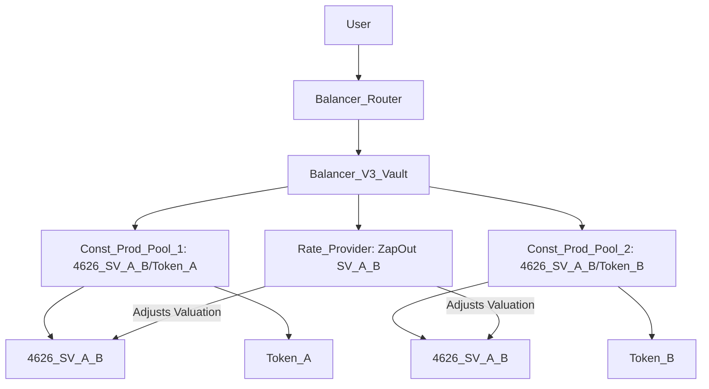

# Nested Liquidity Pools with Balancer V3 Dual Constant Product Pools

This document describes a DeFi system integrating an external Constant Product DEX liquidity pool into a Strategy Vault, wrapped in an ERC4626 vault token, and managed by a Balancer V3 SV Conversion Pool and two Constant Product pools with a Rate Provider.

## Explanation

### External Constant Product DEX LP Token
A Constant Product liquidity pool, as used in DEXes like Uniswap V2 or Camelot, holds a pair of tokens (e.g., Token A and Token B) and facilitates trading using the constant product formula (`x * y = k`). The pool issues an LP token, denoted `ConstProd(A/B)`, representing a share of the pool’s liquidity.

For example:
- A Uniswap V2 pool for Token A and Token B issues `ConstProd(A/B)`.
- Liquidity providers deposit Token A and Token B, receiving `ConstProd(A/B)`.

### Strategy Vault (SV)
The Strategy Vault (SV), denoted `SV(ConstProd(A/B))`, encapsulates the LP token `ConstProd(A/B)` to standardize DEX-specific integration logic (e.g., for Uniswap V2 or Camelot). It treats deposits and withdrawals as swaps.

For example:
- Depositing Token A mints `SV(ConstProd(A/B))` tokens (swap: Token A → SV).
- Withdrawing burns `SV(ConstProd(A/B))` for Token B (swap: SV → Token B).

### ERC4626 Vault Wrapper
The Strategy Vault is wrapped in an ERC4626 vault token, denoted `4626(SV(ConstProd(A/B)))`, for compatibility with Balancer V3’s Vault system and Liquidity Buffers.

### SV Conversion Pool (Custom Balancer V3 Pool)
The SV Conversion Pool is a custom Balancer V3 pool that:
- Holds only the ERC4626 vault token (`4626(SV(ConstProd(A/B)))`) in the Balancer V3 Vault.
- Handles swaps (e.g., Token A ↔ Token B, Token A ↔ SV) and deposits/withdrawals by calling the SV’s logic.
- Users interact via Balancer Routers, which call the Balancer V3 Vault, which calls this pool.

### Dual Constant Product Balancer V3 Pools
Two Constant Product pools operate within the Balancer V3 Vault, each using the `x * y = k` formula:
- **Pool 1**: Pairs `4626(SV(ConstProd(A/B)))` with Token A (e.g., `4626_SV_A_B/Token_A`).
- **Pool 2**: Pairs `4626(SV(ConstProd(A/B)))` with Token B (e.g., `4626_SV_A_B/Token_B`).
These pools rely on a Rate Provider to adjust the valuation of `4626(SV(ConstProd(A/B)))`.

### Rate Provider
A custom Rate Provider in the Balancer V3 Vault provides an exchange rate for `4626(SV(ConstProd(A/B)))` in both Constant Product pools, using the ZapOut valuation of the SV (e.g., the value of underlying Token A and Token B).

For example:
- If a pool calculates a 2:1 exchange for `4626_SV_A_B` to Token A, the Rate Provider may adjust it to 1:1 based on the SV’s ZapOut valuation.
- This enhances pricing flexibility for swaps in both pools.

### Balancer V3 Vault and Routers
The Balancer V3 Vault manages tokens for all pools (SV Conversion Pool and two Constant Product pools). Users interact through Balancer Routers, which call the Vault to execute swaps, deposits, or withdrawals.

Purpose of the architecture:
- **Unified Interface**: Simplifies interactions via Balancer Routers.
- **Scalability**: Supports multiple pools and Strategy Vaults.
- **Flexibility**: Enables advanced pricing via Rate Providers and complex liquidity management.

## Diagram

### Primary Diagram (Dual Constant Product Pools)
This Mermaid diagram illustrates the two Constant Product pools, using simplified labels:

### Diagram Description
- **User**: Interacts with the Balancer Router to initiate swaps.
- **Balancer Router**: Calls the Balancer V3 Vault.
- **Balancer V3 Vault**: Manages the two Constant Product pools and Rate Provider.
- **Const_Prod_Pool_1**: Holds `4626_SV_A_B` and Token A, using `x * y = k`.
- **Const_Prod_Pool_2**: Holds `4626_SV_A_B` and Token B, using `x * y = k`.
- **Rate Provider**: Adjusts the valuation of `4626_SV_A_B` in both pools using the SV’s ZapOut valuation.
- **Tokens**: `4626_SV_A_B`, Token A, and Token B are the pools’ assets.
- Arrows (`-->`) show interaction flow; Rate Provider arrows indicate valuation adjustments.

### Alternative Diagram (Full System)
This diagram shows the full system, including the SV Conversion