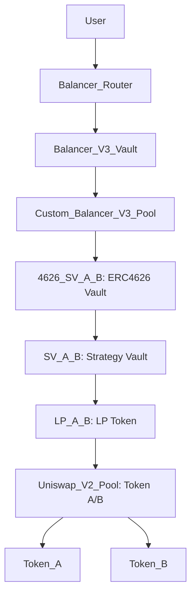
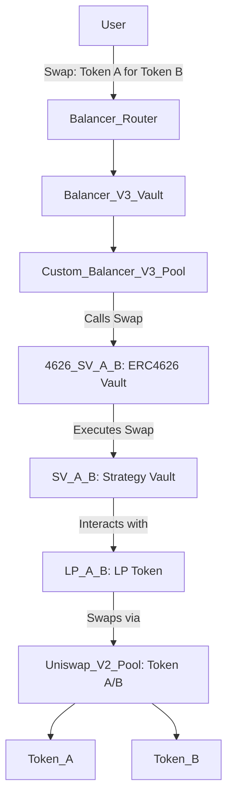

# Nested Liquidity Pools with Balancer V3 Custom Pool Integration

This document describes a DeFi system where Constant Product liquidity pools from decentralized exchanges (DEXes) are integrated into Strategy Vaults, wrapped in ERC4626 vault tokens, and managed by a custom Balancer V3 pool that handles swaps, deposits, and withdrawals.

## Explanation

### Constant Product Liquidity Pools
A Constant Product liquidity pool, as used in DEXes like Uniswap V2 and Camelot, holds a pair of tokens (e.g., Token A and Token B) and facilitates trading using the constant product formula (`x * y = k`). The pool issues an LP token, denoted `ConstProd(A/B)`, representing a share of the pool’s liquidity.

For example:
- A Uniswap V2 pool for Token A and Token B creates `ConstProd(A/B)`.
- Liquidity providers deposit Token A and Token B, receiving `ConstProd(A/B)` in return.

### Strategy Vault (SV)
The Strategy Vault (SV), denoted `SV(ConstProd(A/B))`, encapsulates the LP token and handles DEX-specific integration logic (e.g., for Uniswap V2 or Camelot). It standardizes interactions and treats deposits and withdrawals as swaps.

For example:
- Depositing Token A into the SV mints `SV(ConstProd(A/B))` tokens, treated as a swap (Token A → SV).
- Withdrawing `SV(ConstProd(A/B))` for Token B burns SV tokens, treated as a swap (SV → Token B).

### ERC4626 Vault Wrapper
The Strategy Vault is wrapped in a standard ERC4626 vault token, denoted `4626(SV(ConstProd(A/B)))`, to ensure compatibility with Balancer V3’s Liquidity Buffers and Vault system. The ERC4626 standard provides a consistent interface for tokenized vaults.

### Custom Balancer V3 Pool
A custom Balancer V3 pool is designed to hold only the ERC4626-wrapped Strategy Vault, `4626(SV(ConstProd(A/B)))`, within the Balancer V3 Vault. This pool handles:
- **Swaps**: Exchanging any relevant tokens (e.g., Token A for Token B, Token A for SV, SV for Token B) by calling the SV’s swap logic.
- **Deposits/Withdrawals**: Managing SV deposits and withdrawals, contextualized as swaps, via the SV.

### Balancer V3 Vault and Routers
The Balancer V3 Vault manages the ERC4626 token and interacts with the custom pool. Users interact primarily through Balancer Routers, which call the Balancer Vault, which in turn calls the custom pool to execute swaps, deposits, or withdrawals.

Purpose of the architecture:
- **Unified Interface**: Simplifies user interactions via Balancer Routers and standardizes DEX integration.
- **Scalability**: Supports adding new Strategy Vaults or DEXes via ERC4626 wrappers.
- **Flexibility**: Enables complex swaps and liquidity management within Balancer V3.

## Diagram

### Primary Diagram
The following Mermaid diagram illustrates the nested structure, using simplified labels for reliable rendering:



### Diagram Description
- **User**: Interacts with the Balancer Router to initiate swaps, deposits, or withdrawals.
- **Balancer Router**: Calls the Balancer V3 Vault on behalf of the user.
- **Balancer V3 Vault**: Manages the ERC4626 token and interacts with the custom pool.
- **Custom Balancer V3 Pool**: Holds only the ERC4626 vault (`4626_SV_A_B`) and calls the SV for swap logic.
- **ERC4626 Vault**: Wraps the Strategy Vault (`SV_A_B`) for Balancer compatibility.
- **Strategy Vault**: Manages the LP token and handles swaps, deposits, and withdrawals.
- **LP Token**: Represents a share of the Uniswap V2 pool.
- **Uniswap V2 Pool**: Holds Token A and Token B.
- **Tokens**: Token A and Token B are the pool’s assets.
- The arrows (`-->`) show the interaction flow through the hierarchy.

### Alternative Diagram (Swap Interaction)
This diagram illustrates a specific swap (e.g., Token A → Token B) through the system:



## Rendering Instructions
To visualize either diagram:
1. Copy the Mermaid code (starting with `graph TD`).
2. Paste it into a Mermaid-compatible tool, such as the [Mermaid Live Editor](https://mermaid.live/).
3. Use a recent Mermaid version (v10.0.0 or later) for best compatibility.
4. If rendering fails, check for:
   - Extra spaces or line breaks in the copied code.
   - Tool compatibility (e.g., try VS Code with the Mermaid plugin).
   - Incorrect code block formatting (ensure it starts with ```mermaid and ends with ```).

## Iterative Refinements
This document is evolving. Potential additions include:
- Detailing swap logic in the Strategy Vault (e.g., minting/burning mechanics).
- Adding multiple custom pools or Strategy Vaults (e.g., `4626(SV(ConstProd(X/Y)))`).
- Including diagrams for other interactions (e.g., depositing Token A into the SV).
- Specifying Balancer V3 Vault or Liquidity Buffer mechanics.
- Using specific tokens (e.g., ETH/USDC) or DEX differences (e.g., Uniswap V2 vs. Camelot).

## Troubleshooting Rendering Issues
If rendering issues occur:
- Share the exact error message from the Mermaid Live Editor or other tool.
- Verify the tool’s version (e.g., Mermaid Live Editor should be up-to-date).
- Test the alternative diagram.
- Try a different renderer (e.g., GitHub, VS Code, or Mermaid CLI).