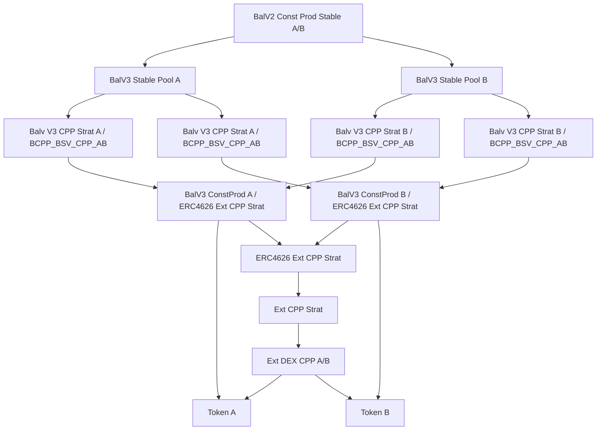

# Nested Liquidity Pools with Balancer V3 Stable Pools

This document describes a DeFi system integrating an external Constant Product DEX liquidity pool into a Strategy Vault, wrapped in an ERC4626 vault token, and managed by Balancer V3 pools, including a custom SV Conversion Pool, two Constant Product pools, new Strategy Vaults, two Stable Pools, and a final Constant Product pool combining Stable Pool outputs. The diagrams focus on the pools, vaults, and tokens.

## Explanation

### External Constant Product DEX LP Token
A Constant Product liquidity pool (`Ext DEX CPP A/B`), as used in DEXes like Uniswap V2 or Camelot, holds Token A and Token B, facilitating trading using the constant product formula (`x * y = k`). It issues an LP token, implied as the input to the Strategy Vault.

### Original Strategy Vault (SV)
The original Strategy Vault (`Ext CPP Strat`) encapsulates the LP token of the external DEX pool to standardize DEX-specific integration logic. It treats deposits and withdrawals as swaps (e.g., Token A → SV, SV → Token B).

### ERC4626 Vault Wrapper
The Strategy Vault is wrapped in an ERC4626 vault token (`ERC4626 Ext CPP Strat`) for compatibility with Balancer V3.

### Balancer V3 Constant Product Pools
Two Constant Product pools operate within Balancer V3, each using the `x * y = k` formula:
- **Pool 1 (`BalV3 ConstProd A / ERC4626 Ext CPP Strat`)**: Pairs the ERC4626-wrapped SV with Token A, issuing a Balancer Pool Token (BPT).
- **Pool 2 (`BalV3 ConstProd B / ERC4626 Ext CPP Strat`)**: Pairs the ERC4626-wrapped SV with Token B, issuing a BPT.
A Rate Provider (implied) adjusts the wrapped SV’s valuation using the original SV’s ZapOut value.

### New Strategy Vaults (SVs)
For each Constant Product pool, two new Strategy Vaults wrap the pool’s BPT, providing distinct valuations:
- For Pool 1:
  - `Balv V3 CPP Strat A / BCPP_BSV_CPP_AB`: Values reserves as Token A’s ZapOut value.
  - `Balv V3 CPP Strat B / BCPP_BSV_CPP_AB`: Values reserves as Token B’s ZapOut value.
- For Pool 2:
  - `Balv V3 CPP Strat A / BCPP_BSV_CPP_AB`: Values reserves as Token A’s ZapOut value.
  - `Balv V3 CPP Strat B / BCPP_BSV_CPP_AB`: Values reserves as Token B’s ZapOut value.
Each SV is ERC4626-compliant with an integrated Rate Provider (implied).

### Balancer V3 Stable Pools
Two Stable Pools pair SVs valued in the same underlying token:
- **Stable Pool A (`BalV3 Stable Pool A`)**: Pairs Token A-valued SVs from both Constant Product pools.
- **Stable Pool B (`BalV3 Stable Pool B`)**: Pairs Token B-valued SVs from both Constant Product pools.
Stable Pools enable stable swaps due to consistent valuation via Rate Providers.

### Balancer Constant Product Pool for Stable Pools
A final Constant Product pool (`BalV2 Const Prod Stable A/B`, possibly Balancer V3) pairs the Stable Pools’ tokens or BPTs, using the `x * y = k` formula.

Purpose of the architecture:
- **Standardization**: Uses SVs and ERC4626 wrappers for DEX and Balancer integration.
- **Scalability**: Supports multiple pools and vaults.
- **Flexibility**: Enables stable and constant product swaps with advanced pricing.

## Diagram

### Primary Diagram (System Overview)
This Mermaid diagram illustrates the system’s pools, vaults, and tokens, using your provided labels:



### Diagram Description
- **Ext DEX CPP A/B**: External DEX pool holding Token A and Token B.
- **Ext CPP Strat**: Strategy Vault wrapping the external pool’s LP token.
- **ERC4626 Ext CPP Strat**: ERC4626 wrapper for the Strategy Vault.
- **BalV3 ConstProd A / ERC4626 Ext CPP Strat**: Balancer V3 Constant Product pool pairing the wrapped SV with Token A.
- **BalV3 ConstProd B / ERC4626 Ext CPP Strat**: Balancer V3 Constant Product pool pairing the wrapped SV with Token B.
- **Balv V3 CPP Strat A / BCPP_BSV_CPP_AB**: New SV for Pool 1, valued in Token A.
- **Balv V3 CPP Strat B / BCPP_BSV_CPP_AB**: New SV for Pool 1, valued in Token B.
- **Balv V3 CPP Strat A / BCPP_BSV_CPP_AB**: New SV for Pool 2, valued in Token A.
- **Balv V3 CPP Strat B / BCPP_BSV_CPP_AB**: New SV for Pool 2, valued in Token B.
- **BalV3 Stable Pool A**: Pairs Token A-valued SVs from both Constant Product pools.
- **BalV3 Stable Pool B**: Pairs Token B-valued SVs from both Constant Product pools.
- **BalV2 Const Prod Stable A/B**: Constant Product pool pairing Stable Pool tokens or BPTs.
- Arrows (`-->`) show relationships between pools, vaults, and tokens.

## Rendering Instructions
To visualize the diagram:
1. Copy the Mermaid code (starting with `graph TD`).
2. Paste it into a Mermaid-compatible tool, such as the [Mermaid Live Editor](https://mermaid.live/).
3. Use a recent Mermaid version (v10.0.0 or later) for best compatibility.
4. If rendering fails, check for:
   - Extra spaces or line breaks in the copied code.
   - Tool compatibility (e.g., try VS Code with the Mermaid plugin).
   - Incorrect code block formatting (ensure it starts with ```mermaid and ends with ```).

## Iterative Refinements
Potential additions or clarifications:
- Confirm if `BalV2 Const Prod Stable A/B` should be Balancer V3.
- Add explicit Balancer Pool Token (BPT) nodes (e.g., `BPT_Pool_1`).
- Include Rate Provider nodes for clarity.
- Specify tokens (e.g., ETH/USDC for Token A/B).
- Add a diagram for a specific interaction (e.g., swap in a Stable Pool).

## Troubleshooting Rendering Issues
If rendering issues occur:
- Share the exact error message from the Mermaid Live Editor or other tool.
- Verify the tool’s version (e.g., Mermaid Live Editor should be up-to-date).
- Try a different renderer (e.g., GitHub, VS Code, or Mermaid CLI).