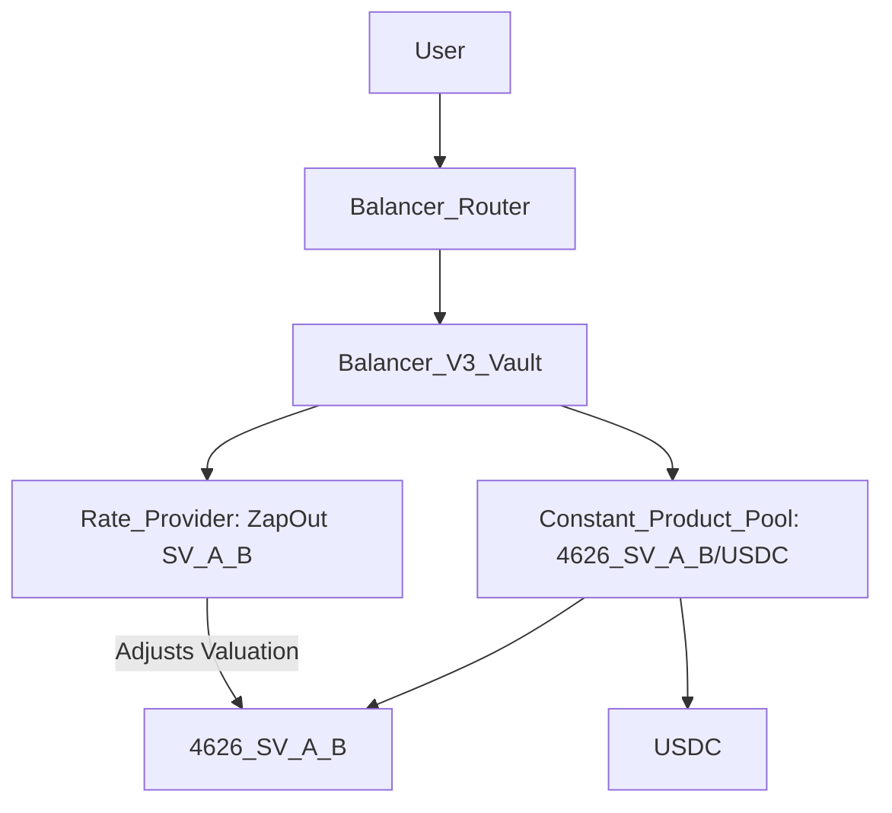
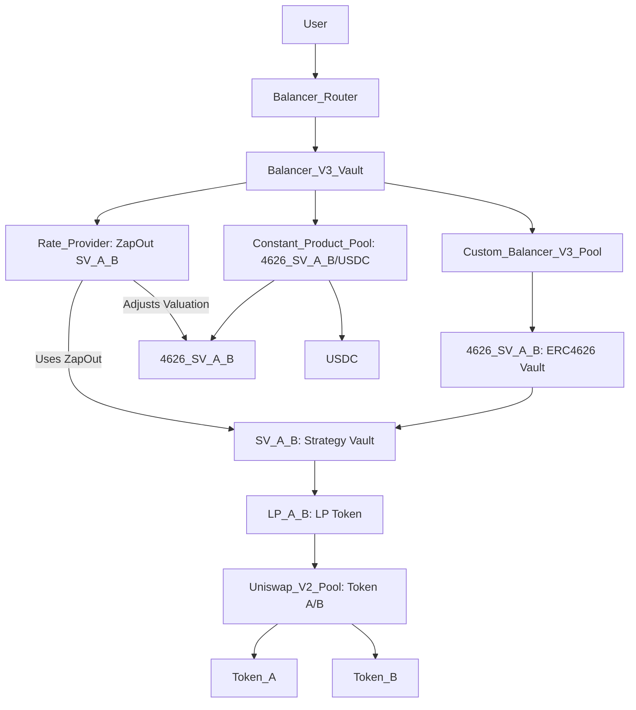

# Nested Liquidity Pools with Balancer V3 Custom and Constant Product Pools

This document describes a DeFi system integrating Constant Product liquidity pools from decentralized exchanges (DEXes) into Strategy Vaults, wrapped in ERC4626 vault tokens, and managed by two distinct Balancer V3 pools: a custom pool for swaps/deposits/withdrawals and a Constant Product pool with a Rate Provider.

## Explanation

### Constant Product Liquidity Pools (DEX)
A Constant Product liquidity pool, as used in DEXes like Uniswap V2 and Camelot, holds a pair of tokens (e.g., Token A and Token B) and facilitates trading using the constant product formula (`x * y = k`). The pool issues an LP token, denoted `ConstProd(A/B)`, representing a share of the pool’s liquidity.

For example:
- A Uniswap V2 pool for Token A and Token B creates `ConstProd(A/B)`.
- Liquidity providers deposit Token A and Token B, receiving `ConstProd(A/B)` in return.

### Strategy Vault (SV)
The Strategy Vault (SV), denoted `SV(ConstProd(A/B))`, encapsulates the LP token and handles DEX-specific integration logic (e.g., for Uniswap V2 or Camelot). It standardizes interactions and treats deposits and withdrawals as swaps.

For example:
- Depositing Token A mints `SV(ConstProd(A/B))` tokens (swap: Token A → SV).
- Withdrawing burns `SV(ConstProd(A/B))` for Token B (swap: SV → Token B).

### ERC4626 Vault Wrapper
The Strategy Vault is wrapped in an ERC4626 vault token, denoted `4626(SV(ConstProd(A/B)))`, for compatibility with Balancer V3’s Vault system and Liquidity Buffers.

### Custom Balancer V3 Pool
The first pool is a custom Balancer V3 pool that:
- Holds only the ERC4626 vault token (`4626(SV(ConstProd(A/B)))`) in the Balancer V3 Vault.
- Handles swaps (e.g., Token A ↔ Token B, Token A ↔ SV) and deposits/withdrawals by calling the SV’s logic.
- Users interact via Balancer Routers, which call the Balancer Vault, which calls this pool.

### Constant Product Balancer V3 Pool
The second pool is a simple Constant Product pool within the Balancer V3 Vault, holding two tokens (e.g., `4626(SV(ConstProd(A/B)))` and USDC). It uses the standard `x * y = k` formula and relies on a custom Rate Provider for enhanced functionality.

### Rate Provider
A custom Rate Provider is deployed in the Balancer V3 Vault to provide an exchange rate for the `4626(SV(ConstProd(A/B)))` token in the Constant Product pool. It uses the ZapOut valuation of the SV, reflecting the value of its underlying assets (e.g., Token A and Token B).

For example:
- If the pool calculates a 2:1 exchange for `4626(SV(ConstProd(A/B)))` to USDC, the Rate Provider might adjust it to 1:1 based on the SV’s ZapOut valuation.
- This allows the Balancer Vault to apply a different valuation during swaps, enhancing pricing flexibility.

### Balancer V3 Vault and Routers
The Balancer V3 Vault manages tokens for both pools and interacts with them. Users interact through Balancer Routers, which call the Vault to execute swaps, deposits, or withdrawals.

Purpose of the architecture:
- **Unified Interface**: Simplifies interactions via Balancer Routers.
- **Scalability**: Supports multiple pools and Strategy Vaults.
- **Flexibility**: Enables advanced pricing and liquidity management via Rate Providers.

## Diagram

### Primary Diagram (Constant Product Pool)
This Mermaid diagram illustrates the Constant Product pool, using simplified labels:



### Diagram Description
- **User**: Interacts with the Balancer Router to initiate swaps.
- **Balancer Router**: Calls the Balancer V3 Vault.
- **Balancer V3 Vault**: Manages the Constant Product pool and Rate Provider.
- **Constant Product Pool**: Holds `4626_SV_A_B` (ERC4626 vault) and USDC, using `x * y = k`.
- **Rate Provider**: Adjusts the valuation of `4626_SV_A_B` using the SV’s ZapOut valuation.
- **Tokens**: `4626_SV_A_B` and USDC are the pool’s assets.
- Arrows (`-->`) show interaction flow; the Rate Provider’s arrow indicates valuation adjustment.

### Alternative Diagram (Linking Both Pools)
This diagram shows both pools, highlighting the Rate Provider’s connection to the SV:



## Rendering Instructions
To visualize either diagram:
1. Copy the Mermaid code (starting with `graph TD`).
2. Paste it into a Mermaid-compatible tool, such as the [Mermaid Live Editor](https://mermaid.live/).
3. Use a recent Mermaid version (v10.0.0 or later) for best compatibility.
4. If rendering fails, check for:
   - Extra spaces or line breaks in the copied code.
   - Tool compatibility (e.g., try VS Code with the Mermaid plugin).
   - Incorrect code block formatting (ensure it starts with ```mermaid and ends with ```).

## Iterative Refinements
Potential additions include:
- Clarifying the ZapOut valuation (e.g., based on SV’s underlying assets).
- Specifying tokens in the Constant Product pool (e.g., ETH/USDC).
- Adding diagrams for swap interactions in the Constant Product pool.
- Detailing Rate Provider mechanics (e.g., how ZapOut valuation is calculated).
- Including multiple pools or Strategy Vaults.

## Troubleshooting Rendering Issues
If rendering issues occur:
- Share the exact error message from the Mermaid Live Editor or other tool.
- Verify the tool’s version (e.g., Mermaid Live Editor should be up-to-date).
- Test the alternative diagram.
- Try a different renderer (e.g., GitHub, VS Code, or Mermaid CLI).