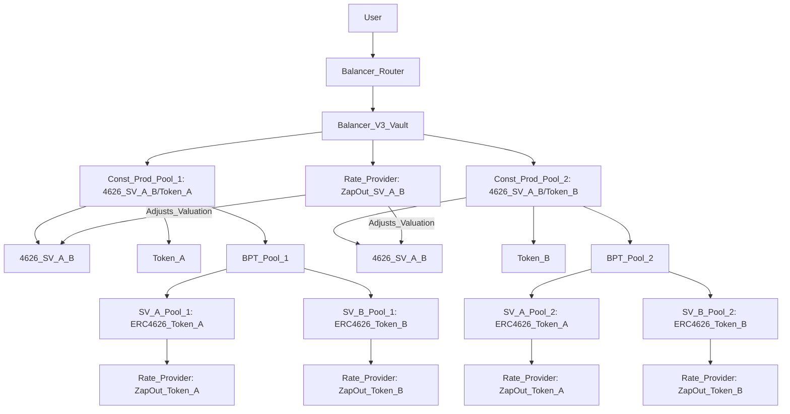
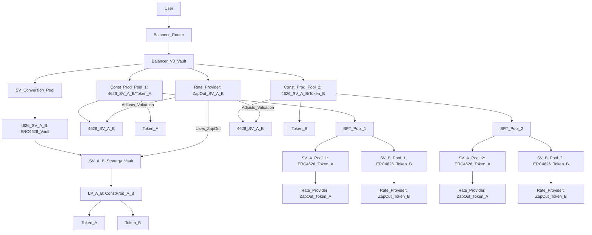

# Nested Liquidity Pools with Balancer V3 and New Strategy Vaults

This document describes a DeFi system integrating an external Constant Product DEX liquidity pool into a Strategy Vault, wrapped in an ERC4626 vault token, and managed by a Balancer V3 SV Conversion Pool, two Constant Product pools, and new Strategy Vaults for the Balancer pool LP tokens.

## Explanation

### External Constant Product DEX LP Token
A Constant Product liquidity pool, as used in DEXes like Uniswap V2 or Camelot, holds a pair of tokens (Token A and Token B) and facilitates trading using the constant product formula (`x * y = k`). The pool issues an LP token, denoted `ConstProd_A_B`, representing a share of the pool’s liquidity.

For example:
- A Uniswap V2 pool for Token A and Token B issues `ConstProd_A_B`.
- Liquidity providers deposit Token A and Token B, receiving `ConstProd_A_B`.

### Original Strategy Vault (SV)
The original Strategy Vault, denoted `SV_A_B`, encapsulates the LP token `ConstProd_A_B` to standardize DEX-specific integration logic (e.g., for Uniswap V2 or Camelot). It treats deposits and withdrawals as swaps.

For example:
- Depositing Token A mints `SV_A_B` tokens (swap: Token A → SV).
- Withdrawing burns `SV_A_B` for Token B (swap: SV → Token B).

### ERC4626 Vault Wrapper
The Strategy Vault is wrapped in an ERC4626 vault token, denoted `4626_SV_A_B`, for compatibility with Balancer V3’s Vault system and Liquidity Buffers.

### SV Conversion Pool (Custom Balancer V3 Pool)
The SV Conversion Pool is a custom Balancer V3 pool that:
- Holds only the ERC4626 vault token (`4626_SV_A_B`) in the Balancer V3 Vault.
- Handles swaps (e.g., Token A ↔ Token B, Token A ↔ SV) and deposits/withdrawals by calling the SV’s logic.
- Users interact via Balancer Routers, which call the Balancer V3 Vault, which calls this pool.

### Dual Constant Product Balancer V3 Pools
Two Constant Product pools operate within the Balancer V3 Vault, each using the `x * y = k` formula:
- **Pool 1**: Pairs `4626_SV_A_B` with Token A (e.g., `4626_SV_A_B/Token_A`), issuing a Balancer Pool Token (`BPT_Pool_1`).
- **Pool 2**: Pairs `4626_SV_A_B` with Token B (e.g., `4626_SV_A_B/Token_B`), issuing a Balancer Pool Token (`BPT_Pool_2`).
A Rate Provider adjusts the valuation of `4626_SV_A_B` using the original SV’s ZapOut valuation.

### New Strategy Vaults (SVs)
For each Constant Product pool, two new ERC4626-compliant Strategy Vaults are created:
- For Pool 1:
  - **SV_A_Pool_1**: Holds `BPT_Pool_1`, values reserves as the ZapOut value of Token A extractable from the pool.
  - **SV_B_Pool_1**: Holds `BPT_Pool_1`, values reserves as the ZapOut value of Token B extractable from the pool.
- For Pool 2:
  - **SV_A_Pool_2**: Holds `BPT_Pool_2`, values reserves as the ZapOut value of Token A extractable from the pool.
  - **SV_B_Pool_2**: Holds `BPT_Pool_2`, values reserves as the ZapOut value of Token B extractable from the pool.

Each new SV:
- Processes deposits as a standard ERC4626 vault, minting vault shares for `BPT` deposits.
- Exposes a Rate Provider interface, valuing its reserves based on the ZapOut value of the pool’s LP token in terms of Token A or Token B.
- Provides distinct token addresses for use in Balancer, with different valuations for the same `BPT`.

### Rate Provider
- **Original Rate Provider**: Adjusts `4626_SV_A_B` valuation in the Constant Product pools using the original SV’s ZapOut value (e.g., Token A/B’s value).
- **New SV Rate Providers**: Each new SV integrates a Rate Provider, valuing its reserves as the ZapOut value of its `BPT` in terms of Token A or Token B.

### Balancer V3 Vault and Routers
The Balancer V3 Vault manages tokens for all pools and new SVs. Users interact through Balancer Routers, which call the Vault to execute swaps, deposits, or withdrawals.

Purpose of the architecture:
- **Unified Interface**: Simplifies interactions via Balancer Routers.
- **Scalability**: Supports multiple pools and Strategy Vaults.
- **Flexibility**: Enables advanced pricing via integrated Rate Providers and complex liquidity management.

## Diagram

### Primary Diagram (Constant Product Pools and New SVs)
This Mermaid diagram illustrates the two Constant Product pools and their new Strategy Vaults, using simplified labels:



### Diagram Description
- **User**: Interacts with the Balancer Router to initiate swaps or deposits.
- **Balancer Router**: Calls the Balancer V3 Vault.
- **Balancer V3 Vault**: Manages the Constant Product pools, Rate Provider, and new SVs.
- **Const_Prod_Pool_1**: Holds `4626_SV_A_B` and Token A, issuing `BPT_Pool_1`.
- **Const_Prod_Pool_2**: Holds `4626_SV_A_B` and Token B, issuing `BPT_Pool_2`.
- **BPT_Pool_1**: Deposited into `SV_A_Pool_1` (valued in Token A) and `SV_B_Pool_1` (valued in Token B).
- **BPT_Pool_2**: Deposited into `SV_A_Pool_2` (valued in Token A) and `SV_B_Pool_2` (valued in Token B).
- **Rate_Provider**: Original Rate Provider adjusts `4626_SV_A_B` valuation in the pools.
- **New SV Rate Providers**: Value each SV’s reserves based on the ZapOut value of its `BPT` in Token A or Token B.
- Arrows (`-->`) show interaction flow; Rate Provider arrows indicate valuation adjustments.

### Alternative Diagram (Full System)
This diagram shows the full system, including the SV Conversion Pool, original SV, LP token, Token A/B, and new SVs, with corrected labels:



## Rendering Instructions
To visualize either diagram:
1. Copy the Mermaid code (starting with `graph TD`).
2. Paste it into a Mermaid-compatible tool, such as the [Mermaid Live Editor](https://mermaid.live/).
3. Use a recent Mermaid version (v10.0.0 or later) for best compatibility.
4. If rendering fails, check for:
   - Extra spaces or line breaks in the copied code.
   - Tool compatibility (e.g., try VS Code with the Mermaid plugin).
   - Incorrect code block formatting (ensure it starts with ```mermaid and ends with ```).

## Iterative Refinements
Potential additions include:
- Clarifying the ZapOut valuation for new SVs (e.g., extractable Token A/B amounts).
- Specifying tokens (e.g., ETH/USDC for Token A/B).
- Adding a diagram for a swap or deposit in a new SV.
- Detailing new SV Rate Provider mechanics (e.g., valuation calculation).
- Exploring how new SVs are used in additional Balancer pools.

## Troubleshooting Rendering Issues
If rendering issues occur:
- Share the exact error message from the Mermaid Live Editor or other tool.
- Verify the tool’s version (e.g., Mermaid Live Editor should be up-to-date).
- Test the alternative diagram.
- Try a different renderer (e.g., GitHub, VS Code, or Mermaid CLI).