# Nested Liquidity Pools with Balancer V3 Weighted Pool Consolidation

This document describes a DeFi system integrating three external Constant Product DEX liquidity pools into Strategy Vaults, wrapped in ERC4626 vault tokens, and managed by Balancer V3 pools, including custom SV Conversion Pools, Constant Product pools, new Strategy Vaults, Stable Pools, and a final Weighted Pool consolidating the system’s tokens. The diagram focuses on the pools, vaults, and tokens, excluding user interaction and vault management components.

## Explanation

### External Constant Product DEX LP Tokens
Three Constant Product liquidity pools, as used in DEXes like Uniswap V2 or Camelot, facilitate trading using the constant product formula (`x * y = k`):
- `Ext DEX CPP A/B`: Holds Token A and Token B, issuing an LP token (implied as `ConstProd_A_B`).
- `Ext DEX CPP A/C`: Holds Token A and Token C, issuing an LP token (implied as `ConstProd_A_C`).
- `Ext DEX CPP B/C`: Holds Token B and Token C, issuing an LP token (implied as `ConstProd_B_C`).

### Original Strategy Vaults (SVs)
Each external DEX pool’s LP token is encapsulated in a Strategy Vault to standardize DEX-specific integration logic:
- `Ext CPP Strat A/B`: Wraps `ConstProd_A_B`.
- `Ext CPP Strat A/C`: Wraps `ConstProd_A_C`.
- `Ext CPP Strat B/C`: Wraps `ConstProd_B_C`.
These SVs treat deposits and withdrawals as swaps.

### ERC4626 Vault Wrappers
Each Strategy Vault is wrapped in an ERC4626 vault token for Balancer V3 compatibility:
- `ERC4626 Ext CPP Strat A/B`: Wraps `Ext CPP Strat A/B`.
- `ERC4626 Ext CPP Strat A/C`: Wraps `Ext CPP Strat A/C`.
- `ERC4626 Ext CPP Strat B/C`: Wraps `Ext CPP Strat B/C`.

### Balancer V3 Constant Product Pools
Six Constant Product pools operate within Balancer V3, each using the `x * y = k` formula:
- For A/B:
  - `BalV3 ConstProd A / ERC4626 Ext CPP Strat A/B`: Pairs with Token A.
  - `BalV3 ConstProd B / ERC4626 Ext CPP Strat A/B`: Pairs with Token B.
- For A/C:
  - `BalV3 ConstProd A / ERC4626 Ext CPP Strat A/C`: Pairs with Token A.
  - `BalV3 ConstProd C / ERC4626 Ext CPP Strat A/C`: Pairs with Token C.
- For B/C:
  - `BalV3 ConstProd B / ERC4626 Ext CPP Strat B/C`: Pairs with Token B.
  - `BalV3 ConstProd C / ERC4626 Ext CPP Strat B/C`: Pairs with Token C.
Each pool issues a Balancer Pool Token (BPT), implied as input to new SVs. A Rate Provider (implied) adjusts the wrapped SV’s valuation.

### New Strategy Vaults (SVs)
For each Constant Product pool, two new ERC4626-compliant Strategy Vaults wrap the pool’s BPT, valuing reserves in the pool’s tokens:
- For A/B pools:
  - Token A and Token B valuations (as in the original diagram).
- For A/C pools:
  - `BalV3 CPP Strat A / BCPP_AC`: Valued in Token A.
  - `BalV3 CPP Strat C / BCPP_AC`: Valued in Token C.
- For B/C pools:
  - `BalV3 CPP Strat B / BCPP_BC`: Valued in Token B.
  - `BalV3 CPP Strat C / BCPP_BC`: Valued in Token C.
Each SV integrates a Rate Provider for valuation.

### Balancer V3 Stable Pools
Three Stable Pools pair SVs valued in the same underlying token:
- **Stable Pool A**: Pairs Token A-valued SVs from A/B and A/C pools.
- **Stable Pool B**: Pairs Token B-valued SVs from A/B and B/C pools.
- **Stable Pool C**: Pairs Token C-valued SVs from A/C and B/C pools.
Each Stable Pool issues a BPT, used in the Weighted Pool.

### Balancer V3 Weighted Pool
A Weighted Pool (`BalV3 Weighted Pool ABC`) consolidates the system by pairing the BPTs from Stable Pools A, B, and C (`BPT_Stable_A`, `BPT_Stable_B`, `BPT_Stable_C`), using a weighted formula to manage liquidity across Token A, B, and C valuations.

Purpose of the architecture:
- **Standardization**: Uses SVs and ERC4626 wrappers for DEX and Balancer integration.
- **Scalability**: Supports multiple pools and vaults for three token pairs.
- **Flexibility**: Enables stable and weighted swaps with advanced pricing.

## Diagram

### Primary Diagram (System Overview with Token C)
This Mermaid diagram illustrates the system’s pools, vaults, and tokens, incorporating two new external DEX pools and a Weighted Pool:

```mermaid
graph TD
    TA[Token A]
    TB[Token B]
    TC[Token C]
    EXTCPP_AB[Ext DEX CPP A/B]
    EXTCPP_AC[Ext DEX CPP A/C]
    EXTCPP_BC[Ext DEX CPP B/C]
    SV_CPP_AB[Ext CPP Strat A/B]
    SV_CPP_AC[Ext CPP Strat A/C]
    SV_CPP_BC[Ext CPP Strat B/C]
    W_SV_CPP_AB[ERC4626 Ext CPP Strat A/B]
    W_SV_CPP_AC[ERC4626 Ext CPP Strat A/C]
    W_SV_CPP_BC[ERC4626 Ext CPP Strat B/C]
    BCPP_A_SV_CPP_AB[BalV3 ConstProd A / ERC4626 Ext CPP Strat A/B]
    BCPP_B_SV_CPP_AB[BalV3 ConstProd B / ERC4626 Ext CPP Strat A/B]
    BCPP_A_SV_CPP_AC[BalV3 ConstProd A / ERC4626 Ext CPP Strat A/C]
    BCPP_C_SV_CPP_AC[BalV3 ConstProd C / ERC4626 Ext CPP Strat A/C]
    BCPP_B_SV_CPP_BC[BalV3 ConstProd B / ERC4626 Ext CPP Strat B/C]
    BCPP_C_SV_CPP_BC[BalV3 ConstProd C / ERC4626 Ext CPP Strat B/C]
    SVA_BCPP_A_SV_CPP_AB[BalV3 CPP Strat A / BCPP_AB]
    SVB_BCPP_A_SV_CPP_AB[BalV3 CPP Strat B / BCPP_AB]
    SVA_BCPP_B_SV_CPP_AB[BalV3 CPP Strat A / BCPP_AB]
    SVB_BCPP_B_SV_CPP_AB[BalV3 CPP Strat B / BCPP_AB]
    SVA_BCPP_A_SV_CPP_AC[BalV3 CPP Strat A / BCPP_AC]
    SVC_BCPP_A_SV_CPP_AC[BalV3 CPP Strat C / BCPP_AC]
    SVA_BCPP_C_SV_CPP_AC[BalV3 CPP Strat A / BCPP_AC]
    SVC_BCPP_C_SV_CPP_AC[BalV3 CPP Strat C / BCPP_AC]
    SVB_BCPP_B_SV_CPP_BC[BalV3 CPP Strat B / BCPP_BC]
    SVC_BCPP_B_SV_CPP_BC[BalV3 CPP Strat C / BCPP_BC]
    SVB_BCPP_C_SV_CPP_BC[BalV3 CPP Strat B / BCPP_BC]
    SVC_BCPP_C_SV_CPP_BC[BalV3 CPP Strat C / BCPP_BC]
    Stable_A[BalV3 Stable Pool A]
    Stable_B[BalV3 Stable Pool B]
    Stable_C[BalV3 Stable Pool C]
    Weighted_ABC[BalV3 Weighted Pool ABC]

    EXTCPP_AB --> TA
    EXTCPP_AB --> TB
    EXTCPP_AC --> TA
    EXTCPP_AC --> TC
    EXTCPP_BC --> TB
    EXTCPP_BC --> TC
    SV_CPP_AB --> EXTCPP_AB
    SV_CPP_AC --> EXTCPP_AC
    SV_CPP_BC --> EXTCPP_BC
    W_SV_CPP_AB --> SV_CPP_AB
    W_SV_CPP_AC --> SV_CPP_AC
    W_SV_CPP_BC --> SV_CPP_BC
    BCPP_A_SV_CPP_AB --> TA
    BCPP_A_SV_CPP_AB --> W_SV_CPP_AB
    BCPP_B_SV_CPP_AB --> TB
    BCPP_B_SV_CPP_AB --> W_SV_CPP_AB
    BCPP_A_SV_CPP_AC --> TA
    BCPP_A_SV_CPP_AC --> W_SV_CPP_AC
    BCPP_C_SV_CPP_AC --> TC
    BCPP_C_SV_CPP_AC --> W_SV_CPP_AC
    BCPP_B_SV_CPP_BC --> TB
    BCPP_B_SV_CPP_BC --> W_SV_CPP_BC
    BCPP_C_SV_CPP_BC --> TC
    BCPP_C_SV_CPP_BC --> W_SV_CPP_BC
    SVA_BCPP_A_SV_CPP_AB --> BCPP_A_SV_CPP_AB
    SVB_BCPP_A_SV_CPP_AB --> BCPP_A_SV_CPP_AB
    SVA_BCPP_B_SV_CPP_AB --> BCPP_B_SV_CPP_AB
    SVB_BCPP_B_SV_CPP_AB --> BCPP_B_SV_CPP_AB
    SVA_BCPP_A_SV_CPP_AC --> BCPP_A_SV_CPP_AC
    SVC_BCPP_A_SV_CPP_AC --> BCPP_A_SV_CPP_AC
    SVA_BCPP_C_SV_CPP_AC --> BCPP_C_SV_CPP_AC
    SVC_BCPP_C_SV_CPP_AC --> BCPP_C_SV_CPP_AC
    SVB_BCPP_B_SV_CPP_BC --> BCPP_B_SV_CPP_BC
    SVC_BCPP_B_SV_CPP_BC --> BCPP_B_SV_CPP_BC
    SVB_BCPP_C_SV_CPP_BC --> BCPP_C_SV_CPP_BC
    SVC_BCPP_C_SV_CPP_BC --> BCPP_C_SV_CPP_BC
    Stable_A --> SVA_BCPP_A_SV_CPP_AB
    Stable_A --> SVA_BCPP_B_SV_CPP_AB
    Stable_A --> SVA_BCPP_A_SV_CPP_AC
    Stable_A --> SVA_BCPP_C_SV_CPP_AC
    Stable_B --> SVB_BCPP_A_SV_CPP_AB
    Stable_B --> SVB_BCPP_B_SV_CPP_AB
    Stable_B --> SVB_BCPP_B_SV_CPP_BC
    Stable_B --> SVB_BCPP_C_SV_CPP_BC
    Stable_C --> SVC_BCPP_A_SV_CPP_AC
    Stable_C --> SVC_BCPP_C_SV_CPP_AC
    Stable_C --> SVC_BCPP_B_SV_CPP_BC
    Stable_C --> SVC_BCPP_C_SV_CPP_BC
    Weighted_ABC --> Stable_A
    Weighted_ABC --> Stable_B
    Weighted_ABC --> Stable_C
```



### Diagram Description
- **TA, TB, TC**: Tokens A, B, and C.
- **EXTCPP_AB, EXTCPP_AC, EXTCPP_BC**: External DEX pools holding A/B, A/C, and B/C pairs.
- **SV_CPP_AB, SV_CPP_AC, SV_CPP_BC**: Strategy Vaults wrapping the external pools’ LP tokens.
- **W_SV_CPP_AB, W_SV_CPP_AC, W_SV_CPP_BC**: ERC4626 wrappers for the SVs.
- **BCPP_...**: Balancer V3 Constant Product pools pairing wrapped SVs with their tokens (A, B, C).
- **SVA_..., SVB_..., SVC_...**: New SVs wrapping BPTs, valued in Token A, B, or C.
- **Stable_A, Stable_B, Stable_C**: Stable Pools pairing SVs valued in Token A, B, or C.
- **Weighted_ABC**: Weighted Pool consolidating BPTs from Stable Pools A, B, and C.
- Arrows (`-->`) show relationships between pools, vaults, and tokens.

## Rendering Instructions
To visualize the diagram:
1. Copy the Mermaid code (starting with `graph TD`).
2. Paste it into a Mermaid-compatible tool, such as the [Mermaid Live Editor](https://mermaid.live/).
3. Use a recent Mermaid version (v10.0.0 or later) for best compatibility.
4. If rendering fails, check for:
   - Extra spaces or line breaks in the copied code.
   - Tool compatibility (e.g., try VS Code with the Mermaid plugin).
   - Incorrect code block formatting (ensure it starts with ```mermaid and ends with ```).

## Iterative Refinements
Potential additions or clarifications:
- Confirm Weighted Pool tokens (e.g., `BPT_Stable_A`, `BPT_Stable_B`, `BPT_Stable_C` or SV tokens).
- Add explicit BPT nodes for clarity.
- Include Rate Provider nodes.
- Specify tokens (e.g., ETH/USDC/DAI for A/B/C).
- Add a diagram for a specific interaction (e.g., swap in the Weighted Pool).

## Troubleshooting Rendering Issues
If rendering issues occur:
- Share the exact error message from the Mermaid Live Editor or other tool.
- Verify the tool’s version (e.g., Mermaid Live Editor should be up-to-date).
- Try a different renderer (e.g., GitHub, VS Code, or Mermaid CLI).