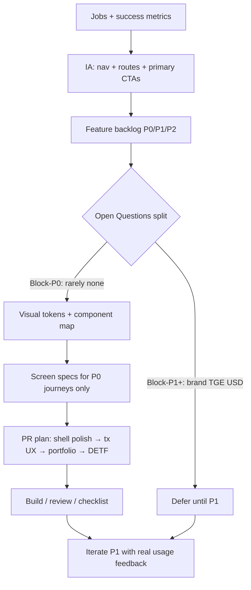
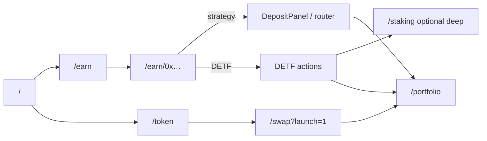
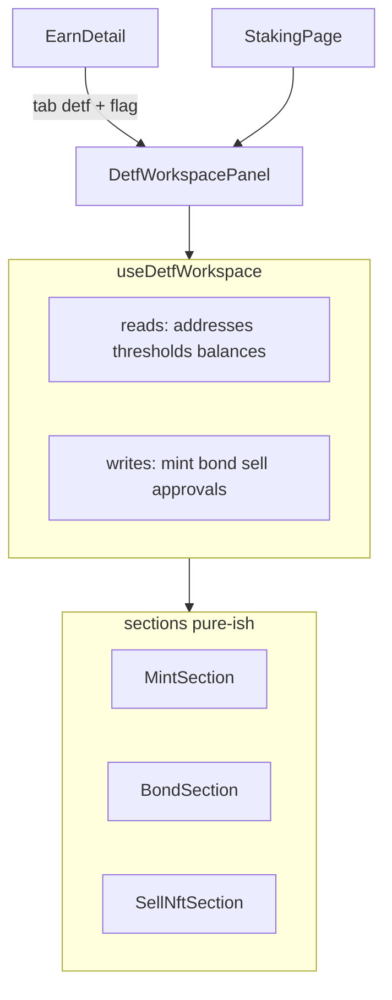

# Frontend Redesign Design Document — IndexedEx / Pachira

| Field | Value |
|-------|--------|
| **Title** | Frontend Redesign for IndexedEx / Pachira DeFi Protocol |
| **Author** | Design (agent-assisted) — owner review required |
| **Date** | 2026-07-26 |
| **Status** | **Rev 10** — Wave 1 + 1.5 + Wave 2 + PR8 + **RiskBadge (partial PR9)** shipped |
| **Agent entry** | **[`ROADMAP.md`](./ROADMAP.md)** — cold-start status, next phase, **no-deploy**, do-not-reopen |
| **Wave 2 design** | [`WAVE2_FEE_DETF_DESIGN.md`](./WAVE2_FEE_DETF_DESIGN.md) — fee-accrual DETF narrative (**W2-PR1–PR4 done**) |
| **Owner status** | Prefer **ROADMAP** for “what’s done”; this doc remains product/architecture SoT. Residual: PR9 USD / brand lock / P2 metadata / Wave 3 / optional risk-* list tags. |
| **Workspace** | `/Users/cyotee/Development/projects-defi/daosys/lib/indexedex` |
| **Frontend root** | `frontend/` |
| **Prior plan** | `frontend/REDESIGN_PLAN.md` (core funnel marked implemented; verified against code below) |
| **Wave 1 execution** | [`WAVE1_IMPLEMENTATION_PLAN.md`](./WAVE1_IMPLEMENTATION_PLAN.md) — money path, DETF embed scaffold (**done**) |
| **Wave 1 UI polish** | [`WAVE1_UI_POLISH_IMPLEMENTATION_PLAN.md`](./WAVE1_UI_POLISH_IMPLEMENTATION_PLAN.md) — Portfolio / DETF / Swap chrome (**done**) |
| **Wave 1.5 (closed)** | [`WAVE1_5_ANVIL_AND_EMBED_PLAN.md`](./WAVE1_5_ANVIL_AND_EMBED_PLAN.md) — local verify + lab embed enable (**done**; no re-deploy) |
| **Stack** | Next.js 14 App Router, Tailwind v4 (`globals.css` `@theme`), wagmi v3 / viem, Permit2, list-driven menus |

---

### Agent resume

| | |
|--|--|
| **Where** | Wave 1 foundation + polish + Wave 1.5 + Wave 2 + PR8 + **RiskBadge** all **shipped** |
| **Next** | Residual only — see [`ROADMAP.md`](./ROADMAP.md): USD when source real, brand lock / P2-7, Wave 3 after Earn vs Lend, optional honest `risk-*` list tags |
| **Forbidden** | **Deploying**; re-implement Wave 1–2 / PR8 / RiskBadge inventing levels; invent USD/APY; DualLiquidity hero; fee DETFs back in Earn grid; enable embed in shared/prod without owner OK |

---

### Owner status (2026-07-26, rev 9)

| Item | Decision |
|------|----------|
| **Phase** | **Wave 1 + 1.5 + Wave 2 + PR8 + RiskBadge complete**. Residual PR9 USD / brand / P2 / Wave 3 only. |
| **No deploy** | Frontend product work **must not** deploy contracts or re-run local stack scripts; use existing RPC/artifacts or offline unit/static tests |
| **Brand / themes** | Keep **dual themes** (Pachira + IndexedEx) for now; brand lock deferred |
| **DETF product surface** | Fee-accrual DETF home = **`/staking`**. Earn embed **lab-proven**; shared/prod flag remains **off** |
| **Money path** | Deposit multi-leg + minOut shipped; **Swap multi-leg ActionCta (PR5) shipped**; Wave 1.5 deposit/bond smoke recorded |
| **Portfolio / visual dual-era** | **Shipped** — design-system Portfolio + `BondNftCard` + human decimals; **PR8 Share** on positions |
| **Wave 2** | Featured fee-detf list, Earn exclude, marketing CTAs, banner + redirect — **shipped** + e2e regression |

---

## Overview

IndexedEx (branded **Pachira** in UI: “Composed Indexed Liquidity”) already has a **working product funnel** in the frontend: shell + design tokens, landing conversion, unified **Earn** catalog/detail with strategy deposit via the Standard Exchange router, Token launch page, demoted power tools, and legacy redirects. What remains is **not a greenfield redesign** — it is a second wave that (1) raises wallet/tx UX to ethskills standards, (2) finishes visual consistency on lagging surfaces (Portfolio, Swap, Header, DETF workspace), (3) adds prioritized product functionality that uses **existing** contracts and tokenlists, and (4) cleans brand-era DETF copy (RICH/RICHIR) toward role-aware labels (list symbols primary) on user-facing surfaces.

This document answers the product owner’s process question first: **yes, define expected functionality and information architecture before pixels**, then visual system, then screen specs, then incremental PRs. It is concrete to this monorepo: file paths, components that already exist, and what is still missing.

**Rev 2** tightens implementable algorithms (minOut/preview), multi-leg Permit2 approvals in ActionCta, P0 screen-state matrices, PR7 embed architecture, USD policy exception, and PR acceptance criteria.

**Rev 3** corrects §5.2.1 to the real Swap recipe (**execute 10-tuple vs query 8-tuple** via `toPreviewArgs` / `simulateContract`) and mandates **split** approval handlers (`handleIssuePermit2Approval` / `handleIssueRouterApproval`) for sequential ActionCta legs.

**Rev 4** records owner decisions: design-discussion phase (no build yet); dual brand retained; DETF Earn embed prioritized (PR6→PR7 elevated after money-path Track A).

**Rev 5** status sync after Wave 1 execution: green-light assumed; PR1a–PR7 foundation + **PR5 Swap multi-leg ActionCta** marked implemented against code; remaining focus is residual polish (Header Admin 404, portfolio human decimals/visual, enable DETF embed after smoke) and Wave 2 design — not re-planning finished money-path primitives.

**Rev 6** UI polish sync (2026-07-25): Portfolio design-system restyle + `BondNftCard` + `formatBondAmount`; DETF workspace shell/sections semantic tokens + symbol/role titles; Swap preview→ActionCta hierarchy + Advanced collapsed default. See [`WAVE1_UI_POLISH_IMPLEMENTATION_PLAN.md`](./WAVE1_UI_POLISH_IMPLEMENTATION_PLAN.md).

**Rev 7** Wave 1.5 closed (2026-07-25): local money-path + lab embed enable recorded; `local_testing` address registry fix (TS+JS); **mandatory no-deploy** for frontend agents (ROADMAP). Shared/prod embed flag stays false. Next: Wave 2 fee-DETF design narrative only.

**Rev 8** Wave 2 design drafted (2026-07-25): [`WAVE2_FEE_DETF_DESIGN.md`](./WAVE2_FEE_DETF_DESIGN.md) — featured resolution (DETF-preferring), landing/Earn/Token narrative, honest fee disclaimer, W2-PR1–PR3. Implementation gated on owner sign-off.

**Rev 9** (2026-07-26): Wave 2 **implemented** (W2-PR1–PR4 + smoke/e2e). **PR8 SharePositionCard shipped** — `SharePositionCard.tsx`, `sanitizeShareFields.ts`, Portfolio Share actions, Token/LaunchBanner polish. Residual: PR9 USD/RiskBadge (gated), brand lock, P2-7 metadata, Wave 3 lending IA. Agent entry remains [`ROADMAP.md`](./ROADMAP.md).

**Rev 10** (2026-07-26): **RiskBadge (partial PR9)** — `riskFromTags.ts`, `RiskBadge.tsx`, tags preserved on `TokenListEntry`, Earn catalog/detail wire. Hide when untagged; no mass-tagging of production lists. Residual: USD (real source only), brand lock / P2-7, Wave 3, optional owner risk-* tags.

---

## 0. Process for a new-to-UI product owner

### 0.1 The short answer

**Do this order:**

1. **Jobs-to-be-done & outcomes** — who must succeed, and what “done” means (e.g. “first deposit in &lt; 3 minutes”).
2. **Functionality & information architecture (IA)** — routes, primary actions, what is in/out of scope.
3. **Feature backlog P0/P1/P2** — with defaults from Key Decisions so P0 can ship without answering every Open Question.
4. **Visual system** — color, type, components (tokens + primitives). *Shell polish does not wait on brand/TGE answers.*
5. **Screen specs** — P0 state matrices (§2.5) for money paths.
6. **Build in thin PRs** — mergeable slices; measure with checklist + e2e smoke.

**Why function/IA before pixels when both will change:** pixels without IA produce pretty dead-ends (this repo already fixed that once: toolbox nav → Earn-first). Changing layout again without locking journeys reopens the same trap. Visual work on top of a stable IA is cheap; redoing IA after every color pass is expensive.

### 0.2 Recommended owner sequence (non-designer PM)



| Step | Owner does | Engineer does | Avoid |
|------|------------|---------------|--------|
| 1. Outcomes | Rank user jobs: deposit, swap, bond, portfolio | Map jobs → existing contracts | Inventing new vault math in UI |
| 2. IA | Approve nav labels and “More” demotions | Keep list-driven catalogs | Equal-weight power tools in primary nav |
| 3. Backlog | Accept P0/P1/P2 and defer list | Estimate PR slices | “Redesign everything at once” |
| 4. Visual | Pick accent/brand when ready; **P0 uses existing dual brand** | Tokens + primitives only | Blocking shell on brand lock |
| 5. Screens | Review P0 copy matrices (§2.5) | Wire multi-leg ActionCta | Joke copy on confirm/lock |
| 6. Ship | Run MANUAL checklist on testnet | Playwright + vitest | Silent APY / fake USD |

**Open Questions gating (see § Open Questions):**

| Bucket | Blocks | Examples |
|--------|--------|----------|
| **Block-P0** | Almost nothing for PR1–6 | Optional: mobile 375px priority if PR3 calendar is tight — default **desktop-first + usable 375px Earn filters** |
| **Block-P1+** | PR7–9 expansion / production | Brand lock, TGE path, USD source, staking link permanence |

P0 ships under **Key Decision defaults** without waiting for all 12 owner answers.

### 0.3 “Define expected functionality first?”

**Yes — with a refinement:** define **user outcomes and routes**, not every button microcopy. For this product the P0 functionality is already partially live:

| Outcome | Status (verified in code, rev 6) |
|---------|---------------------------|
| Browse products without wallet | **Shipped** — `/earn` catalog without connect |
| Connect → Earn → strategy deposit | **Shipped** — `DepositPanel` multi-leg + preview minOut + wrong-network |
| Swap | **Shipped** — multi-leg ActionCta + density polish (form inputs may still be dual-era) |
| DETF mint/bond/sell | **Scaffold + chrome + lab embed proven** — `/staking` + Earn embed behind flag (shared default off) |
| Portfolio positions + bond NFTs | **Shipped** — design system + `BondNftCard` + human decimals |
| Launch token → Earn handoff | Scaffold — `/token` + `?launch=1` |
| Trust (fees, contracts, risks) | Partial — AddressLink + risk bullets; **static fee disclaimer only**; no USD |

**Next (rev 9):** Wave 2 + PR8 **shipped**. Residual PR9 / brand lock / P2 metadata / Wave 3 only — see [`ROADMAP.md`](./ROADMAP.md). Do not re-litigate Wave 1–2 or PR8; **do not deploy**.

---

## Background & Motivation

### Current state (code inventory, July 2026)

#### Routes

| Route | Implementation | Redesign fate / status |
|-------|----------------|------------------------|
| `/` | Conversion landing (`frontend/apps/indexedex/app/page.tsx`) — DETF first screen, three steps, Protocol DETF fees card, Learn, disclaimers | **Shipped** (compact 2026-08-21) |
| `/earn` | Catalog: preferred tokenlists + vault registry search (`EarnPageClient.tsx`) | **Shipped** |
| `/earn/[address]` | Detail tabs + `DepositPanel` (strategy); DETF → staking link | **Shipped scaffold**; DETF incomplete |
| `/swap` | Full SE router + Permit2 (`swap/page.tsx`) | Logic + **multi-leg ActionCta (PR5) shipped**; residual chrome polish optional |
| `/portfolio` | Balances + bond NFT discovery/actions (~1.2k lines) | Logic shipped; **not on design system** |
| `/token` | Launch status + buy CTA | **Shipped scaffold** |
| `/staking` | DETF workspace (mint/bond/sell sections) | **Still primary DETF UI** — keep until embed (deviation from REDESIGN_PLAN redirect) |
| `/vaults`, `/detf`, `/detfs` | `redirect` → `/earn?...` | **Shipped** |
| `/seigniorage` | `redirect` → `/detfs` (double hop to Earn) | Works; **should redirect direct to Earn** |
| `/batch-swap`, `/create`, `/mint`, `/token-info`, `/insights` | Power / lab | Demoted under **More** |
| `/admin` | Linked from Header More | **Confirmed 404** — no `app/admin` route; **remove or lab-gate in PR3** |

#### Shell & design system (exists under `frontend/app/components/`)

**Shipped UI primitives** (`components/ui/`):

- `AppShell`, `Button`, `Card`, `Badge`, `PageHeader`, `Stat`, `Tabs`/`TabPanel`, `EmptyState`, `TxSteps`, `AddressLink`, `LaunchBanner`

**Shipped Earn components** (`components/earn/`):

- `DepositPanel`, `EarnFilters`, `ProductTypeBadge`, `DetfLifecycleStepper`

**Layout:**

- `Header.tsx` — primary nav Earn · Swap · Portfolio · Token + More; complex chain/wallet logic **must not be rewritten carelessly**
- `Footer.tsx` — brand tagline, docs/audit links
- `layout.tsx` — Inter + JetBrains Mono, LaunchBanner, Header, AppShell, Footer

**Tokens** (`globals.css`):

- Semantic: `--surface-0/1/2`, `--text-primary/muted`, `--accent`, `--border-subtle/accent`, `--danger`
- Themes: `data-theme="pachira"` (lime `#4FD44B`) and `data-theme="indexedex"` (blue `#3b82f6`)
- Residual `!important` theme remaps for legacy gray/green utilities remain

**List / deploy model (preserve — indexedex-ui-refactor constraint):**

- Environments in code: `sepolia` | `public_sepolia` | `supersim_sepolia` | `local_testing` via `addresses/`, `addressArtifacts.ts`, `deploymentEnvironment.tsx`  
  *(Skill doc that lists only `sepolia | supersim_sepolia` is narrower than code — prefer code.)*
- Wagmi transports in `providers.tsx` (local RPC for supersim/local_testing)
- Menu/list: `menuConfig.ts` + `tokenlists.ts` + earn menus `earn-strategy-vaults` / `earn-protocol-detfs` / `earn-seigniorage-detfs`
- Earn assembly: `lib/earn/loadEarnProducts.ts`, `assembleEarnProducts.ts`, registry via `useVaultRegistrySearch`

#### Pain points still true

1. **Dual UI eras** — Earn/Token/landing use semantic tokens; Portfolio/Swap/Header/Staking still largely raw Tailwind gray/slate.
2. **DETF is a second app** — Earn detail deep-links to `/staking`; brand-era **RICH/RICHIR** copy remains in stepper and staking sections while contracts already use `pairToken` / `rebasingClaimToken` in places.
3. **Wallet action UX incomplete vs ethskills-frontend-ux** — no consistent multi-leg ActionCta; shared `isPending` risks; limited human error translation outside Swap Permit2 path; **no USD** (acceptable on testnet — see K13).
4. **Deposit honesty gaps** — strategy deposit uses `minOut = BigInt(0)` with **no preview**; **static fee disclaimer only** (no numeric protocol fee read); connect is passive text; **no wrong-network gate**; asset `<select>` shows **raw addresses**.
5. **Trust depth** — APY always “—”; AddressLink lacks copy; portfolio pending rewards / shares often via `.toString()` raw base units.
6. **Header density** — chain switch + brand + wallet correct functionally but visually heavy; **Admin More-link 404**.
7. **Environment is compile-time only** — `DeploymentEnvironmentToggle` is **unmounted dead code** (`deploymentEnvironment.tsx` definition only). `providers.tsx` sets environment from `NEXT_PUBLIC_DEFAULT_DEPLOYMENT_ENVIRONMENT` and `setEnvironment` is a no-op. **Restoring interactive env switch is out of scope** unless explicitly scheduled (would conflict with current providers design). Skill docs that imply a live toggle are outdated relative to code.

### Motivation

- Product owner wants **both** more functionality **and** better look/layout, but is new to UI process.
- Core funnel PRs from `REDESIGN_PLAN.md` largely landed; without a Phase-2 plan, work will thrash between cosmetics and unfinished money paths.
- Protocol contracts are the source of truth — frontend redesign must **not** invent seigniorage math or fake APY/USD.

---

## Goals & Non-Goals

### Goals

| ID | Goal |
|----|------|
| G1 | Document a **PM-friendly process** so functionality/IA decisions precede pixel decisions. |
| G2 | Complete a **coherent product surface**: visitor → connect → deposit; swap; DETF bond/claim; portfolio home. |
| G3 | Enforce **ethskills-frontend-ux** on money paths for: four-state (incl. multi-leg approve) + per-action pending/cooldown, addresses, human decimals, error translation. **USD is mandatory only when a price source is configured** (K13); otherwise hide USD, do not fake. |
| G4 | Finish **visual unification** onto semantic tokens + `components/ui/*` for Portfolio, Swap chrome, Header, Staking. |
| G5 | DETF UX: list/ERC20 **symbol primary**, role helper secondary; never RICH/RICHIR on Earn surfaces. |
| G6 | Incremental, reviewable PRs that preserve env model, tokenlists, CREATE3-era address artifacts. |
| G7 | Prioritized backlog of **net-new UX/orchestration** features that only use existing contracts. |

### Non-Goals

- Smart-contract changes, new DFPkgs, new DETF families, indexer/subgraph (unless later phase).
- Full mobile native app.
- Replacing wagmi/Permit2 architecture.
- Hard-coded product registries that bypass tokenlists.
- Inventing APY/TVL/USD when not readable on-chain or from a real data feed.
- Forcing a single brand identity without owner decision (dual brand already exists).
- Restoring interactive deployment-environment toggle (dead code; out of scope).

---

## Proposed Design

### 1. Target information architecture

Primary nav (keep — already correct):

```
[Logo]  Earn  ·  Swap  ·  Portfolio  ·  Token     [Network] [Connect]
                                              More ▾
```

| Item | Path | Role |
|------|------|------|
| Logo | `/` | Landing / manifesto |
| Earn | `/earn` | **Default product surface** — vaults + DETFs |
| Swap | `/swap` | Exchange / launch buy |
| Portfolio | `/portfolio` | Post-deposit home |
| Token | `/token` | Launch / utility story |
| More | dropdown | Batch Swap, Create, Insights, DETF workspace (`/staking` until embed), Mint, Token Info; **no Admin until page exists**; Brand (if unlocked) |



**URL-reflected state (Vercel / a11y guidelines):**

- `/earn?type=strategy|protocol-detf|seigniorage-detf|detf&q=`
- `/earn/[address]?tab=overview|composition|risks|activity|detf`
- `/swap?launch=1&tokenOut=0x…`
- `/staking?detf=0x…` (preserve; remains full workspace)

### 2. Primary user journeys

#### J1 — Visitor → connect → first deposit (P0)

1. `/` shows value without wallet; catalog stats from tokenlists.
2. **Connect & Earn** or browse `/earn` disconnected.
3. Open strategy product → connect if needed → multi-leg CTA: Connect | Switch network | Approve token | Approve Permit2 | Deposit.
4. Preview + minOut required before Deposit enabled (see §5.2.1).
5. Success: “Position live.” + link Portfolio + explorer tx.

#### J2 — Swap (P0 polish)

1. Optional launch defaults from query.
2. Same multi-leg pattern; Permit2 explicit/signed modes already exist — **present** with per-button pending, not shared loaders.
3. Human-readable amounts; USD only if price source configured.

#### J3 — DETF bond / claim (P0 product clarity, P1 full embed)

1. Earn detail for `protocol-detf` / `seigniorage-detf` shows lifecycle stepper with **symbols + role helpers**.
2. Phase A: polished deep-link to `/staking?detf=`.
3. Phase B (flagged): extract workspace container into Earn tab; `/staking` keeps same container full-page.

#### J4 — Portfolio home (P0 polish)

1. Summary: # positions, # bond NFTs; USD total only if priced.
2. Positions → Manage `/earn/[address]`.
3. Bond cards: unlock countdown, claim/unlock with **per-action** pending keys (already partially there via `actionKeyPending`).
4. Empty → Earn CTA with light culture line.

### 2.5 P0 screen-state specifications

Textual state matrices (implementable; no Figma required). Money-path copy is **institutional**.

#### 2.5.1 Strategy DepositPanel (`/earn/[address]`, productType = strategy)

**Component tree:**

```
Card
  ModeToggle [Deposit | Withdraw]
  AmountField (symbol, balance, Max)
  AssetSelect (symbol primary; address mono subtitle)
  PreviewRow (expected out | min out | slippage control)
  FeeNote (static disclaimer — see §5.2.2)
  TxSteps (Approve token → Approve Permit2 → Deposit)
  ActionCta (single primary from WalletGate)
  StatusLine (error | success + explorer + Portfolio link)
```

| State | Primary CTA | Secondary | Body / helper copy |
|-------|-------------|-----------|-------------------|
| Disconnected | **Connect wallet** | — | Catalog/detail still visible; “Connect to deposit.” |
| Wrong network | **Switch network to {label}** | — | “App network is {selected}. Wallet is on {wallet}.” Disable approve/execute. |
| Connected, amount empty | **Deposit** disabled | Max | Balance line via `formatUnits`. |
| Preview pending | disabled “Quoting…” | — | Spinner on preview row only (not whole page). |
| Preview error | disabled | “Open in Swap” link | “Quote unavailable. Use Swap for this route, or retry.” |
| Needs ERC20→Permit2 | **Approve {symbol}** | — | Never show Deposit yet. |
| Needs Permit2→Router | **Approve Permit2** | — | After token approve confirms + cooldown. |
| Ready | **Deposit** | Slippage gear | Shows min out. |
| Pending approve/deposit | **{Approving…\|Depositing…}** disabled | — | Hold until **receipt** + allowance refetch cooldown for approves. |
| Error | re-enable gate | — | Inline `parseContractError`; near CTA. |
| Success | **Deposit** idle | Portfolio · Explorer | “Position live.” |

**Data deps:** `useAccount`, `useSelectedNetwork` / wallet chain, `getAddressArtifacts` (router, permit2), vault `tokens`/`vaultTokens`, ERC20 symbol/decimals/balance, router preview via `simulateContract` + `querySwapSingleTokenExactIn` (**8-tuple**, see §5.2.1), `useApprovalFlow` **split** handlers, `writeContractAsync` `swapSingleTokenExactIn` (**10-tuple**).

**Acceptance:** disconnected user sees catalog; deposit never enables with `minOut = 0` after PR2; wrong network cannot approve.

#### 2.5.2 Swap primary CTA strip (`/swap`)

| State | Primary CTA | Notes |
|-------|-------------|-------|
| Disconnected | Connect wallet | Form browsable |
| Wrong network | Switch network | Match Header resolution |
| Needs approvals | Approve {token} / Approve Permit2 | Sequential; no side-by-side Swap |
| Ready | Swap | Own pending until receipt |
| Pending | Swapping… | |
| Error | Inline translated error | Preserve Permit2 InsufficientAllowance mapping |
| Success | Reset form + explorer | |

Reuse existing preview/`minOut` memos in `swap/page.tsx`; restyle chrome only in PR5.

#### 2.5.3 Portfolio (`/portfolio`)

| State | Layout | Copy |
|-------|--------|------|
| Disconnected | EmptyState | “Connect to see positions.” CTA Connect |
| Connected, loading | Skeleton / “Loading balances…” | No fake zeros as final |
| Connected, empty | EmptyState | “No positions yet. The index is empty — you can fix that.” CTA → Earn |
| Has balances | Summary Stats + table/cards | Manage → `/earn/[address]` |
| Has bonds | BondNftCard grid | Unlock countdown; per-action Claim/Unlock pending |
| Error subset | Inline errors list | Existing pattern; capped list |

**Format:** every bigint amount via `formatUnits(amount, decimals)` — balances, pending rewards, shares awarded (not `.toString()` raw).

#### 2.5.4 Header mobile (≤375px)

| Element | Spec |
|---------|------|
| Primary nav | Wrap or collapse non-active into More; Earn always visible |
| Network select | Compact; label “App network” |
| Connect | Button sm; address truncated |
| More | `aria-expanded`; Esc/click-out close |
| Admin | **Absent** (PR3) |

#### 2.5.5 DETF Earn detail (pre-embed)

| Element | Spec |
|---------|------|
| Stepper | Mint → Bond NFT → Sell to protocol → Claim token / redeem |
| Primary action | “Open mint / bond / sell workspace” → `/staking?detf={address}` |
| DepositPanel | Replaced by DETF card (no strategy deposit) |
| Labels | Symbol primary; “pair token” / “claim token” helper |

---

### 3. Net-new / remaining functionality backlog

Features that **do not** require new contracts unless noted.

#### P0 — Must ship for “redesign complete” claim

| ID | Item | Notes |
|----|------|-------|
| P0-1 | **Multi-leg ActionCta** | connect → switch → approve steps[] → execute; per-leg pending + cooldown |
| P0-2 | **Portfolio design-system restyle** | Cards/Stats/EmptyState; keep discovery logic |
| P0-3 | **Header chrome restyle** | Use Button/select tokens; remove Admin 404; no switch-logic rewrite |
| P0-4 | **Swap surface restyle** | Card shell around existing form; collapse debug |
| P0-5 | **DETF copy policy** | Symbols primary; role helpers; no RICH/RICHIR on Earn |
| P0-6 | **Deposit minOut via preview algorithm** | §5.2.1 — not bare slippage % on amountIn |
| P0-7 | **AddressLink upgrade** | Copy + explorer |
| P0-8 | **Human decimals everywhere** | Portfolio rewards, shares awarded, all bigint displays |
| P0-9 | **Deposit asset symbols** | Resolve ERC20/tokenlist symbol in asset select (not raw address only) |
| P0-10 | **Wrong-network gate on DepositPanel** | Align wallet chain with app `selectedChainId` before approve/execute |
| P0-11 | **`parseContractError` helper** | Ships in **PR1b** (not P1) — use on Deposit/Portfolio/Swap |
| P0-12 | **Seigniorage redirect fix** | Ships in **PR6**: `/seigniorage` → `/earn?type=seigniorage-detf` (single hop) |

#### P1 — High value next

| ID | Item | Notes |
|----|------|-------|
| P1-1 | Embed DETF mint/bond/sell in Earn detail | **Owner priority (K19)** — PR6→PR7 ASAP after Track A; architecture §5.6; flag default off until e2e |
| P1-2 | BondNftCard + summary bar | Extract from portfolio markup |
| P1-3 | SharePositionCard (DOM/canvas) | **Shipped PR8** — sanitized only — § Security |
| P1-4 | USD context layer | Only with real source; default `none` |
| P1-5 | ~~Error translation helper~~ | **Moved → P0-11 / PR1b** — do not re-implement as a separate P1 ticket |
| P1-6 | Active nav + mobile drawer | Header overflow on 375px |
| P1-7 | ~~Seigniorage redirect~~ | **Moved → P0-12 / PR6** — do not schedule as separate P1 work |
| P1-8 | RiskBadge + risk copy matrix | Manual tags / tokenlist tags |
| P1-9 | Performance tab stub → real share price | Only if on-chain cheap or indexer later |

#### P2 — Later / optional

| ID | Item | Dependency |
|----|------|------------|
| P2-1 | Live TVL aggregation | Multi-call totalAssets |
| P2-2 | Activity feed | Event logs or indexer |
| P2-3 | Modal/Drawer deposit | Optional mobile pattern |
| P2-4 | Light theme | Owner call |
| P2-5 | Claim redeem orchestration UX polish | Existing paths |
| P2-6 | Soft post-connect redirect to `/earn` | Owner preference |
| P2-7 | Pre-publish metadata | Absolute OG image, favicon, titles when brand-locked production |

**Out of scope / contract dependency:** new claim contracts, mainnet TGE mechanics, governance UI, multi-chain production beyond artifact chains.

---

### 4. Visual / layout system

#### 4.1 Principles

1. **Proof-first** — numbers, chain, contracts before personality.
2. **One primary CTA** per view (ActionCta advances legs sequentially).
3. **Progressive disclosure** — catalog → detail tabs → advanced/DETF.
4. **80/20 tone** — institutional on money paths; culture only on landing empty/success/share (not on claim/confirm buttons).
5. **Semantic tokens only** on new/restyled surfaces; peel `!important` as files are touched.
6. **Distinctive but disciplined** — dual brand (Pachira lime vs IndexedEx blue) is intentional identity.

#### 4.2 Tokens (already in `globals.css` — freeze as API)

| Token | Role | Pachira | IndexedEx |
|-------|------|---------|-----------|
| `--surface-0` | Page | `#0a0a0a` | `#070b14` |
| `--surface-1` | Card | `#14171f` | `#0f1729` |
| `--surface-2` | Input | `#1c2030` | `#152238` |
| `--text-primary` | Body | `#EDEDED` | `#e8eef8` |
| `--text-muted` | Secondary | `#9aa3b2` | `#8b9bb8` |
| `--accent` | CTA | `#4FD44B` | `#3b82f6` |
| `--danger` | Errors | `#E6386A` | `#f87171` |

**Theme policy:** body text stays near-white; accent for CTAs, positive states, focus rings only. Wave background opacity ≤ 0.35–0.55; honor `prefers-reduced-motion` (already present).

#### 4.3 Typography

| Use | Guidance |
|-----|----------|
| Page title | `text-2xl md:text-3xl font-semibold tracking-tight` |
| Metrics | `font-mono tabular-nums` (JetBrains via `--font-mono`) |
| Addresses | `font-mono text-xs text-muted` |
| Culture | `text-sm text-muted` only below fold / empty |

#### 4.4 Component map (introduce / finish)

| Component | Path | Status | Action |
|-----------|------|--------|--------|
| Button, Card, … | `components/ui/*` | Shipped | Extend with `loading` labels |
| **ActionCta** | `components/ui/ActionCta.tsx` | **New** | Multi-leg wallet CTA |
| **AmountField** | `components/ui/AmountField.tsx` | **New** | Balance, Max, mono, optional USD |
| **AddressDisplay** | extend `AddressLink` | Partial | + copy |
| BondNftCard | `components/earn/BondNftCard.tsx` | **New** | Extract portfolio |
| SharePositionCard | `components/earn/SharePositionCard.tsx` | **Shipped (PR8)** | Sanitized only; Portfolio wired |
| DetfWorkspace | `components/earn/detf/*` | **New** | §5.6 |
| RiskBadge | `components/earn/RiskBadge.tsx` | **Shipped (partial PR9)** | Tags only; hide if none |
| Modal/Drawer | `components/ui/Modal.tsx` | **New** | P2 — not P0 |
| DataTable | optional | Earn uses native table | Not P0 |

#### 4.5 Shell layout

Keep `layout.tsx` structure. Restyle Header internals to token surfaces without changing switch/connect algorithms.

---

### 5. Technical architecture

#### 5.1 Data flow (list-driven)

```mermaid
flowchart TB
  subgraph artifacts [Address artifacts]
    ENV[DeploymentEnvironment env default]
    TL[Tokenlists JSON]
    PLAT[platform deployments]
  end
  subgraph loaders [Loaders]
    LEP[loadEarnProductsForChain]
    MENU[selectFromMenu / menuConfig]
    REG[useVaultRegistrySearch]
  end
  subgraph pages [Pages]
    EARN[/earn]
    DET[/earn/address]
    SWAP[/swap]
    PORT[/portfolio]
  end
  ENV --> LEP
  TL --> LEP
  TL --> MENU
  PLAT --> SWAP
  PLAT --> DET
  LEP --> EARN
  LEP --> DET
  REG --> EARN
  MENU --> SWAP
  TL --> PORT
  DET --> DepositPanel
  DepositPanel --> Router[SE Router query + swap + Permit2]
```

**Rules:**

- Never hard-code vault tables; always filter tokenlists for `selectedChainId` + `environment`.
- Platform addresses only via `getAddressArtifacts(chainId, environment)`.
- Featured products: `NEXT_PUBLIC_FEATURED_EARN_ADDRESSES` ∩ catalog.
- Environment is **env-var default only** in current providers (no live toggle).

#### 5.2 Shared deposit / tx primitive

Current: `DepositPanel` + `useApprovalFlow` + `buildVaultSwapArgs` + `swapExactInAbi.swapSingleTokenExactIn` with **`minOut = 0`**.

##### 5.2.1 P0-6 — minOut / preview algorithm (implementable)

Strategy deposit is **not 1:1** (underlying in → vault shares out). A bare “0.5% of amountIn” is **wrong** and must not ship as minOut.

**Critical ABI fact (do not get this wrong):**

| Call | Function | Arity / shape | Source |
|------|----------|---------------|--------|
| **Execute** | `swapSingleTokenExactIn` | **10-tuple**: `pool, tokenIn, tokenInVault, tokenOut, tokenOutVault, exactAmountIn, minAmountOut, deadline, wethIsEth, userData` | `buildStrategyVaultDepositArgs` / `buildStrategyVaultWithdrawArgs` (`lib/earn/buildVaultSwapArgs.ts`) |
| **Query** | `querySwapSingleTokenExactIn` | **8-tuple**: `pool, tokenIn, tokenInVault, tokenOut, tokenOutVault, exactAmountIn, sender, userData` | Query facet ABI; Swap builds this via exact-in builder then `toPreviewArgs` |

**Never** spread execute 10-tuple args into `querySwapSingleTokenExactIn` — that mis-binds `minAmountOut` as `sender` and will fail typecheck / produce garbage.

**Chosen algorithm (copy Swap’s real recipe, not invent a third builder):**

```text
1. Derive deposit (or withdraw) route fields from the same field layout as
   buildStrategyVaultDepositArgs / Withdraw:
     deposit: pool=vault, tokenIn=asset, tokenInVault=vault, tokenOut=vault,
              tokenOutVault=0, amountIn
     withdraw: pool=vault, tokenIn=vault, tokenInVault=0, tokenOut=asset,
               tokenOutVault=vault, amountIn

2. Build QUERY 8-tuple (not execute args):
     queryArgs = [
       pool, tokenIn, tokenInVault, tokenOut, tokenOutVault,
       amountIn,
       ZERO_ADDR,   // sender forced for query — see Swap toPreviewArgs
       userData,    // usually '0x'
     ]
   Prefer a shared helper e.g. toVaultDepositQueryArgs(fields) or extract/reuse
   Swap’s toPreviewArgs pattern after building a query-shaped intermediate.
   Do NOT pass minAmountOut, deadline, or wethIsEth into the query.

3. Preview via simulateContract (query is nonpayable — not plain readContract):
     const { result: previewOut } = await publicClient.simulateContract({
       address: routerAddress,
       abi: balancerV3StandardExchangeRouterExactInQueryFacetAbi,
       functionName: 'querySwapSingleTokenExactIn',
       args: queryArgs,       // 8-tuple
       account: ZERO_ADDR,    // match Swap simulateQueryExactIn
     })
   Cite: frontend/app/swap/page.tsx simulateQueryExactIn + toPreviewArgs.

4. minOut = computeMinAmountOut(previewOut, slippagePercent)
   // same bps math as MintChirSection.computeMinAmountOut
   // default slippagePercent = 0.5 (user-editable, clamp e.g. 0–5)

5. Execute with 10-tuple only:
     executeArgs = buildStrategyVaultDepositArgs({
       vault, tokenIn, amountIn, minAmountOut: minOut, deadline, ...
     })
     writeContractAsync({
       address: routerAddress,
       abi: swapExactInAbi, // or execute facet
       functionName: 'swapSingleTokenExactIn',
       args: executeArgs,
     })
```

**Optional P0 hardening (recommended for vault routes):** Swap documents that pure `querySwapSingleTokenExactIn` may **skip Standard Exchange vault hooks** that the real swap path runs. After approvals are ready and wallet is connected, optionally re-preview with Swap’s `simulateActualSwapExactIn` pattern: `simulateContract` of `swapSingleTokenExactIn` using execute-shaped args with `minAmountOut = 0n` for the sim only, then recompute minOut from that result. If actual-sim fails after query succeeded, apply the same block + “Continue via Swap” policy (do not invent a floor).

**Shared helpers (thin, extract from Swap where possible):**

```ts
// lib/earn/computeMinAmountOut.ts
export function computeMinAmountOut(amountOut: bigint | undefined, slippagePercent: number): bigint | undefined {
  if (amountOut === undefined) return undefined
  const bps = BigInt(Math.max(0, Math.min(10000, Math.floor(slippagePercent * 100))))
  return (amountOut * (BigInt(10000) - bps)) / BigInt(10000)
}

// lib/earn/toVaultSwapQueryArgs.ts  (or share with Swap)
// Returns 8-tuple for querySwapSingleTokenExactIn — never 10-tuple execute args.
export function toVaultDepositQueryArgs(fields: {
  vault: Address
  tokenIn: Address
  amountIn: bigint
  userData?: `0x${string}`
}): readonly [Address, Address, Address, Address, Address, bigint, Address, `0x${string}`] {
  const zero = '0x0000000000000000000000000000000000000000' as Address
  return [
    fields.vault,           // pool
    fields.tokenIn,
    fields.vault,           // tokenInVault (Strategy Vault Deposit)
    fields.vault,           // tokenOut = vault shares
    zero,                   // tokenOutVault
    fields.amountIn,
    zero,                   // sender = ZERO for query (toPreviewArgs)
    fields.userData ?? '0x',
  ] as const
}
```

**Gating policy (no invented minOut):**

| Condition | UI behavior |
|-----------|-------------|
| No router / no bytecode | Deposit disabled; “Router not available on this network.” |
| Amount empty / invalid | Deposit disabled |
| Query pending | “Quoting…”; Deposit disabled |
| Query fails | Deposit **disabled**; message + secondary **Continue via Swap** → `/swap` with pool/token defaults if feasible |
| Query succeeds | Show expected out + min out; enable ActionCta when approvals satisfied |
| Optional actual-sim fails | Same as query fails (block + Swap fallback) |
| User clears slippage to invalid | Treat as block |

**Interim forbidden:** shipping production narrative with silent `minOut = 0`. Testnet may still hit query failures — then **block execute**, do not invent floor.

**Withdraw path:** same 8-tuple query / 10-tuple execute split using withdraw field layout + `buildStrategyVaultWithdrawArgs` for execute only.

**Do not invent** an off-chain FX model or hardcoded share rate.

##### 5.2.2 Fee display policy

There is **no reliable numeric fee read** on DepositPanel today (static disclaimer only). P0 policy:

- Keep institutional disclaimer: “Protocol and venue fees may apply; amounts are not guarantees.”
- **Do not invent** fee bps. If later a vault/router view exposes fee, show it; until then disclaimer-only is honest.

##### 5.2.3 ActionCta composition with `useApprovalFlow` (split handlers only)

ActionCta **does not** replace `useApprovalFlow`. For sequential multi-leg UI it must call **one leg per click**.

**Code reality** (`lib/hooks/useApprovalFlow.ts`):

| API | What it does |
|-----|----------------|
| `handleIssuePermit2Approval` | **Only** ERC20 → Permit2 (`setTokenAllowance`) |
| `handleIssueRouterApproval` | **Only** Permit2 → Router (`setPermit2Allowance`) |
| `handleApproval` | **One-shot orchestrator** — in `explicit` mode runs **both** legs in a single invocation |

**Mandate (explicit mode — DepositPanel uses `effectiveApprovalMode: 'explicit'` today):**

| WalletGate | onClick | Forbidden |
|------------|---------|-----------|
| `approve` + `token-to-permit2` | `handleIssuePermit2Approval()` only | **Do not** call `handleApproval` |
| `approve` + `permit2-to-router` | `handleIssueRouterApproval()` only | **Do not** call `handleApproval` |
| `execute` | deposit/withdraw with minOut from §5.2.1 | — |

Combined `handleApproval` is **legacy single-button** only (paths being deleted from DepositPanel / not used by ActionCta). Displaying “Approve token” while `handleApproval` fires two txs violates ethskills per-action pending and §2.5.1.

**Signed mode (PR5 Swap):** when approval mode is `signed`, gate only shows token→Permit2 (`handleIssuePermit2Approval`); **omit** Permit2→Router leg (signature path covers router spend). Do not show a second Approve for Permit2 in signed mode.

```tsx
// Conceptual — sequential legs, split handlers
const gate = resolveWalletGate({
  isConnected,
  walletChainId,
  appChainId: selectedChainId,
  appChainLabel,
  needsTokenApproval: approval.needsTokenApproval,
  needsPermit2Approval:
    effectiveApprovalMode === 'explicit' && approval.needsPermit2Approval,
  tokenSymbol,
  previewReady: !!minOut && !previewError,
  executeLabel: mode === 'deposit' ? 'Deposit' : 'Withdraw',
  approvalSubmitting,
  executeSubmitting,
})

async function onActionCta() {
  switch (gate.kind) {
    case 'connect':
      return connect()
    case 'switch':
      return promptWalletSwitch(/* Header/Swap pattern */)
    case 'approve':
      if (gate.leg.id === 'token-to-permit2') {
        return approval.handleIssuePermit2Approval()
      }
      if (gate.leg.id === 'permit2-to-router') {
        return approval.handleIssueRouterApproval()
      }
      return
    case 'execute':
      return runDepositWithMinOut() // 10-tuple execute only
  }
}
// NEVER: gate.kind === 'approve' && approval.handleApproval()
```

#### 5.3 Wallet UX states (ethskills-frontend-ux) — multi-leg

| State | UI |
|-------|-----|
| Disconnected | Catalog visible; primary CTA = Connect (clickable) |
| Wrong network | Switch Network primary; **disable** approve/execute |
| Needs ERC20→Permit2 | **Approve {symbol}** → `handleIssuePermit2Approval` only |
| Needs Permit2→Router (explicit mode) | **Approve Permit2** → `handleIssueRouterApproval` only (after token leg receipt + cooldown) |
| Signed mode | Token approve only; no second Permit2→Router CTA |
| Ready | **Deposit / Swap / Claim** |
| Pending | Button disabled + action text until **receipt** |
| Approve cooldown | Keep disabled ~4s after confirm while allowance refetches (ethskills) |
| Error | Inline near control; translated |
| Success | Inline + Portfolio + explorer |

**Never** show Approve and Execute simultaneously. **Never** one shared `isLoading` across approve legs and execute. **Never** wire sequential ActionCta approve legs to one-shot `handleApproval`.

#### 5.4 DETF UX naming — display policy

| Layer | Rule |
|-------|------|
| **Primary label** | Tokenlist / ERC20 **symbol** (e.g. list symbol for claim token) |
| **Secondary / helper** | Role: “pair token”, “claim token”, “rate asset”, “vault share” |
| **Forbidden on Earn** | RICH, RICHIR, richToken, mintWithWeth as user chrome |
| **Debug / lab** | Role field names and raw addresses OK behind `NEXT_PUBLIC_SHOW_DEBUG` |

Technical fields may still read legacy JSON keys with fallbacks (`pairToken ?? richToken` in `tokenlists.ts`).

**Bad:** “Mint with rate asset” alone.  
**Good:** “Mint with WETH” + helper “rate asset for this DETF”.

#### 5.5 Constraints (do not break)

| File | Constraint |
|------|------------|
| `deploymentEnvironment.tsx` / `providers.tsx` | Env from env-var; **no live toggle restore** unless scheduled |
| `addressArtifacts.ts` / `addresses/` | Registry of deployments |
| `menuConfig.ts` | List-driven menus |
| Header chain switch | Complex MetaMask/Coinbase path — restyle only |
| Permit2 witness | Router canonical if used in signed flows |
| `useApprovalFlow` | Reuse; ActionCta composes, does not fork allowance math |

#### 5.6 DETF embed architecture (PR7 / Phase B)

**Problem:** Blind re-export of `staking/sections/*` into Earn reintroduces dual-era chrome and splits write handlers that live in `StakingPageClient`.

**Design:**



| Piece | Responsibility |
|-------|----------------|
| `useDetfWorkspace(detfAddress, chainId)` | All contract reads/writes, approval state, selected DETF injection from props **or** `?detf=` |
| `DetfWorkspacePanel` | Layout chrome using Earn design system (Card/Button); mounts Mint/Bond/Sell only in v1 |
| Section components | Presentational + callbacks; migrate off brand-era labels |
| `StakingPageClient` | Full-page shell: selector + `DetfWorkspacePanel` + optional PriceInfo; **no** duplicate write paths |
| Earn detail | If `NEXT_PUBLIC_EARN_DETF_EMBED=true` and product is DETF, show tab `detf` with panel; else deep-link button |

**v1 embed scope:** Mint + Bond + Sell only.  
**Out of v1 embed:** StakingDebugPanel, full PriceInfo density (link to workspace), Burn section if not essential.

**Feature flag:** `NEXT_PUBLIC_EARN_DETF_EMBED=false` default. Enable after Playwright mint/bond smoke on supersim.

**Deep links:** `/staking?detf=0x…` remains valid forever for power users / More menu.

#### 5.7 Performance (vercel-react-best-practices)

- Keep heavy swap logic client-only; avoid re-creating ABIs/helpers in render.
- Prefer `useMemo` for catalog assembly; debounce Earn search if it triggers registry queries.
- Deposit preview: debounce query like Swap (`previewDebounceTimerRef` pattern).
- Split Portfolio into presentational components to reduce re-renders when claiming one NFT.

#### 5.8 Accessibility & web guidelines

- Focus-visible rings on Button (exists).
- `aria-expanded` on More (exists); add keyboard dismiss.
- Forms: labels on amount/asset selects.
- URL state for filters/tabs.
- Reduced motion respected for wave.

---

## API / Interface Changes

No smart-contract API changes. Frontend-only interfaces:

### WalletGate / ActionCta (multi-leg)

```ts
// lib/tx/actionState.ts
export type ApprovalLeg =
  | { id: 'token-to-permit2'; label: string }      // e.g. "Approve WETH"
  | { id: 'permit2-to-router'; label: string }     // "Approve Permit2"

export type WalletGate =
  | { kind: 'connect' }
  | { kind: 'switch'; chainId: number; label: string }
  | { kind: 'approve'; leg: ApprovalLeg; pending?: boolean }
  | { kind: 'execute'; label: string; pending?: boolean }
  | { kind: 'pending'; label: string }             // generic hold
  | { kind: 'disabled'; reason: string }

export function resolveWalletGate(input: {
  isConnected: boolean
  walletChainId?: number
  appChainId: number
  appChainLabel: string
  needsTokenApproval: boolean
  needsPermit2Approval: boolean
  tokenSymbol?: string
  previewReady: boolean
  previewError?: string | null
  executeLabel: string
  // ethskills: submitting flags that cover wallet→receipt gap
  approvalSubmitting?: boolean
  executeSubmitting?: boolean
}): WalletGate
```

```ts
// lib/tx/parseContractError.ts
export function parseContractError(err: unknown): string

// lib/earn/computeMinAmountOut.ts — see §5.2.1
```

```ts
// AmountField
export type AmountFieldProps = {
  value: string
  onChange: (v: string) => void
  balance?: bigint
  decimals: number
  symbol?: string
  usdApprox?: string | null  // null/undefined = hide (K13)
  onMax?: () => void
}
```

### Env flags

```bash
NEXT_PUBLIC_SHOW_DEBUG=false
NEXT_PUBLIC_SHOW_LAUNCH_BANNER=false
NEXT_PUBLIC_LAUNCH_TOKEN_ADDRESS=
NEXT_PUBLIC_FEATURED_EARN_ADDRESSES=
NEXT_PUBLIC_DOCS_URL=
NEXT_PUBLIC_AUDIT_URL=
NEXT_PUBLIC_DEFAULT_DEPLOYMENT_ENVIRONMENT=supersim_sepolia
NEXT_PUBLIC_DEFAULT_BRAND=pachira
NEXT_PUBLIC_BRAND_LOCKED=false
NEXT_PUBLIC_EARN_DETF_EMBED=false
# optional later
NEXT_PUBLIC_USD_PRICE_SOURCE=none
```

### Redirect fix

```ts
// seigniorage/page.tsx — target
redirect('/earn?type=seigniorage-detf')
```

---

## Data Model Changes

No DB. Frontend models:

| Model | Location | Change |
|-------|----------|--------|
| `EarnProduct` | `lib/earn/types.ts` | Optional later: `risk?`, `tags?` |
| Portfolio `BondPosition` | extract `lib/portfolio/types.ts` | For BondNftCard |
| Featured list | env ∩ catalog | Unchanged |

**Migration:** none. Tokenlist pipelines unchanged.

---

## Alternatives Considered

### A1 — Greenfield redesign (new app shell, rewrite Swap/Portfolio)

| Pros | Cons |
|------|------|
| Cleanest visual | High regression risk on Permit2/swap routes |
| | Weeks without shippable value |

**Reject** for now.

### A2 — Design-system-only pass (no new functionality)

| Pros | Cons |
|------|------|
| Fast visual win | Leaves DETF/portfolio UX gaps |

**Partial accept:** PR3 chrome; money-path UX still required.

### A3 — Embed all DETF flows in Earn before visual polish

| Pros | Cons |
|------|------|
| Product completeness | Large PR; fragile |

**Sequence:** copy + deep-link first; embed after ActionCta + flag.

### A4 — Build custom indexer for APY/TVL before UX polish

**Defer** to P2; show honest “—”.

### A5 — Thin cut: money-path UX only; defer Portfolio/Swap visual

| Pros | Cons |
|------|------|
| Smallest calendar if bandwidth is tiny | Dual UI eras persist longer |

**Accept as schedule contingency (updated for K19):** If calendar slips after money-path P0, **prefer PR6→PR7 (Earn DETF embed)** over PR4 Portfolio visual / PR5 Swap chrome / PR8 share. Still **keep** P0-1, P0-6, P0-7, P0-9, P0-10, PR2 deposit. **Do not defer** minOut/preview or wrong-network gate.

### Intentional deviations from `REDESIGN_PLAN.md`

| Original plan | This design |
|---------------|-------------|
| `/staking` redirect to Earn | **Keep `/staking`** as full workspace until embed proves out |
| PR numbering PR1–8 of original plan | **New Phase-2 PR1–10** (do not re-run shipped funnel PRs) |
| DataTable / Modal / TrustFooter / RiskBadge in early phases | **P1/P2** — not required for deposit path |
| Full DETF in Earn as PR5 of original | **PR6 copy + PR7 flagged embed** |
| Deposit minOut hand-waved | **Concrete query + computeMinAmountOut** |

Agents must **not** re-implement original “redirect staking away” as a lone PR without embed replacement.

---

## Security & Privacy Considerations

| Risk | Severity | Mitigation |
|------|----------|------------|
| Phishing / wrong contract | High | List-driven addresses only; AddressLink explorer + copy |
| Approval to wrong spender | High | Approval only to Permit2/router from artifacts |
| `minOut = 0` sandwich | High | §5.2.1 — query + floor; block execute if no preview |
| Debug panel leak | Medium | `NEXT_PUBLIC_SHOW_DEBUG` default false |
| Env confusion | Medium | Env compile-time; no accidental toggle |
| Signature phishing (Permit2) | High | Preserve witness schema from router |
| XSS via tokenURI SVG | Medium | Portfolio Image data URIs; do not expand unsandboxed |
| SharePositionCard XSS | Medium | **Only sanitized symbol/numeric/address fields** — never raw tokenURI HTML/SVG in share canvas/DOM |
| Privacy | Low | No PII; wallet addresses client-only |

---

## Observability

| Layer | Approach |
|-------|----------|
| Client logs | Existing `[chain-switch]`, swap `debugLog` behind lab flag |
| User-visible | Inline tx errors + success; never silent fail |
| E2E | Playwright shell + **deposit four-state smoke in PR2** + later full journeys |
| Manual | `MANUAL_UI_ROUTE_CHECKLIST.md` |
| Metrics (later) | Connect rate, deposit completion |

---

## Rollout Plan

1. **Dev / supersim_sepolia** — default env; full deposit + DETF smoke.
2. **public_sepolia** — artifact lists non-empty; no fake mainnet token.
3. **Brand-locked production build** — `NEXT_PUBLIC_BRAND_LOCKED=true`, debug off; **P2-7 metadata checklist** (OG absolute URL, title, favicon).
4. **Rollback** — revert single PR; redirects keep old bookmarks.
5. **Feature flags** — launch banner, debug, featured addresses, `EARN_DETF_EMBED`.

---

## Testing Strategy

| Layer | What |
|-------|------|
| Vitest | `loadEarnProducts`, `computeMinAmountOut`, `resolveWalletGate`, `parseContractError`, `buildVaultSwapArgs` |
| Playwright | Shell routes; **PR2:** disconnected deposit CTA + connected wrong-network if fixture allows; earn filters; later mint/bond |
| Manual | Four-state legs; portfolio formatUnits; reduced motion; 375px |

---

## Key Decisions

| # | Decision | Rationale |
|---|----------|-----------|
| K1 | **Treat redesign as Phase 2** on shipped funnel | Avoid greenfield Swap/Permit2 rewrite |
| K2 | **IA first; P0 defaults ship without all Open Questions** | Owner process without stalling shell/tx UX |
| K3 | **Preserve list-driven + artifact env model** | Multi-env truth; ui-refactor |
| K4 | **Earn is the default product surface** | Conversion; already live |
| K5 | **Multi-leg ActionCta + per-action pending/cooldown mandatory** | ethskills; dual Permit2 approvals |
| K6 | **No fabricated APY/TVL/USD** | Trust |
| K7 | **Dual brand stays** until owner locks | Already implemented; **owner confirmed dual for now** (K18) |
| K8 | **DETF labels: symbol primary, role secondary** | Users read symbols; roles educate; no RICH/RICHIR |
| K9 | **Strategy deposit stays on SE router path** | Proven; **query 8-tuple via simulateContract** + **execute 10-tuple**; never spread execute args into query |
| K17 | **ActionCta uses split approval handlers only** | `handleIssuePermit2Approval` / `handleIssueRouterApproval` for sequential legs; never one-shot `handleApproval` when legs are separate CTAs |
| K10 | **Header switch logic is restyle-only** | 900+ lines edge cases |
| K11 | **Incremental PR plan with acceptance criteria** | Reviewable slices |
| K12 | **minOut via router preview + slippage floor** | Not % of amountIn; block if no quote |
| K13 | **USD optional when `NEXT_PUBLIC_USD_PRICE_SOURCE=none`** | Hide USD on testnet; still ship four-state + decimals. USD becomes required for brand-locked production only when a real source is configured. |
| K14 | **Keep `/staking` until embed flag proves out** | Workspace remains; owner wants **Earn embed as primary surface**, not staking-only forever |
| K15 | **Admin link removed/gated until route exists** | Confirmed 404 |
| K16 | **Env toggle remains dead code / out of scope** | providers fix env at build/runtime default only |
| K18 | **Dual themes confirmed (Pachira + IndexedEx)** | Owner: keep dual for now; production brand lock deferred |
| K19 | **DETF embed prioritized (PR6 → PR7 ASAP)** | Owner: embed in Earn as priority after money-path Track A; flag default off until e2e, then enable |
| K20 | **Implementation gated on owner green-light** | **Superseded in rev 5** — Wave 1 build proceeded; residual work continues without re-entering design-only freeze |

---

## Open Questions

### Resolved by owner (2026-07-25)

| # | Question | Decision |
|---|----------|----------|
| OQ1 | Canonical brand / dual deploy? | **Keep dual themes** (Pachira + IndexedEx) for now. Production single-brand lock **deferred**. (K18) |
| OQ2 | Accent family: dual vs one? | **Keep dual themes** (same as OQ1). No single accent forced yet. |
| OQ5 | Which P1 features first? | **DETF embed in Earn ASAP** (PR6 → PR7 elevated). Prefer over share cards / USD for next product depth. (K19) |
| OQ-next | Start building PRs now? | Wave 1 + Wave 1.5 shipped. Wave 2 **design drafted** ([`WAVE2_FEE_DETF_DESIGN.md`](./WAVE2_FEE_DETF_DESIGN.md)); implement W2-PRs after owner sign-off. **Do not deploy.** (K20 superseded) |
| 11 | Admin route | **Resolved in design** — remove until page exists (K15); **still open in code** (Header More still links `/admin`) |
| 12 | Restore interactive env switch? | **Resolved in design** — **no** (K16) |

### Still open (Block-P0)

| # | Question | Default if unanswered |
|---|----------|----------------------|
| M1 | Mobile 375px priority for Header? | Usable wrap + Earn filters; not perfect drawer |

### Still open (Block-P1+ / production)

3. **Default post-connect navigation:** stay on page vs soft-nav to `/earn`?
4. **TGE path:** swap-only vs claim contract vs external launchpad?
6. **Risk model source:** manual tags vs tokenlist tags vs omit?
7. **USD pricing source for production:** none / static / CoinGecko / other?
8. **Should `/staking` remain in More after embed?** Default: yes as power link (full workspace still valid).
9. **Docs/audit URLs** for footer?
10. **Culture line** “Employed bags” vs fully institutional footer?

---

## Risks & Mitigations (implementation)

| Risk | Severity | Mitigation |
|------|----------|------------|
| Restyle breaks chain switch | High | Header JSX only; e2e connected wallet |
| DETF embed regressions | High | Flag default off; shared container; keep `/staking` |
| Scope creep into contracts | Medium | Non-goals |
| Theme `!important` fights | Medium | New components use CSS variables |
| Owner delays Open Questions | Medium | Block-P0 empty; Key Decision defaults |
| PR1 bikeshed on ActionCta API | Medium | Optional split PR1a/PR1b |

---

## References

- `frontend/REDESIGN_PLAN.md` — original plan (core funnel; see deviations)
- `frontend/MANUAL_UI_ROUTE_CHECKLIST.md`, `frontend/UI_FULL_FUNCTIONALITY_TEST_PLAN.md`
- `frontend/STAKING_REFACTOR_PLAN.md`
- `Agents.md` — DETF role naming
- Skills: `ethskills-frontend-ux`, web-design-guidelines, vercel-react-best-practices, indexedex-ui-refactor
- Preview precedents: `swap/page.tsx` `toPreviewArgs` + `simulateQueryExactIn` (`simulateContract` + `querySwapSingleTokenExactIn` 8-tuple); optional `simulateActualSwapExactIn`; `staking/sections/MintChirSection.tsx` `computeMinAmountOut`
- Approval split APIs: `useApprovalFlow.handleIssuePermit2Approval` / `handleIssueRouterApproval` (not multi-leg `handleApproval`)
- Code: `DepositPanel.tsx`, `useApprovalFlow.ts`, `buildVaultSwapArgs.ts` (execute 10-tuple), `providers.tsx`, `Header.tsx`, `portfolio/page.tsx`

---

## Implemented vs remaining (audit summary)

### Shipped (do not re-implement)

- Shell: AppShell, Footer, LaunchBanner, dual brand, fonts
- Semantic tokens (pachira + indexedex)
- Primary nav IA + More demotion
- Landing conversion
- Earn catalog + detail + strategy DepositPanel (**multi-leg ActionCta**, wrong-network, query 8-tuple preview → minOut → execute 10-tuple)
- Shared primitives: `ActionCta`, `resolveWalletGate`, `AmountField`, AddressLink copy, `parseContractError`, `computeMinAmountOut`, `toVaultSwapQueryArgs`
- **Swap multi-leg ActionCta (PR5)** — sequential connect → switch → split approve legs → execute; signed mode omits permit2→router CTA; routeMatcher / Permit2 / launch query preserved
- Token page + launch query helper
- Redirects vaults/detf/detfs; seigniorage single-hop → `/earn?type=seigniorage-detf`
- DETF display policy baseline + `DetfWorkspaceEmbed` behind `NEXT_PUBLIC_EARN_DETF_EMBED` (default off)
- Debug gating via `NEXT_PUBLIC_SHOW_DEBUG`
- Vitest earn/tx helpers + Playwright shell / deposit / swap-surface routes
- Portfolio `actionKeyPending` per-action pattern
- **Portfolio design-system restyle** — `PageHeader` / `EmptyState` / `Stat` summary / section `Card`s / `AddressLink`; `BondNftCard` extract; `formatBondAmount` for UI + cert SVG (no raw wei for shares/rewards)
- **DETF workspace chrome** — `StakingPageClient` shell + mint/bond/sell/burn sections on semantic tokens; symbol primary + role helpers (no fixed CHIR/RICH/RICHIR user titles when symbol available)
- **Swap density polish** — preview → ActionCta hierarchy; Advanced collapsed by default; token peel on touched chrome (ActionCta multi-leg wiring unchanged)
- **Wave 2 fee-accrual DETF** — dedicated `featured-fee-detfs` tokenlist; Earn catalog exclude; `/staking` product home; landing/Token/Portfolio CTAs; Earn banner + `/earn/0xFee` → `/staking?detf=`; Playwright `e2e/wave2-fee-detf.spec.ts`
- **PR8 SharePositionCard** — `SharePositionCard.tsx` + `lib/portfolio/sanitizeShareFields.ts` (+ vitest); Portfolio Share on vault/DETF/bond; PNG from sanitized canvas text only; Token no invent claim; LaunchBanner env wiring

### Remaining (this design’s residual focus)

- Header Admin: already **debug-gated** (`NEXT_PUBLIC_SHOW_DEBUG`)
- **Policy:** frontend agents **must not deploy** (see ROADMAP § Do not deploy).
- **Shared/prod** still `NEXT_PUBLIC_EARN_DETF_EMBED=false` (lab-only opt-in).
- **PR9 USD:** only with real price source (`none` → hide `$`)
- **RiskBadge:** **shipped** — tags only; optional owner work = add honest `risk-*` to tokenlists
- Production metadata checklist (P2-7) — brand-locked production
- **Wave 3:** Aave / lending IA after product decides Earn vs Lend
- **Do not re-open:** Wave 1–2, PR8, invent risk levels, DualLiquidity as hero, fee DETFs in Earn grid

**Canonical next steps:** [`ROADMAP.md`](./ROADMAP.md) ordered roadmap + resume prompt.

---

## PR Plan

> **Historical (Wave 1 foundation).** Acceptance checkboxes below are **templates from planning** — work through **PR8** is **implemented** (see § Implemented vs remaining, [`ROADMAP.md`](./ROADMAP.md), and Wave plans).  
> **Do not re-execute PR1a–PR8 or Wave 1.5 deploys or Wave 2 PRs.** Wave 1.5 closed: [`WAVE1_5_ANVIL_AND_EMBED_PLAN.md`](./WAVE1_5_ANVIL_AND_EMBED_PLAN.md). Wave 2 closed: [`WAVE2_FEE_DETF_DESIGN.md`](./WAVE2_FEE_DETF_DESIGN.md).

Each PR was independently reviewable. Order was dependency-aware.

### PR1a — `ui: ActionCta + resolveWalletGate + actionState tests` *(preferred split)*

- **Title:** `ui: multi-leg ActionCta and resolveWalletGate`
- **Files:** `components/ui/ActionCta.tsx`, `lib/tx/actionState.ts`, `lib/tx/actionState.test.ts`
- **Dependencies:** none
- **Description:** Implement `WalletGate` including sequential approve legs (token→Permit2, Permit2→router), pending + disabled reasons. Document that consumers **must** wire legs to `handleIssuePermit2Approval` / `handleIssueRouterApproval` (K17) — ActionCta does not call `handleApproval`.
- **Acceptance:**
  - [ ] `resolveWalletGate` unit tests: disconnected, wrong network, token approve, permit2 approve, execute, disabled without preview
  - [ ] ActionCta never renders Approve + Execute together
  - [ ] Loading label reflects active leg
  - [ ] NatSpec/comment: forbid `handleApproval` for multi-leg sequential UI
  - [ ] `npm run test` passes for new tests

### PR1b — `ui: AmountField + AddressLink copy + parseContractError`

- **Title:** `ui: AmountField, AddressLink copy, parseContractError`
- **Files:** `AmountField.tsx`, `AddressLink.tsx`, `lib/tx/parseContractError.ts` + tests
- **Dependencies:** none (parallel to PR1a)
- **Description:** Amount field with Max + formatUnits; AddressLink copy-to-clipboard; viem/wagmi error parsing. **This is P0-11** (not a future P1 ticket).
- **Acceptance:**
  - [ ] Copy works; explorer still works
  - [ ] USD prop hidden when null
  - [ ] parseContractError maps common rejections; safe fallback string

*If review bandwidth allows, PR1a+PR1b may merge as single PR1 — still acceptable if tests pass.*

### PR2 — `earn: DepositPanel multi-leg CTA + preview minOut + wrong network`

- **Title:** `earn: DepositPanel ActionCta, query 8-tuple preview, network gate`
- **Files:** `DepositPanel.tsx`, `lib/earn/computeMinAmountOut.ts`, `lib/earn/toVaultSwapQueryArgs.ts` (or shared with Swap), optional `SlippageInput`, asset symbol resolution
- **Dependencies:** PR1a (required), PR1b (AmountField preferred)
- **Description:** Wire multi-leg ActionCta with **split** handlers only (`handleIssuePermit2Approval` / `handleIssueRouterApproval` — **never** one-shot `handleApproval` for sequential CTAs). Wrong-network Switch using app `selectedChainId` vs wallet chain (Header/Swap patterns). Preview per §5.2.1: **8-tuple** `simulateContract` + `querySwapSingleTokenExactIn` → `computeMinAmountOut` → execute **10-tuple** via `buildStrategyVaultDepositArgs`. Asset select shows **symbol**. Block execute when preview missing. Static fee disclaimer only.
- **Acceptance:**
  - [ ] Query uses 8-tuple + `simulateContract` + `account: ZERO_ADDR` (not execute args spread into query)
  - [ ] Execute uses 10-tuple `buildStrategyVaultDepositArgs` / withdraw with non-zero minOut from preview
  - [ ] No execute path with hard-coded `minOut = 0` when preview available
  - [ ] Preview failure disables Deposit; offers Swap fallback link
  - [ ] Disconnected → Connect CTA (not passive text only)
  - [ ] Wrong network → Switch CTA; approve/execute disabled
  - [ ] Approve legs call split handlers only; never `handleApproval` for multi-leg UI
  - [ ] Asset options show symbol (address secondary)
  - [ ] Playwright smoke: deposit panel shows Connect when disconnected (`e2e` extend shell or earn)
  - [ ] `npm run test` includes `computeMinAmountOut` + query-arg shape helper if extracted

### PR3 — `chrome: Header + Footer semantic restyle; drop Admin 404`

- **Title:** `chrome: restyle Header/Footer; remove Admin link`
- **Files:** `Header.tsx` (JSX/classNames only), `Footer.tsx`
- **Dependencies:** none
- **Description:** Token surfaces; active nav; mobile wrap. **Remove `/admin` from More** (or gate behind `isDebugLabEnabled()`). Do not rewrite chain-switch logic.
- **Acceptance:**
  - [ ] No Admin link in production More menu (or lab-only)
  - [ ] Chain switch + connect still work manually on Sepolia
  - [ ] Visual use of `--surface-*` / Button styles on primary controls

### PR4 — `portfolio: design-system restyle + BondNftCard + formatUnits`

- **Title:** `portfolio: Card/Stat restyle, BondNftCard, human decimals`
- **Files:** `portfolio/page.tsx`, `BondNftCard.tsx`, optional `lib/portfolio/types.ts`
- **Dependencies:** PR1a (ActionCta for claim/unlock), PR1b
- **Description:** Keep discovery logic. formatUnits for balances, pending rewards, shares awarded. Empty → Earn. Culture only on empty state, not claim buttons.
- **Acceptance:**
  - [ ] No raw `.toString()` wei for user-visible amounts
  - [ ] Per-action pending preserved
  - [ ] Empty state uses EmptyState + Earn CTA
  - [ ] Debug remains lab-flagged

### PR5 — `swap: surface restyle + multi-leg primary CTA` — **IMPLEMENTED (rev 5)**

- **Title:** `swap: Card shell and ActionCta without route rewrite`
- **Files:** `swap/page.tsx` (live path), `lib/tx/actionState.ts` composition, `swap/swapActionCta.wiring.test.ts`
- **Dependencies:** PR1a
- **Description:** Card shell + sequential `ActionCta` via `resolveWalletGate`; split `handleIssuePermit2Approval` / `handleIssueRouterApproval`; signed mode omits permit2→router leg. RouteMatcher, Permit2, launch query, preview/minOut unchanged. Legacy one-shot `handleApproval` not wired to multi-leg UI.
- **Acceptance:**
  - [x] Launch query still applies
  - [x] Explicit mode: two approve legs use split handlers, not one-shot `handleApproval` for sequential CTAs
  - [x] Signed mode: only token approve leg shown before swap/sign path
  - [x] No shared isLoading across approve + swap (per-leg `pendingLeg`)
  - [x] Debug lab-gated (DebugPanel retained)
  - [x] Unit + wiring tests + swap-surface e2e green after rebuild

### PR6 — `detf: symbol/role copy + lifecycle + seigniorage redirect`

- **Title:** `detf: display policy copy, stepper, seigniorage redirect`
- **Files:** `DetfLifecycleStepper.tsx`, `EarnDetailClient.tsx`, staking labels, `seigniorage/page.tsx`
- **Dependencies:** none
- **Description:** Apply §5.4 display policy. Redirect seigniorage → `/earn?type=seigniorage-detf`.
- **Acceptance:**
  - [ ] No RICH/RICHIR on Earn detail / stepper
  - [ ] Seigniorage URL lands on Earn with type filter (single hop)
  - [ ] Staking deep-link still works

### PR7 — `detf: DetfWorkspace container embed behind flag`

- **Title:** `detf: useDetfWorkspace + Earn embed flag`
- **Files:** `components/earn/detf/*`, refactor `StakingPageClient` to mount same panel, `EarnDetailClient` tab
- **Dependencies:** **PR1a + PR6** (four-state + copy). **PR2 optional** unless reusing DepositPanel patterns (DETF uses staking mint path, not strategy deposit).
- **Description:** Implement §5.6. **Owner priority (K19):** ship soon after PR6 — Earn embed is the target product surface, not “staking only forever.” Flag `NEXT_PUBLIC_EARN_DETF_EMBED` **default false** for safety; plan to **enable after e2e mint/bond smoke**. v1: mint/bond/sell only. `/staking` remains full-page power workspace.
- **Acceptance:**
  - [ ] Flag off: Earn still deep-links only
  - [ ] Flag on: Earn detf tab mounts same handlers as `/staking`
  - [ ] `/staking?detf=` still full page
  - [ ] No StakingDebugPanel on Earn embed
  - [ ] e2e mint/bond smoke before enabling flag in shared envs
  - [ ] Owner-facing path: Earn detail is primary; staking is secondary/deep-link

### PR8 — `product: SharePositionCard + Token polish` ✅ **shipped 2026-07-26**

- **Title:** `product: sanitized share card and token/launch polish`
- **Files:** `SharePositionCard.tsx`, `sanitizeShareFields.ts`, portfolio, token, LaunchBanner
- **Dependencies:** PR4
- **Description:** Share image from **sanitized** symbol/amounts/address only — never raw tokenURI HTML. Culture subtitle optional and **off** by default.
- **Acceptance:**
  - [x] Share fields sanitized (`sanitizeShareFields` + vitest)
  - [x] Token page does not invent claim contract
  - [x] Launch banner env wiring verified
  - [x] Portfolio Share on vault / DETF / bond; fee DETF Manage → staking

### PR9 — `ux: optional USD + RiskBadge`

- **Title:** `ux: USD when configured + RiskBadge`
- **Files:** `lib/pricing/*`, AmountField, RiskBadge, Earn rows
- **Dependencies:** PR1b
- **Description:** Default price source `none` → hide USD (K13). RiskBadge from tags only.
- **Acceptance:**
  - [x] **RiskBadge** from list tags only; hide when untagged (`riskFromTags` + Earn wire)
  - [ ] With `none`, no fake `$` anywhere (still default)
  - [ ] With source configured, amounts show USD context on AmountField/portfolio sample

### PR10 — `qa: a11y, e2e expansion, checklist, metadata note`

- **Title:** `qa: a11y pass, Playwright journeys, production checklist`
- **Files:** `e2e/*`, MANUAL checklist, residual CSS, Header keyboard
- **Dependencies:** PR2–PR7 preferred
- **Description:** Expand e2e; document brand lock + OG metadata for production (P2-7).
- **Acceptance:**
  - [ ] `npm run test:e2e` shell + earn + deposit smoke green on CI target env
  - [ ] Checklist includes four-state + reduced motion
  - [ ] Production metadata listed as release gate

### Suggested parallel tracks

**Owner schedule intent (when implementation is green-lit — not now):**

1. **Track A (money path) first** — PR1a → PR2 (and PR1b in parallel): deposit four-state + minOut. Do not ship DETF embed before ActionCta exists.
2. **Track D elevated next** — **PR6 → PR7 ASAP** after Track A (and PR1a). Owner prioritizes **Earn DETF embed** over Portfolio visual polish (Track C) and over leaving DETF on `/staking` only.
3. Track B (Header) can stay parallel with A.
4. Track C (Portfolio → Share) and Track E (USD/QA) after D unless capacity allows parallel.

```text
Priority order (owner-aligned, when build starts):
  Track A  (tx UX):     PR1a → PR2  [then PR5 can wait if needed]
  Track A2 (ui bits):   PR1b  (parallel with A)
  Track B  (chrome):    PR3   (parallel OK)
  Track D  (DETF):      PR6 → PR7   ★ elevated — embed in Earn ASAP (K19)
  Track C  (portfolio): PR1a+PR1b → PR4 → PR8   (may slip behind D)
  Track E  (finish):    PR9 → PR10
```

**Calendar contingency (A5, updated):** If capacity slips after Track A: **prefer PR6→PR7 over PR4/PR5/PR8**. Never defer PR2 minOut/network gates. Flag stays default off until e2e; enabling embed is planned, not open-ended “staking forever.”

**Implementation gate (K20):** Superseded in rev 5 — Wave 1 build is in progress / largely complete. Do not re-enter a design-only freeze for residual polish.

---

## Success criteria

| Metric | Target | Rev 5 status |
|--------|--------|--------------|
| Strategy deposit | Multi-leg CTA (split handlers); query 8-tuple → minOut → execute 10-tuple; wrong-network gate; receipt-held buttons | **Met** |
| Swap money path | Same multi-leg ActionCta bar; explicit split handlers; signed omits permit2→router | **Met (PR5)** |
| Visual consistency | Portfolio, Swap chrome, Header on semantic tokens (or A5 defer documented) | **Met** for Portfolio + DETF workspace + Swap chrome polish (rev 6); form density on Swap still dual-era in places |
| DETF clarity | No RICH/RICHIR on Earn; symbol + role helpers; **Earn embed lab-proven**; shared flag off | **Met** (Wave 1.5); shared/prod embed stays false |
| Honesty | No fabricated APY/USD; no silent minOut=0 when quote works; fee disclaimer-only until readable | **Met** on deposit happy path |
| Admin | No 404 from More | **Met** — debug-gated only |
| Brand | Dual themes remain until later lock decision (K18) | **Met** |
| Regressions | Chain switch + swap routes pass e2e/manual | Swap-surface e2e green post-rebuild; polish gated by `npm run check` |
| Owner process | Wave 2 fee-DETF design drafted; Block-P1+ (TGE, USD source) can wait; **no deploy** | **Next: owner sign-off → W2-PRs** |

---

*End of design document (rev 10 — Wave 1.5 + Wave 2 + PR8 + RiskBadge shipped; residual PR9 USD/brand/Wave 3; **no-deploy** policy; agent entry [`ROADMAP.md`](./ROADMAP.md)).*
