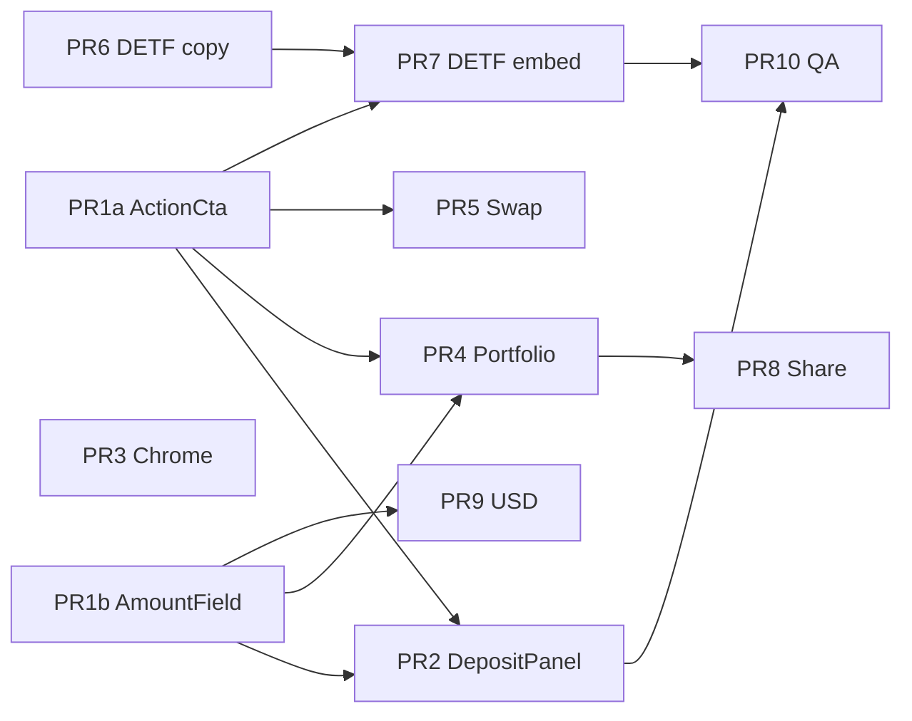

# Wave 1 Implementation Plan — Frontend Foundation

| Field | Value |
|-------|--------|
| **Status** | Wave 1 foundation **implemented** (2026-07-25) — do not re-execute |
| **Date** | 2026-07-25 |
| **Agent entry** | [`ROADMAP.md`](./ROADMAP.md) |
| **Design source** | [`FRONTEND_REDESIGN_DESIGN.md`](./FRONTEND_REDESIGN_DESIGN.md) (rev 6) |
| **UI polish (done)** | [`WAVE1_UI_POLISH_IMPLEMENTATION_PLAN.md`](./WAVE1_UI_POLISH_IMPLEMENTATION_PLAN.md) |
| **Next phase** | [`WAVE1_5_ANVIL_AND_EMBED_PLAN.md`](./WAVE1_5_ANVIL_AND_EMBED_PLAN.md) |
| **Prior funnel plan** | [`REDESIGN_PLAN.md`](./REDESIGN_PLAN.md) (core funnel mostly shipped — do not re-implement) |
| **Stack** | Next.js 14 App Router · Tailwind v4 · wagmi/viem · Permit2 · list-driven tokenlists |
| **Working directory** | `frontend/` |

> **Checkbox note:** Per-PR acceptance boxes in §5 are **historical templates**. Foundation is complete — use §11 orchestrator checklist. Active work is Wave 1.5.

---

## 1. Purpose

Execute **Wave 1 only**: raise wallet/tx UX to ethskills standards, finish visual consistency on lagging surfaces, clean DETF display copy, and embed DETF mint/bond/sell into Earn **behind a flag**.

Wave 1 is **foundation UX**. It does **not** design or ship:

| Deferred | Wave |
|----------|------|
| Featured “fee-accrual DETF” product narrative / marketing highlight | **Wave 2** (separate design) |
| Aave v3.6 / lending product surfaces beyond generic Earn SE rows | **Wave 3** (separate design) |
| New smart contracts, fee math, indexers, fabricated APY/TVL/USD | Out of scope |

If a task is not listed in §4–§5, it is out of Wave 1 unless the owner expands scope in writing.

---

## 2. Goals & non-goals

### Goals (definition of “Wave 1 done”)

1. **Money-path honesty** — strategy deposit: multi-leg CTA, wrong-network gate, query **8-tuple** preview → non-zero `minOut`, execute **10-tuple**; never silent `minOut = 0` when a quote works.
2. **Shared tx primitives** — `ActionCta` / `resolveWalletGate`, `AmountField`, AddressLink copy, `parseContractError`; split approval handlers only.
3. **Chrome consistency** — Header/Footer on semantic tokens; no production Admin 404.
4. **Surface polish** — Portfolio + Swap use design-system primitives; human-readable amounts.
5. **DETF baseline** — symbol-primary / role-secondary copy; seigniorage single-hop redirect; Earn embed of mint/bond/sell behind `NEXT_PUBLIC_EARN_DETF_EMBED` (default **off** until e2e).
6. **QA gate** — vitest for new pure helpers; Playwright shell + earn + deposit smoke; manual checklist includes four-state + reduced motion.

### Non-goals

- Greenfield rewrite of Swap routing, Permit2, or Header chain-switch algorithms.
- Brand lock / single-theme production marketing (dual themes stay).
- Live USD prices unless `NEXT_PUBLIC_USD_PRICE_SOURCE` is configured (default `none` → hide USD).
- Numeric fee display (disclaimer only until a real fee view exists).
- Wave 2 fee-DETF highlight, Wave 3 lending IA, activity feed, live TVL aggregation, mobile drawer perfection.

---

## 3. Constraints (do not violate)

| Constraint | Rule |
|------------|------|
| **ethskills-frontend-ux** | One primary action: connect → switch network → approve leg(s) → execute. Per-action pending + cooldown. No shared `isLoading` across legs. |
| **Split approvals (K17)** | Explicit mode: `handleIssuePermit2Approval` / `handleIssueRouterApproval` only. **Never** one-shot `handleApproval` for sequential multi-leg CTAs. |
| **Query vs execute arity (K9)** | Query: 8-tuple `querySwapSingleTokenExactIn` via `simulateContract` + `account: ZERO_ADDR`. Execute: 10-tuple `buildStrategyVaultDepositArgs` / withdraw. **Never** spread execute args into query. |
| **List-driven + env** | Tokenlists / `menuConfig` / `getAddressArtifacts` only. Do not break `indexedex-ui-refactor` (deployment env, artifacts, transports). |
| **Honesty** | No fabricated APY, TVL, or USD. No invented minOut from `% of amountIn`. |
| **DETF naming** | No RICH/RICHIR on Earn / new surfaces. Symbol primary; role helpers secondary (`Agents.md`). |
| **Header safety** | Restyle classNames/JSX only — do not rewrite chain/env/wallet switch logic. |
| **Embed safety** | DETF Earn embed flag default **false** until mint/bond e2e smoke. Keep `/staking` full page. |

**Skills to keep open while implementing:** `ethskills-frontend-ux`, `indexedex-ui-refactor`, `web-design-guidelines` (PR10 audit), `vercel-react-best-practices` (heavy pages).

---

## 4. Recommended execution order

Owner-aligned priority (from design doc):

```text
Track A   money path     PR1a → PR2          [required first]
Track A2  ui bits        PR1b                [parallel with A]
Track B   chrome         PR3                 [parallel OK]
Track D   DETF           PR6 → PR7           [elevated after A]
Track C   portfolio      PR4 → PR8           [may slip behind D]
Track A3  swap polish    PR5                 [after PR1a; can wait behind D]
Track E   finish         PR9 → PR10          [end]
```

**Calendar contingency:** Never ship Track D or C at the expense of PR2. Prefer slipping Portfolio/share (PR4/PR8) over deposit honesty.

### Suggested calendar (illustrative, 1 engineer)

| Week | PRs | Outcome |
|------|-----|---------|
| 1 | PR1a, PR1b, PR3 | Primitives + chrome |
| 2 | PR2 | Deposit four-state + minOut live |
| 3 | PR6, PR7 | DETF copy + flagged Earn embed |
| 4 | PR5, PR4 | Swap + Portfolio polish |
| 5 | PR8, PR9, PR10 | Share/token, optional USD, QA gate |

Adjust for parallel capacity; keep dependency edges below.

---

## 5. PR slices (implementation units)

Each PR: independently reviewable, mergeable, with acceptance checkboxes. File paths are relative to `frontend/app/` unless noted.

---

### PR1a — ActionCta + resolveWalletGate

| | |
|--|--|
| **Title** | `ui: multi-leg ActionCta and resolveWalletGate` |
| **Deps** | None |
| **Create** | `components/ui/ActionCta.tsx`, `lib/tx/actionState.ts`, `lib/tx/actionState.test.ts` |
| **Do** | `WalletGate` states: disconnected · wrong-network · approve (leg: token→Permit2 \| permit2→router) · execute · disabled (no preview / invalid). Labels for pending per leg. Comments: forbid `handleApproval` for sequential multi-leg UI. |
| **Do not** | Call `useApprovalFlow` from ActionCta itself — consumers wire onClick. |

**Acceptance**

- [ ] Unit tests: disconnected, wrong network, each approve leg, execute, disabled without preview
- [ ] Never renders Approve + Execute together
- [ ] Loading label reflects active leg
- [ ] Comment/docs forbid one-shot `handleApproval` for multi-leg sequential UI
- [ ] `npm run test` passes

---

### PR1b — AmountField + AddressLink copy + parseContractError

| | |
|--|--|
| **Title** | `ui: AmountField, AddressLink copy, parseContractError` |
| **Deps** | None (parallel PR1a) |
| **Touch** | `components/ui/AmountField.tsx` (new), `components/ui/AddressLink.tsx`, `lib/tx/parseContractError.ts` + tests |
| **Do** | Amount + Max + `formatUnits`/`parseUnits`; optional USD prop **hidden when null**; copy-to-clipboard on AddressLink; map common wallet rejections + safe fallback. |

**Acceptance**

- [ ] Copy + explorer work on AddressLink
- [ ] USD prop does not show `$` when null / source none
- [ ] `parseContractError` has tests for reject + unknown
- [ ] `npm run test` passes

*Optional:* merge PR1a+PR1b as single PR1 if review bandwidth prefers one PR.

---

### PR2 — DepositPanel money path (critical)

| | |
|--|--|
| **Title** | `earn: DepositPanel ActionCta, query 8-tuple preview, network gate` |
| **Deps** | **PR1a required**; PR1b preferred |
| **Touch** | `components/earn/DepositPanel.tsx`, `lib/earn/computeMinAmountOut.ts`, `lib/earn/toVaultSwapQueryArgs.ts` (or shared with Swap), optional SlippageInput wiring, asset symbol resolution |
| **Cite** | `swap/page.tsx` (`toPreviewArgs`, `simulateQueryExactIn`), `lib/earn/buildVaultSwapArgs.ts`, `lib/hooks/useApprovalFlow.ts`, design §5.2.1–5.2.3 |

**Implement**

1. Preview: build **8-tuple** via `toVaultDepositQueryArgs` / withdraw equivalent → `publicClient.simulateContract` on `querySwapSingleTokenExactIn` with `account: ZERO_ADDR`.
2. `minOut = computeMinAmountOut(previewOut, slippagePercent)` (default 0.5%, clamp e.g. 0–5).
3. Execute: **10-tuple** only via `buildStrategyVaultDepositArgs` / withdraw with that minOut.
4. Gate: no quote → disable Deposit + “Continue via Swap” link; never invent floor.
5. ActionCta: Connect / Switch / `handleIssuePermit2Approval` / `handleIssueRouterApproval` / execute — split handlers only.
6. Wrong network: compare wallet chain to app `selectedChainId` (Header/Swap patterns).
7. Asset select: **symbol** primary, address secondary.
8. Fee: static disclaimer only.

**Optional hardening:** after approvals, re-preview with Swap’s actual-sim pattern if vault hooks make pure query wrong; on failure, same block + Swap fallback.

**Acceptance**

- [ ] Query 8-tuple + `simulateContract` + `ZERO_ADDR` (not execute-args spread)
- [ ] Execute 10-tuple with non-zero minOut when preview available
- [ ] No hard-coded `minOut = 0` on happy path
- [ ] Preview failure disables Deposit; Swap fallback present
- [ ] Disconnected → Connect CTA (not passive text only)
- [ ] Wrong network → Switch; approve/execute disabled
- [ ] Split approval handlers only
- [ ] Asset symbols visible
- [ ] Vitest: `computeMinAmountOut` + query-arg shape
- [ ] Playwright smoke: disconnected deposit panel shows Connect
- [ ] `npm run test` passes

---

### PR3 — Header / Footer chrome

| | |
|--|--|
| **Title** | `chrome: restyle Header/Footer; remove Admin link` |
| **Deps** | None |
| **Touch** | `components/layout/Header.tsx` (**classNames/JSX only**), `components/layout/Footer.tsx` |
| **Do** | Semantic surfaces (`--surface-*`, Button); active nav; mobile wrap usable at 375px. Remove `/admin` from More (or `isDebugLabEnabled()` only). |

**Acceptance**

- [ ] No production Admin 404 link
- [ ] Manual: chain switch + connect still work (Sepolia / supersim)
- [ ] Primary controls use design tokens

---

### PR4 — Portfolio restyle

| | |
|--|--|
| **Title** | `portfolio: Card/Stat restyle, BondNftCard, human decimals` |
| **Deps** | PR1a, PR1b |
| **Touch** | `portfolio/page.tsx`, `components/earn/BondNftCard.tsx` (new), optional `lib/portfolio/types.ts` |
| **Do** | Keep discovery logic. `formatUnits` for balances/rewards/shares. EmptyState → Earn. Culture only on empty state. Preserve per-action pending keys. |

**Acceptance**

- [ ] No raw wei `.toString()` for user-visible amounts
- [ ] Per-action pending preserved
- [ ] Empty → Earn CTA
- [ ] Debug lab-flagged only

---

### PR5 — Swap surface + multi-leg CTA

| | |
|--|--|
| **Title** | `swap: Card shell and ActionCta without route rewrite` |
| **Deps** | PR1a |
| **Touch** | `swap/page.tsx` (chrome), swap form components, `components/WalletStatusBanner.tsx` |
| **Do** | Card/PageHeader; ActionCta with **split** handlers. Explicit mode: two approve legs. Signed mode: token→Permit2 only before sign path. Keep routeMatcher, Permit2, launch query, existing minOut/`toPreviewArgs`/`simulateQueryExactIn`. |

**Acceptance**

- [ ] Launch query still applies
- [ ] Explicit: split handlers, not sequential `handleApproval`
- [ ] Signed: single approve leg before swap/sign
- [ ] No shared isLoading across approve + swap
- [ ] Debug lab-gated
- [ ] Manual swap smoke on supersim

---

### PR6 — DETF copy + seigniorage redirect

| | |
|--|--|
| **Title** | `detf: display policy copy, stepper, seigniorage redirect` |
| **Deps** | None |
| **Touch** | `components/earn/DetfLifecycleStepper.tsx`, Earn detail client, staking user-facing labels, `seigniorage/page.tsx` |
| **Do** | Symbol primary + role secondary. Remove RICH/RICHIR from Earn detail / stepper. `/seigniorage` → `/earn?type=seigniorage-detf` single hop. Keep `/staking?detf=` deep links. |

**Acceptance**

- [ ] No RICH/RICHIR on Earn detail / stepper
- [ ] Seigniorage URL lands on Earn type filter (one hop)
- [ ] Staking deep-link still works

---

### PR7 — DETF Earn embed (flagged)

| | |
|--|--|
| **Title** | `detf: useDetfWorkspace + Earn embed flag` |
| **Deps** | **PR1a + PR6** (PR2 not required for DETF mint path) |
| **Touch** | `components/earn/detf/*`, refactor staking page client to mount same panel, Earn detail tab |
| **Flag** | `NEXT_PUBLIC_EARN_DETF_EMBED` default **`false`** |
| **v1 scope** | mint / bond / sell only — no StakingDebugPanel on Earn embed |

**Acceptance**

- [ ] Flag off: Earn deep-links only (current behavior)
- [ ] Flag on: Earn DETF tab mounts same handlers as `/staking`
- [ ] `/staking?detf=` still full page
- [ ] No debug panel on Earn embed
- [ ] e2e mint/bond smoke **before** enabling flag in shared envs
- [ ] Primary product path: Earn detail; staking secondary

**After merge:** leave flag off in production until smoke passes; document enablement in PR10 checklist.

---

### PR8 — Share card + Token polish ✅ **shipped 2026-07-26**

| | |
|--|--|
| **Title** | `product: sanitized share card and token/launch polish` |
| **Deps** | PR4 |
| **Touch** | `components/earn/SharePositionCard.tsx`, `lib/portfolio/sanitizeShareFields.ts`, portfolio, `token/`, `LaunchBanner` |
| **Do** | Share fields: sanitized symbol/amounts/address only — never raw tokenURI HTML. Culture off by default on money confirms. No invented claim contract on Token page. |

**Acceptance**

- [x] Share fields sanitized (+ vitest)
- [x] Token page does not invent claim flows
- [x] Launch banner env wiring verified
- [x] Portfolio Share wired (vault / DETF / bond)

See [`ROADMAP.md`](./ROADMAP.md) for residual work after PR8.

---

### PR9 — Optional USD + RiskBadge

| | |
|--|--|
| **Title** | `ux: USD when configured + RiskBadge` |
| **Deps** | PR1b |
| **Touch** | `lib/pricing/*`, AmountField, RiskBadge, Earn rows |
| **Do** | Default price source `none` → hide USD (K13). RiskBadge from list/manual tags only. |

**Acceptance**

- [ ] With `none`, no fake `$`
- [ ] With source configured, sample AmountField/portfolio shows USD

---

### PR10 — QA + checklist

| | |
|--|--|
| **Title** | `qa: a11y pass, Playwright journeys, production checklist` |
| **Deps** | Prefer PR2–PR7 merged |
| **Touch** | `e2e/*`, `MANUAL_UI_ROUTE_CHECKLIST.md`, residual a11y on Header, metadata note |
| **Do** | Expand e2e (shell + earn + deposit smoke). Checklist: four-state, reduced motion, brand lock/OG as **release gate** (not blocking Wave 1 merge of primitives). |

**Acceptance**

- [ ] `npm run test:e2e` green on CI target env (shell + earn + deposit)
- [ ] Checklist includes four-state + reduced motion
- [ ] Production metadata listed as release gate item

---

## 6. Dependency graph



---

## 7. Test & verification commands

From `frontend/`:

```bash
# Unit / component
npm run test
npm run typecheck
npm run lint

# E2E (after Playwright browsers installed)
npm run test:e2e:install   # once
npm run test:e2e

# Full local gate before merge of money-path PRs
npm run check && npm run test:e2e
```

**Manual smoke (PR2 / PR5 / PR7):**

1. Supersim or Sepolia with correct `NEXT_PUBLIC_*` deployment env.
2. Disconnected Earn detail → Connect CTA.
3. Wrong network → Switch; no approve/execute.
4. Approve legs sequential; Deposit enabled only after quote.
5. Reject wallet tx → UI recovers (parseContractError / pending cleared).
6. Flag off: DETF Earn deep-link only; flag on (lab): mint panel mounts without debug dump.

**Skills audit (PR10):** run UI against `web-design-guidelines` + ethskills four-state checklist on Deposit + Swap + Portfolio claim.

---

## 8. Environment & flags

| Variable | Wave 1 use |
|----------|------------|
| `NEXT_PUBLIC_DEFAULT_DEPLOYMENT_ENVIRONMENT` | `sepolia` \| `supersim_sepolia` — do not reintroduce broken live toggle |
| `NEXT_PUBLIC_SHOW_DEBUG` | Lab debug only |
| `NEXT_PUBLIC_EARN_DETF_EMBED` | PR7 — default **false** until e2e |
| `NEXT_PUBLIC_FEATURED_EARN_ADDRESSES` | Existing featured rows (Wave 2 will refine fee-DETF highlight) |
| `NEXT_PUBLIC_USD_PRICE_SOURCE` | Default `none` (PR9); hide USD when none |
| Brand / theme | Dual Pachira + IndexedEx — no lock in Wave 1 |

Do **not** scatter artifact JSON imports; use `addresses/` + `addressArtifacts` + providers per `indexedex-ui-refactor`.

---

## 9. Risks & mitigations

| Risk | Mitigation |
|------|------------|
| Restyle breaks chain switch | PR3: classNames only; manual smoke |
| Wrong query arity | PR2: unit test 8-tuple shape; copy Swap simulate pattern |
| Double-submit approvals | Per-leg pending + cooldown; split handlers |
| DETF embed regressions | Flag default off; shared container; keep `/staking` |
| Scope creep (Aave, fee hero) | Refuse in Wave 1 PR reviews — open Wave 2/3 design instead |
| `!important` theme fights | New components use CSS variables from `globals.css` |

---

## 10. Wave 1 Definition of Done

Wave 1 is **complete** when:

1. All PR1a–PR7 acceptance boxes checked (PR5/PR4 may trail PR7 if needed, but **PR2 must ship**).
2. PR8–PR10 either merged or explicitly deferred with owner note (PR9 optional if no price source).
3. No silent `minOut = 0` on strategy deposit happy path.
4. No RICH/RICHIR on Earn detail / stepper.
5. DETF embed flag documented; off in prod until smoke green.
6. `npm run check` + agreed e2e suite green.
7. Owner sign-off recorded (checklist or PR merge message).

**Handoff to Wave 1.5 (before Wave 2):** Anvil/`local_testing` money-path + mint/bond smoke + lab embed enable — [`WAVE1_5_ANVIL_AND_EMBED_PLAN.md`](./WAVE1_5_ANVIL_AND_EMBED_PLAN.md). Entry: [`ROADMAP.md`](./ROADMAP.md).

**Handoff to Wave 2:** open a short product design for the **fee-accrual DETF highlight** (featured entry, trust copy, portfolio treatment) without reopening Wave 1 shell primitives — **after** Wave 1.5 DoD.

**Handoff to Wave 3:** Aave v3.6 / lending IA only after Wave 1 money path is live and product decides Earn-row vs primary “Lend” nav.

---

## 11. Execution checklist (orchestrator)

Use this when green-lit:

- [x] Owner green-light to start PRs
- [x] Branch / worktree strategy agreed (e.g. `feat/wave1-pr1a-action-cta`)
- [x] PR1a + PR1b land
- [x] PR2 lands + manual deposit smoke
- [x] PR3 lands
- [x] PR6 lands
- [x] PR7 lands (flag off)
- [x] PR5 / PR4 as capacity allows (PR4 portfolio formatUnits+Earn CTA; **PR5 Swap ActionCta multi-leg rewire landed**)
- [x] PR8 SharePositionCard **shipped 2026-07-26** (see ROADMAP); PR9 USD still deferred while `NEXT_PUBLIC_USD_PRICE_SOURCE=none`
- [x] PR10 + owner DoD sign-off
- [x] UI polish plan executed (see WAVE1_UI_POLISH)
- [ ] Wave 1.5 Anvil + embed enable ([`WAVE1_5_ANVIL_AND_EMBED_PLAN.md`](./WAVE1_5_ANVIL_AND_EMBED_PLAN.md))
- [ ] Schedule Wave 2 design session (fee DETF) — after Wave 1.5

---

## 12. References

- Design: [`FRONTEND_REDESIGN_DESIGN.md`](./FRONTEND_REDESIGN_DESIGN.md)
- Funnel baseline: [`REDESIGN_PLAN.md`](./REDESIGN_PLAN.md)
- Manual QA: [`MANUAL_UI_ROUTE_CHECKLIST.md`](./MANUAL_UI_ROUTE_CHECKLIST.md)
- Functionality matrix: [`UI_FULL_FUNCTIONALITY_TEST_PLAN.md`](./UI_FULL_FUNCTIONALITY_TEST_PLAN.md)
- Staking notes: [`STAKING_REFACTOR_PLAN.md`](./STAKING_REFACTOR_PLAN.md)
- Repo: `Agents.md` (DETF role names), skills `ethskills-frontend-ux`, `indexedex-ui-refactor`
- Code anchors:
  - `components/earn/DepositPanel.tsx`
  - `lib/hooks/useApprovalFlow.ts`
  - `lib/earn/buildVaultSwapArgs.ts` (+ tests)
  - `swap/page.tsx` (query 8-tuple / simulate)
  - `staking/sections/MintChirSection.tsx` (`computeMinAmountOut` pattern)
  - `lib/deploymentEnvironment.tsx`, `lib/addressArtifacts.ts`, `addresses/index.ts`, `providers.tsx`
