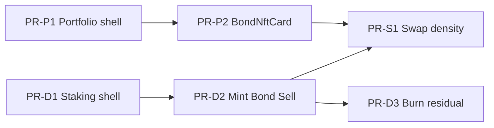

# Wave 1 UI Polish Implementation Plan — Portfolio · DETF · Swap

| Field | Value |
|-------|--------|
| **Status** | **Implemented** (2026-07-25) — do not re-execute |
| **Date** | 2026-07-25 |
| **Agent entry** | [`ROADMAP.md`](./ROADMAP.md) |
| **Parent design** | [`FRONTEND_REDESIGN_DESIGN.md`](./FRONTEND_REDESIGN_DESIGN.md) (rev 6) |
| **Wave 1 foundation** | [`WAVE1_IMPLEMENTATION_PLAN.md`](./WAVE1_IMPLEMENTATION_PLAN.md) (money path + embed scaffold **done**) |
| **Next phase** | [`WAVE1_5_ANVIL_AND_EMBED_PLAN.md`](./WAVE1_5_ANVIL_AND_EMBED_PLAN.md) |
| **Working directory** | `frontend/` (paths below relative to `frontend/app/` unless noted) |
| **Anvil / local node** | **Deferred to Wave 1.5** — this plan is UI polish only |

> **Checkbox note:** Per-PR acceptance boxes in §6 are **historical templates**. Implementation is complete — use §11 orchestrator checklist (all shipped items `[x]`). Active work is Wave 1.5, not this plan.

---

## 1. Purpose

Close the remaining **dual-era UI** gap after Wave 1 foundation so primary product surfaces share one design system before any local-node testing.

This plan covers **only** the three refinement steps agreed for the residual roadmap:

| Step | Surface | Outcome |
|------|---------|---------|
| **1** | Portfolio | Design-system restyle + `BondNftCard` extract + human decimals |
| **2** | DETF workspace (staking sections + shell) | Semantic tokens + symbol/role copy (feeds Earn embed) |
| **3** | Swap | Thin density/chrome pass — no route/tx rewrite |

**Explicitly deferred (not this plan):**

- Anvil / `local_testing` / supersim money-path e2e
- Enabling `NEXT_PUBLIC_EARN_DETF_EMBED` in shared envs (needs mint/bond smoke later)
- Wave 2 fee-accrual DETF narrative
- ~~PR8 SharePositionCard~~ **shipped 2026-07-26** (see ROADMAP); PR9 USD/RiskBadge still residual
- Brand lock, light theme, OG metadata
- Header chain-switch logic, env toggle restore
- Modal/Drawer deposit, full mobile drawer perfection

---

## 2. Goals & non-goals

### Goals

1. **One visual system** on Portfolio, DETF workspace (full page + embed body), and Swap primary chrome — same tokens and primitives as Earn (`PageHeader`, `Card`, `Button`, `Stat`, `EmptyState`, `AddressLink`).
2. **Portfolio home quality** — summary stats, section cards, bond cards, no raw wei, no raw `slate-*` on the connected happy path.
3. **DETF copy policy on workspace** — symbol primary + role helper secondary; no fixed brand chrome (`CHIR` / `RICH` / `RICHIR`) on user-facing titles/labels where a symbol is available; WETH only when the rate asset *is* WETH (or wrap-ETH path is explicitly selected).
4. **Swap scannability** — one clear hierarchy (form → preview → ActionCta); advanced/lab panels collapsed or debug-gated; peel gray utilities on **touched** blocks only.
5. **No regressions** on discovery logic, write handlers, Permit2, routeMatcher, bond pending keys, or Header switch algorithms.

### Non-goals

- Greenfield rewrite of `portfolio/page.tsx` data layer or Swap routing.
- Wiring every bond action through `ActionCta` (keep existing per-`actionKeyPending` pattern unless a leg is clearly broken).
- Rewriting mint/bond/sell math, ABIs, or approval orchestration in staking sections.
- Extracting full `useDetfWorkspace` from `StakingPageClient` (already embed-mounted; polish chrome only).
- Fabricated APY/TVL/USD.
- Anvil verification in this plan’s DoD.

---

## 3. Constraints (do not violate)

| Constraint | Rule |
|------------|------|
| **Design tokens** | New/restyled surfaces use `var(--surface-*)`, `var(--text-*)`, `var(--accent)`, `var(--border-*)`, `var(--danger)`. Prefer existing `components/ui/*`. |
| **List-driven + env** | Portfolio discovery stays on tokenlists / `getAddressArtifacts` / deployment env — no hard-coded vault tables. |
| **DETF naming (`Agents.md`)** | User chrome: symbol primary; roles (“pair token”, “claim token”, “rate asset”, “vault share”). No RICH/RICHIR on Earn or polished workspace UI. Debug panel may keep field names. |
| **WETH rule** | Label “WETH” only when the asset is actually WETH or user chose wrap-ETH; otherwise use rate-asset symbol + role helper. |
| **ethskills-frontend-ux** | Institutional copy on claim/unlock/redeem/confirm; culture only on empty states. Per-action pending preserved. |
| **Header / providers** | Do not touch chain-switch algorithms or reintroduce live env toggle. |
| **Swap money path** | Keep multi-leg `ActionCta`, split approval handlers, query/execute arity, launch query. Chrome only. |
| **Anvil deferred** | Do not block merge on local-node smoke; manual visual pass in browser (any env with lists) is enough for this plan. |

**Reference chrome (do not regress):** `earn/EarnPageClient.tsx`, `earn/[address]/EarnDetailClient.tsx`, `components/earn/DepositPanel.tsx`.

**Skills:** `ethskills-frontend-ux`, `indexedex-ui-refactor`, `web-design-guidelines` (light a11y pass on touched controls).

---

## 4. Recommended execution order

```text
PR-P1  Portfolio shell + sections + EmptyState/Stat/PageHeader/AddressLink
PR-P2  BondNftCard extract + button tokens + cert SVG decimals
PR-D1  StakingPageClient shell + DetfSelector + PriceInfo tokens
PR-D2  Mint / Bond / Sell section chrome + symbol/role titles
PR-D3  Burn section chrome + residual CHIR labels (power workspace)
PR-S1  Swap density: hierarchy + advanced collapse + token peel on touched blocks
```

**Suggested merge order**

1. **PR-P1 → PR-P2** (Portfolio complete first — highest residual impact, no flag coupling).
2. **PR-D1 → PR-D2 → PR-D3** (DETF workspace; D2 is critical path for Earn embed look; D3 can trail).
3. **PR-S1** last (optional if capacity slips; never block Portfolio/DETF).

**Parallelism:** PR-P1 and PR-D1 can start in parallel. Do not open PR-S1 until P and D are mostly green if review bandwidth is thin.



---

## 5. Shared design rules (apply to every PR)

### 5.1 Token class map (replace gray/slate era)

| Legacy (remove on touched UI) | Target |
|-------------------------------|--------|
| `bg-slate-800`, `bg-gray-800`, `bg-slate-900` | `bg-[var(--surface-1)]` or `Card` |
| `bg-gray-950`, input backgrounds | `bg-[var(--surface-2)]` |
| `text-white`, `text-gray-100` | `text-[var(--text-primary)]` |
| `text-gray-300/400/500` | `text-[var(--text-muted)]` |
| `border-slate-700`, `border-gray-700` | `border-[var(--border-subtle)]` |
| Ad-hoc `bg-blue-700` / `bg-purple-700` action buttons | `Button` `primary` / `secondary` / `ghost` |
| Raw `text-green-300` amounts | `font-mono tabular-nums text-[var(--text-primary)]` (accent sparingly for positive status only) |

### 5.2 Primitive usage

| Need | Use |
|------|-----|
| Page title + actions | `PageHeader` |
| Section container | `Card` |
| Empty / disconnected | `EmptyState` + `Button` / `Link` |
| Summary metrics | `Stat` |
| Addresses | `AddressLink` (copy + explorer) — never bare truncated mono only |
| Primary/secondary clicks | `Button` |
| Multi-leg money CTA | `ActionCta` (already on Deposit/Swap; **not required** for bond claim buttons in this plan) |

### 5.3 Copy rules (DETF / Portfolio)

| Surface | Pattern |
|---------|---------|
| Section titles | Product/role: “Bond NFTs”, “Mint {symbol}”, “Sell bond NFT” |
| Amount labels | “{symbol} amount” + helper “rate asset” / “vault share” when non-obvious |
| Status strings | May keep internal names in lab debug only |
| Forbidden (user chrome) | RICH, RICHIR, fixed “CHIR” when symbol prop/list symbol exists |

### 5.4 Culture vs institutional

- **Culture OK:** Portfolio empty state one soft line (“The index is empty — you can fix that.”).
- **Institutional only:** Claim / Unlock / Redeem / Approve / Mint / Bond / Sell button labels and confirm helpers.

---

## 6. PR slices

Paths are relative to `frontend/app/` unless noted.

---

### PR-P1 — Portfolio shell + sections on design system

| | |
|--|--|
| **Title** | `ui(portfolio): PageHeader, Card, EmptyState, Stat, AddressLink` |
| **Deps** | None (primitives already shipped) |
| **Touch** | `portfolio/page.tsx` (layout/JSX primarily; keep discovery/write logic) |
| **Optional create** | `lib/portfolio/types.ts` — move `BondPosition` / `TokenBalance` types out if it reduces page noise |

**Implement**

1. **Disconnected**
   - Replace ad-hoc centered block with `EmptyState`:
     - title: `Connect to see positions`
     - body: short institutional line
     - action: optional Earn link (Connect remains Header/wallet — do not invent a second connect stack unless already trivial)
   - Remove contradictory “No positions yet” on disconnected (empty index copy belongs on **connected + empty**).

2. **Unsupported chain**
   - Tokenized danger text inside `Card` or `EmptyState` (keep existing condition).

3. **Connected shell**
   - `PageHeader` title `Portfolio`, subtitle with Browse Earn link.
   - Refresh → `Button` (`secondary` or `primary`, `loading={isLoading}`).
   - Summary row: three `Stat`s — strategy share count, DETF balance count, bond NFT count (counts only; no USD).

4. **Three sections** — each wrap in `Card`:
   - Strategy vault shares (already partially tokenized — finish table headers/borders).
   - DETF tokens (replace `bg-slate-800/50` block entirely).
   - Bond NFTs (section chrome only in P1; cards may still be inline markup until P2).

5. **Tables**
   - Headers: muted + subtle border.
   - Address cells: `AddressLink`.
   - Balances: keep `formatUnits`; add `font-mono tabular-nums`.
   - Strategy Manage → `/earn/{address}` (existing).

6. **Empty subsections**
   - Prefer short muted copy + Earn link (or nested `EmptyState` if it does not over-pad).

7. **Do not** extract `BondNftCard` in this PR if it risks a large diff — leave bond card body for PR-P2, but section container must already be `Card`.

**Acceptance**

- [ ] Disconnected uses `EmptyState` (or equivalent Card-centered empty) without fake zero tables
- [ ] Connected: `PageHeader` + summary `Stat`s + three section `Card`s
- [ ] No `slate-*` / `gray-*` on strategy **or** DETF section happy path (bond cards may still lag until P2)
- [ ] Address cells use `AddressLink` in share/DETF tables
- [ ] Discovery + refresh + manage links unchanged
- [ ] Dual theme: accents still via CSS variables
- [ ] `npm run typecheck` (or project `check`) passes for touched files

---

### PR-P2 — BondNftCard + human decimals + action buttons

| | |
|--|--|
| **Title** | `ui(portfolio): BondNftCard extract, Button actions, cert decimals` |
| **Deps** | PR-P1 |
| **Create** | `components/earn/BondNftCard.tsx` |
| **Optional** | `lib/portfolio/types.ts` if not done in P1 |
| **Touch** | `portfolio/page.tsx` (map positions → card), certificate SVG helper in same file if present |

**Implement**

1. **`BondNftCard` presentational API** (props, not data fetching):

```ts
// Conceptual — adjust names to match portfolio types
export type BondNftCardProps = {
  kind: 'seigniorage' | 'protocol'
  symbol: string
  tokenId: bigint
  nftVault: `0x${string}`
  claimToken?: `0x${string}`
  rewardToken?: `0x${string}`
  unlockTime?: bigint
  bonusPercentage?: bigint
  sharesAwarded?: bigint
  pendingRewards?: bigint
  sharesDecimals?: number  // default 18 if protocol uses 18e shares
  rewardDecimals?: number
  matured: boolean
  actionKeyPending: string | null
  withdrawKey / unlockKey / claimKey / redeemKey: string
  onLoadCertificate?: () => void
  onWithdrawRewards?: () => void
  onUnlock?: () => void
  onClaim?: () => void
  onRedeem?: () => void
  metadata?: { name?: string; description?: string; image?: string }
  isWritePending?: boolean
}
```

2. **Layout**
   - Outer `Card` (or nested card inside section).
   - Title: `{symbol} · Protocol Bond|Bond #{id}`.
   - Meta: `AddressLink` for nft vault / claim / reward.
   - Grid: unlock time (countdown if already computed), bonus %, shares, pending rewards — all `formatUnits` where bigint.
   - Actions: `Button size="sm"` — primary for available action, secondary for locked/disabled labels like `Unlock (locked)`.
   - Preserve **exact** disable rules and `actionKeyPending === key` loading labels.

3. **Certificate SVG / metadata**
   - Keep sandboxed `Image` for data URI.
   - In `buildBondCertificateSvg` (or equivalent): format shares/rewards with `formatUnits`, not `.toString()` wei.
   - Do not inject raw tokenURI HTML into DOM beyond existing image path.

4. **Portfolio page**
   - Map `bondPositions` → `<BondNftCard ... />`; keep handlers in page.

**Acceptance**

- [ ] No inline bond card markup left in `portfolio/page.tsx` (except map + handlers)
- [ ] No raw wei `.toString()` for user-visible shares/rewards (UI + cert SVG)
- [ ] Per-action pending keys preserved (withdraw/unlock/claim/redeem)
- [ ] Buttons use `Button` primitive (no `bg-blue-700` / `bg-purple-700`)
- [ ] Bond section free of `slate-*` / `gray-*` on card chrome
- [ ] Culture not on claim/unlock labels
- [ ] Typecheck clean

---

### PR-D1 — Staking shell + selector + price info tokens

| | |
|--|--|
| **Title** | `ui(detf): StakingPageClient shell and meta cards on design system` |
| **Deps** | None |
| **Touch** | `staking/StakingPageClient.tsx`, `staking/sections/DetfSelectorSection.tsx`, `staking/sections/PriceInfoSection.tsx` |
| **Do not touch** | Write paths, `StakingDebugPanel` content beyond optional token classes; keep debug lab-gated |

**Implement**

1. **Full-page shell** (`embedMode === false`)
   - `PageHeader` title e.g. `DETF workspace` (not brand product name).
   - Subtitle: institutional — mint / bond / sell; link back to Earn optional.
   - Replace outer `text-gray-100` / gray containers with tokenized max-width layout matching Earn.

2. **Embed mode**
   - Keep compact chrome (no duplicate full-page header if Earn already provides context).
   - Ensure section stack still tokenized so Earn tab does not drop into gray lab panels.

3. **Address / config grid**
   - `Card` with rows: DETF proxy, pair token, claim token, bond NFT vault, reserve pool.
   - Values via `AddressLink` where addresses; labels use **role names** (pair token, claim token, …).

4. **Empty / missing DETF**
   - Tokenized empty guidance (scenario3 copy can stay but secondary/muted; prefer list-driven select when products exist).

5. **DetfSelectorSection**
   - `Card` + tokenized `<select>` / labels.

6. **PriceInfoSection**
   - Compact `Card`; keep synthetic price + thresholds honest; no invented USD.

7. **Status line**
   - Muted `Card` or inline status; no gray-900 dump unless debug.

**Acceptance**

- [ ] Full-page staking shell uses `PageHeader` + semantic surfaces
- [ ] Meta addresses use `AddressLink` + role labels
- [ ] DetfSelector + PriceInfo free of gray/slate era classes
- [ ] `embedMode` still hides debug; Earn embed still mounts
- [ ] No logic changes to selected DETF resolution (`?detf=` / fixedDetf)
- [ ] Typecheck clean

---

### PR-D2 — Mint / Bond / Sell chrome + symbol/role titles

| | |
|--|--|
| **Title** | `ui(detf): mint bond sell section chrome and display policy` |
| **Deps** | PR-D1 preferred (can land after with minor conflict risk) |
| **Touch** | `staking/sections/MintChirSection.tsx`, `BondSection.tsx`, `SellNftSection.tsx` |
| **Props** | Pass `detfSymbol` / rate-asset symbol from parent when already available; fall back to short address or “DETF” — **do not hardcode CHIR** |

**Implement**

1. **Shared section chrome**
   - Outer: `rounded` + border subtle + `bg-[var(--surface-1)]` **or** wrap in `Card`.
   - Inputs: surface-2 border, text-primary, focus ring accent (match DepositPanel inputs if practical).
   - Primary actions: prefer existing approval UI components; if raw `<button>`, swap to `Button`.

2. **MintChirSection display**
   - Title: `Mint {detfSymbol}` (not `Mint CHIR with WETH`).
   - Helper: `Pay with {rateAssetSymbol}` + secondary “rate asset” if needed.
   - Preview label: `Preview {detfSymbol} out`.
   - Wrap-ETH checkbox copy: keep accurate (“Wrap ETH to WETH in the router…”) — WETH name OK here (actual wrap).
   - Status strings may still say mint internally; user-visible headings/labels must use symbols.
   - File name may remain `MintChirSection.tsx` this plan (rename optional follow-up — avoid drive-by renames).

3. **BondSection display**
   - Replace `Bond with WETH` with rate-asset-aware title: e.g. `Bond with {rateAssetSymbol}` + helper “locks into bond NFT”.
   - Second bond path (vault shares if present): label by role “vault share”, not brand.
   - Lock days input tokenized.
   - Buttons: `Button`; labels institutional (`Bond`, `Bond (approving…)`) using existing pending behavior.

4. **SellNftSection**
   - Title: `Sell bond NFT` + helper “receive rebasing claim token”.
   - Token ID field tokenized.

5. **Do not**
   - Change permit/explicit mint paths, slippage math, or `computeMinAmountOut` behavior.
   - Mount debug on Earn embed.

**Acceptance**

- [ ] No user-visible fixed `CHIR` title/label when symbol is available
- [ ] No RICH/RICHIR introduced
- [ ] Mint/Bond/Sell sections use design tokens (no gray-700/900 era)
- [ ] WETH only where wrap or asset is WETH
- [ ] Handlers and approval modes unchanged (manual smoke: UI still enables same buttons)
- [ ] Typecheck clean

---

### PR-D3 — Burn section + residual brand strings

| | |
|--|--|
| **Title** | `ui(detf): burn section chrome and residual label cleanup` |
| **Deps** | PR-D2 |
| **Touch** | `staking/sections/BurnChirSection.tsx`, residual strings in `StakingDebugPanel.tsx` (debug-only OK), any leftover workspace copy |

**Implement**

1. Same chrome rules as D2 for burn panel.
2. Title: `Burn {detfSymbol}` → rate asset / ETH out (not `Burn CHIR for WETH`).
3. Debug panel may keep short field labels; optional `DETF` instead of `CHIR` for consistency.
4. Burn remains **full workspace** power tool (not required on Earn v1 embed).

**Acceptance**

- [ ] Burn section tokenized + symbol-based titles
- [ ] No RICH/RICHIR on non-debug UI
- [ ] Typecheck clean

---

### PR-S1 — Swap density + advanced collapse + token peel

| | |
|--|--|
| **Title** | `ui(swap): density pass, advanced disclosure, token peel on chrome` |
| **Deps** | None strictly; land after P/D if review bandwidth limited |
| **Touch** | `swap/page.tsx` (**chrome only** — large file; minimize logic diff) |
| **Do not** | Rewrite routeMatcher, Permit2 witness, preview 8-tuple / execute 10-tuple, launch query, ActionCta wiring |

**Implement**

1. **Visual hierarchy** (top → bottom)
   - Page/form shell already partially Card’d — ensure order:
     1. Pair / amount inputs  
     2. Preview card (exact in/out) — **tokenized** (replace `bg-slate-700/50` preview blocks)  
     3. Primary `ActionCta` card (keep multi-leg behavior)  
     4. Advanced / lab below fold  

2. **Advanced disclosure**
   - Group under a single `<details>` / “Advanced” disclosure (default **closed**):
     - Signed mode explanation density  
     - Accurate quote (sign permit) block  
     - Any debug-ish toggles not already lab-gated  
   - Keep ActionCta **outside** the disclosure (always visible).
   - Lab-only: continue to respect `NEXT_PUBLIC_SHOW_DEBUG` for DebugPanel.

3. **Token peel (touched blocks only)**
   - Preview panels → surface-1/2 + muted text + mono amounts.
   - Signed mode callout → softer token border (optional accent), not loud purple stack if it competes with primary CTA.
   - Accurate quote button → `Button secondary` if low risk; otherwise className token swap only.
   - Warning callouts (router missing) may keep amber danger semantics.

4. **Stop conditions**
   - Do not restructure state hooks.
   - Do not split `swap/page.tsx` into many files in this PR unless a single extract is required for review (prefer no extract).

**Acceptance**

- [ ] Preview + ActionCta hierarchy clear; advanced default collapsed
- [ ] ActionCta multi-leg still works (explicit split handlers; signed omits permit2→router)
- [ ] Launch query still applies
- [ ] Touched chrome free of the worst `slate-700` preview slabs
- [ ] No shared isLoading regression across approve + swap
- [ ] Typecheck clean; existing swap unit/wiring tests still pass if present

---

## 7. Testing strategy (Anvil deferred)

| Layer | This plan |
|-------|-----------|
| **Unit** | Optional: pure format helpers if extracted from portfolio SVG; no requirement for new mint math tests |
| **Typecheck / lint** | `cd frontend && npm run check` (or `typecheck` + `lint` per package.json) after each PR |
| **Playwright** | Not required for DoD; do not add Anvil-dependent e2e here. Optional: static route render smoke if already in suite (`/portfolio`, `/swap`, `/staking`) |
| **Manual visual** | Required — see §8 |

### Manual visual checklist (browser only)

Use any configured deployment env with tokenlists (supersim or public sepolia artifacts as available). **No Anvil deposits required.**

| # | Check |
|---|--------|
| 1 | Dual theme toggle still works (Pachira / IndexedEx); CTAs use accent |
| 2 | `/portfolio` disconnected empty looks like Earn empty language |
| 3 | `/portfolio` connected: summary stats + three cards; tables/addresses polished |
| 4 | Bond card actions show pending per key (can short-circuit with wallet reject) |
| 5 | `/staking` full page: shell + sections match Earn chrome |
| 6 | Mint/Bond/Sell titles use symbols / roles, not CHIR/RICH |
| 7 | Earn detail with embed flag **off**: deep-link still works; **on** (local only): sections not gray-lab |
| 8 | `/swap`: preview → ActionCta visible; Advanced collapsed by default |
| 9 | 375px smoke: Portfolio bond actions wrap; staking sections scroll; no horizontal disaster |
| 10 | `prefers-reduced-motion`: no new motion introduced |

Record results in `MANUAL_UI_ROUTE_CHECKLIST.md` (append a short “UI polish 2026-07-25” section) when merging the last PR.

---

## 8. Environment & flags

| Variable | Role in this plan |
|----------|-------------------|
| `NEXT_PUBLIC_DEFAULT_BRAND` / dual theme | Verify both themes on polished pages |
| `NEXT_PUBLIC_SHOW_DEBUG` | DebugPanel + any lab-only swap bits stay gated |
| `NEXT_PUBLIC_EARN_DETF_EMBED` | Leave **default false** in shared envs; local `true` only to eyeball embed chrome after D2 |
| `NEXT_PUBLIC_USD_PRICE_SOURCE` | Leave `none` — do not show fake `$` |

No new env vars required.

---

## 9. Risks & mitigations

| Risk | Mitigation |
|------|------------|
| Huge `portfolio/page.tsx` / `swap/page.tsx` diffs | Split P1/P2 and keep S1 chrome-only; avoid drive-by logic |
| Breaking bond disable rules | Copy existing boolean expressions into card props; no “cleanup” of conditions |
| DETF symbol unavailable | Fall back to list symbol → ERC20 read if already in parent → `"DETF"`; never invent CHIR |
| Embed + full page double headers | `embedMode` skips page-level PageHeader |
| Reviewer fatigue on swap 4k file | S1 only touches chrome regions; describe line ranges in PR body |
| Accidental Anvil scope creep | DoD explicitly excludes node testing |

---

## 10. Definition of Done

This plan is **complete** when:

1. **PR-P1 + PR-P2** merged — Portfolio on design system; `BondNftCard` extracted; no user-visible raw wei for shares/rewards; no slate/gray era on portfolio happy path.
2. **PR-D1 + PR-D2** merged — Staking shell + mint/bond/sell tokenized; symbol/role display policy on titles/labels. **PR-D3** merged or explicitly deferred with owner note.
3. **PR-S1** merged or explicitly deferred with owner note (Portfolio+DETF must not wait on Swap).
4. Manual visual checklist §8 signed off (no Anvil).
5. `npm run check` green for frontend.
6. No new fabricated USD/APY; no RICH/RICHIR on polished surfaces.
7. Handoff note: **next** work is Anvil/local money-path verification + mint/bond e2e before enabling Earn embed flag in shared envs — **not** more shell redesign.

---

## 11. Execution checklist (orchestrator)

- [x] Branch strategy agreed (e.g. `feat/ui-polish-portfolio`, stacked PRs or sequential)
- [x] PR-P1 Portfolio shell
- [x] PR-P2 BondNftCard + decimals
- [x] PR-D1 Staking shell + selector + price
- [x] PR-D2 Mint / Bond / Sell chrome + copy
- [x] PR-D3 Burn residual (or defer note)
- [x] PR-S1 Swap density (or defer note)
- [x] Manual visual checklist recorded (static audits + typecheck; browser optional / Anvil deferred)
- [x] Update `FRONTEND_REDESIGN_DESIGN.md` residual section when merging (Portfolio/DETF/Swap polish done; Anvil still open) — rev 6
- [x] **Stop** — do not start Anvil testing under this plan

---

## 12. References

- Design residual: `FRONTEND_REDESIGN_DESIGN.md` § Implemented vs remaining, §2.5.3 Portfolio, §4 visual system, §5.4 DETF naming
- Wave 1 foundation: `WAVE1_IMPLEMENTATION_PLAN.md` (PR4 / PR5 / PR7 context)
- Manual QA: `MANUAL_UI_ROUTE_CHECKLIST.md`
- Code anchors:
  - `portfolio/page.tsx`
  - `components/ui/{PageHeader,Card,Button,Stat,EmptyState,AddressLink,ActionCta}.tsx`
  - `staking/StakingPageClient.tsx`, `staking/sections/*`
  - `components/earn/detf/DetfWorkspaceEmbed.tsx`
  - `swap/page.tsx` (ActionCta strip ~primary action card)
  - Earn reference: `earn/EarnPageClient.tsx`, `earn/[address]/EarnDetailClient.tsx`
- Repo: `Agents.md` DETF role naming; skills `ethskills-frontend-ux`, `indexedex-ui-refactor`

---

*End of plan — UI polish only; Anvil deferred.*
