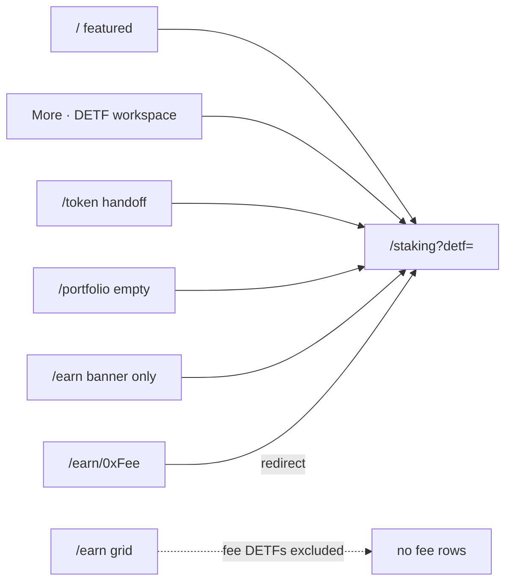

# Wave 2 Design — Fee-Accrual DETF Featured Narrative

| Field | Value |
|-------|--------|
| **Title** | Fee-accrual DETF featured narrative (product + IA + copy + PR plan) |
| **Status** | **Implemented + smoked** (2026-07-26) — W2-PR1–PR4 + vitest + Playwright `e2e/wave2-fee-detf.spec.ts` green |
| **Date** | 2026-07-25 (impl 2026-07-26) |
| **Agent entry** | [`ROADMAP.md`](./ROADMAP.md) — **do not re-implement Wave 2** |
| **Architecture SoT** | [`FRONTEND_REDESIGN_DESIGN.md`](./FRONTEND_REDESIGN_DESIGN.md) (**rev 9**) |
| **Contract package (hero)** | `contracts/vaults/detf/protocols/dexes/balancer/v3/standardExchange/single` — **SingleStandardExchangeDETF** |
| **Depends on** | Wave 1 + Wave 1.5 **shipped** |
| **Working directory** | `frontend/` |
| **Follow-on** | PR8 SharePositionCard **also shipped** (see ROADMAP). Residual = PR9 / brand / Wave 3 — not Wave 2 rework. |

---

## Agent resume

| | |
|--|--|
| **Where** | Wave 2 **closed** (build + regression e2e). PR8 also shipped. |
| **Next** | Do **not** rebuild Wave 2. Residual redesign only per [`ROADMAP.md`](./ROADMAP.md). |
| **Forbidden** | Deploy contracts; invent APY/USD/fee bps; re-open Wave 1 money-path; mix fee DETF into Earn catalog grid; DualLiquidity as Wave 2 hero; re-ship W2-PR1–PR4 |

---

## Owner decisions (locked via Q&A)

| # | Topic | Decision |
|---|--------|----------|
| D1 | **Product package** | **Single SE DETF only** (`detf/standardExchange/single`). DualLiquidityLinked / crossVersion is **not** the Wave 2 hero. |
| D2 | **Public phrase** | **“Fee-accrual DETF”** |
| D3 | **Dedicated surface** | Keep **`/staking`** as the fee-DETF product page (mint/bond/sell). Do **not** mingle with other DETFs on Earn. |
| D4 | **Earn catalog** | Fee-accrual DETF addresses are **excluded** from the main `/earn` grid. |
| D5 | **Discovery** | Featured on **landing** + **More → DETF workspace** (`/staking`). No new primary nav item. Primary nav stays Earn · Swap · Portfolio · Token. |
| D6 | **Featured data** | **Dedicated tokenlist bucket** under `app/addresses/*` (new list file(s)), not hard-coded addresses, not “first seigniorage in Earn catalog.” |
| D7 | **Primary CTA** | Featured cards → **`/staking?detf=0x…`** (workspace). Not strategy DepositPanel. Not Earn detail as primary home. |
| D8 | **Fee-make copy depth** | **On-product seigniorage + usage fee behavior only** (what Single SE DETF implements). Do **not** claim DualLiquidity `donation` routing as live on this surface. |
| D9 | **Full fee-make thesis** | Allowed as product story for **this DETF’s** fee/seigniorage mechanics (usage fee, seigniorage split, bond terms from fee oracle) — still **no fabricated APR/USD/fee bps numbers**. |
| D10 | **RICH / RICHIR** | **Allowed** on Wave 2 narrative surfaces (landing, Earn *banner* marketing, Token, Portfolio empty, staking chrome) per owner override of Agents.md for marketing. Prefer list **symbol** when available; brand names OK when list uses them. |
| D11 | **Ship surfaces** | Full set: landing, Earn *cross-promo banner*, Token handoff, Portfolio empty, plus staking product page polish for fee narrative. |
| D12 | **Earn detail for fee DETF address** | If user hits `/earn/0xFeeDetf` (bookmark/share): **redirect** to `/staking?detf=0x…` (do not show strategy deposit / generic DETF peer UI). |
| D13 | **Embed flag** | Shared `NEXT_PUBLIC_EARN_DETF_EMBED` stays **false**. Fee DETF lives on `/staking`, not Earn embed. |
| D14 | **No deploy** | Frontend agents must not deploy / re-run local stack scripts. |

**Superseded (rev 1 draft):** Earn-detail-as-home, seigniorage-auto-hero from Earn catalog, DualLiquidity hero, “no RICH on Earn,” env-only `FEATURED_EARN_ADDRESSES` as sole featured source.

---

## 0. Purpose

Wave 2 is a **product narrative + IA separation** pass:

1. Position **Single SE DETF** as the **fee-accrual DETF** flagship (seigniorage mint/bond/claim + on-product fees).
2. Give it a **dedicated home**: **`/staking`** (historical “Staking” workspace), **not** mixed into the Earn catalog with strategy vaults / other DETFs.
3. Drive discovery via **landing featured**, **More menu**, **Token handoff**, **Portfolio empty**, and an Earn **banner that links out** (without listing fee DETFs in the Earn grid).
4. Load featured addresses from a **dedicated tokenlist** (list-driven, like all other token sets).

Wave 1 already shipped mint/bond/sell mechanics and chrome on `/staking`. Wave 2 ships **identity, separation, and story**.

---

## 1. Goals & non-goals

### Goals

| ID | Goal |
|----|------|
| W2-G1 | Visitor understands **fee-accrual DETF** without reading contracts. |
| W2-G2 | Honest trust: no APY/USD; no invented fee **bps**; describe real Single SE fee/seigniorage behavior qualitatively. |
| W2-G3 | Featured set from **dedicated tokenlist** per env/chain. |
| W2-G4 | Primary CTA → **`/staking?detf=`** for fee DETFs. |
| W2-G5 | Fee DETFs **never** appear as peers in `/earn` catalog rows. |
| W2-G6 | Thin frontend PRs; no contract work; no deploys. |

### Non-goals

- DualLiquidityLinked / `donation` fee-sink UI or “live donation” claims.
- New smart contracts, fee oracle numeric UI, fabricated rates.
- Enabling Earn DETF embed in shared/prod.
- Wave 3 lending IA.
- Re-implementing ActionCta / DepositPanel / Portfolio design system primitives.

---

## 2. Product thesis

### 2.1 Package

**Hero:** [SingleStandardExchangeDETF](../contracts/vaults/detf/protocols/dexes/balancer/v3/standardExchange/single/SingleStandardExchangeDETF_PRD.md)

- True seigniorage DETF: DETF share + one SE vault share on Balancer V3 weighted reserve.
- User flows: mint / exchange in → bond NFT → sell to protocol → claim/redeem.
- Fees (live product behavior to describe): usage fee / seigniorage incentive and mint split per Vault Fee Oracle; bond terms from oracle (`bondTermsOfVault`); no fee-free mint side door.
- **Not** DualLiquidityLinked (simple BPT-pro-rata vault; different package).

### 2.2 One sentence (institutional)

> **Fee-accrual DETF** is a seigniorage product: mint or exchange into the DETF against its reserve, bond for oracle terms, sell to the protocol when ready, and redeem via the claim path. Protocol usage and seigniorage fees apply on-chain; lock terms come from the fee oracle.

### 2.3 Copy boundaries

| Allowed | Forbidden |
|---------|-----------|
| Qualitative fee/seigniorage/bond-term description for **this** DETF | Fake APY, USD TVL, invented fee **percentages** |
| RICH/RICHIR when list/marketing uses them (owner override) | Claiming DualLiquidity `donation` buyback-and-make as live |
| Lifecycle stepper mint → bond → sell → claim | Strategy DepositPanel as primary fee-DETF path |
| “Fees may apply; amounts are not guarantees” when numbers unknown | Silent invented minOut / yields |

Optional soft line (not required): broader protocol fee routing to other products may evolve — do **not** assert live DualLiquidity donation.

### 2.4 Featured set (list-driven)

**New tokenlist bucket** (name to implement):

```text
app/addresses/<env>/…/featured-fee-detfs.tokenlist.json
# and/or chain-keyed equivalent under addresses/chain/<chainId>/ when that pipeline applies
```

| Rule | Detail |
|------|--------|
| **Canonical set** | Tokens in this list for `selectedChainId` + deployment environment |
| **Order** | List order = featured order (hero = first) |
| **Validation** | Address must still resolve to a known DETF instance for the chain (bytecode / list metadata); drop zero/invalid |
| **Earn catalog** | Addresses in this list are **filtered out** of `loadEarnProductsForChain` display (or filtered at Earn page assemble) |
| **Env var** | Prefer list-only; `NEXT_PUBLIC_FEATURED_EARN_ADDRESSES` may remain as **optional override** for local dev but is **not** the primary SoT for Wave 2 |
| **No hard-code** | No DualLiquidity or RICH addresses in TS source |

Wire loader parallel to `getSeigniorageDetfsForChain` / strategy lists in `tokenlists.ts` + registry generation if required by the aggregator.

---

## 3. Information architecture

### 3.1 Route map

```text
Primary nav:  Earn · Swap · Portfolio · Token
More:         DETF workspace → /staking   (+ other power tools)
Landing:      Featured fee-DETF card(s) → /staking?detf=0x…
Token:        Open {symbol} → /staking?detf=0x…
Portfolio:    Empty → Explore fee-accrual DETF → /staking?detf=0x… (or /staking)
Earn grid:    Strategies + non-fee DETFs only (fee list excluded)
Earn banner:  Optional cross-promo “Fee-accrual DETF” → /staking (not a grid row)
/earn/0xFee:  redirect → /staking?detf=0xFee
/staking:     Full fee-DETF product page (selector if multiple featured; mint/bond/sell)
```



### 3.2 Why `/staking` not Earn

Owner: fee-accrual DETF was originally its own **Staking** page and must **not** be mingled with other DETFs. Earn remains the **strategy + other product catalog**. Fee DETF is a **separate product surface** with seigniorage UX (not strategy deposit).

### 3.3 Jobs-to-be-done

| Job | Success |
|-----|---------|
| Understand flagship | Landing featured explains fee-accrual DETF |
| Enter product | One click → `/staking?detf=` |
| Act | Mint/bond/sell on staking page (existing Wave 1 chrome) |
| Not confused with Earn | Fee DETF absent from Earn grid |

---

## 4. Screen specs

### 4.1 Landing (`app/page.tsx`)

| Element | Spec |
|---------|------|
| Section | **Fee-accrual DETF** (or “Featured” with fee-DETF eyebrow) |
| Cards | From dedicated fee-detf tokenlist (≤3); hero = first |
| Body | §2.2 thesis + honest fee language |
| CTA | **Open {symbol}** → `/staking?detf={address}` |
| Empty list | Soft empty: “No fee-accrual DETF configured on this network” + link More/staking if page still works with manual select |

Strategy vaults may remain in a **separate** “Earn strategies” strip **only if** desired later; Wave 2 **priority** is fee-DETF featured. Default: **fee-DETF featured section is primary**; do not bury it under strategy-first defaults from Wave 1.

### 4.2 Earn catalog (`EarnPageClient.tsx`)

| Element | Spec |
|---------|------|
| Grid | **Exclude** addresses present in featured-fee-detf list |
| Banner | Accent card: fee-accrual DETF cross-promo → `/staking?detf=` (or `/staking`) — **not** “Open” to `/earn/0x` for fee products |
| Filters | Unchanged for remaining products; no required new “fee” chip if fee products are excluded |

### 4.3 Earn detail (`EarnDetailClient.tsx`)

| State | Behavior |
|-------|----------|
| Address ∈ fee-detf list | **`redirect` / `router.replace` → `/staking?detf={address}`** |
| Other products | Unchanged |

### 4.4 Staking (`StakingPageClient.tsx`)

| Element | Spec |
|---------|------|
| Role | **Canonical fee-accrual DETF product page** |
| Selector | Prefer options from fee-detf tokenlist when present; keep existing discovery for lab if needed |
| Narrative | Page header / intro: fee-accrual DETF thesis; lifecycle reminder |
| Actions | Existing mint/bond/sell sections (Wave 1) |
| Query | `?detf=` selects instance |

### 4.5 Token (`token/page.tsx`)

| CTA when fee list non-empty | **Open {symbol}** → `/staking?detf=` |
| Empty fee list | Browse Earn (strategies) as today |

### 4.6 Portfolio empty

| Copy | Explore the fee-accrual DETF (or Open {symbol}) → `/staking?detf=` |

### 4.7 Header More

| Link | Label can stay **DETF workspace** or become **Fee-accrual DETF** → `/staking` |

---

## 5. Technical design

### 5.1 New loaders

```ts
// conceptual
getFeaturedFeeDetfsForChain(chainId, environment): TokenListEntry[]
loadFeaturedFeeDetfs(chainId, environment): EarnProduct[] // or FeeDetfProduct[]
isFeaturedFeeDetfAddress(chainId, environment, address): boolean
```

- Filter Earn catalog: `products.filter(p => !isFeaturedFeeDetfAddress(...))`
- Do not require DualLiquidity special-casing.

### 5.2 Tokenlist pipeline

- Add `featured-fee-detfs.tokenlist.json` (or agreed name) under env trees used by local_testing / supersim / sepolia as available.
- Extend `tokenlists.ts` + aggregator/registry if lists are generated — follow existing pattern for seigniorage-detfs.
- **Ops fills real addresses** when deployments exist; empty list is valid (UI empty states).

### 5.3 Env flags

```bash
# Optional override only — primary SoT is featured-fee-detfs tokenlist
# NEXT_PUBLIC_FEATURED_EARN_ADDRESSES=   # demote or document as legacy

NEXT_PUBLIC_EARN_DETF_EMBED=false      # stays false; fee DETF is /staking
NEXT_PUBLIC_USD_PRICE_SOURCE=none
```

### 5.4 Constraints

| Constraint | Rule |
|------------|------|
| List-driven | Dedicated fee-detf list + existing staking reads |
| No deploy | ROADMAP no-deploy policy |
| Honesty | No fake APY/USD/bps |
| Separation | Fee DETFs out of Earn grid |
| Money path | Do not rewrite DepositPanel/ActionCta for this wave |

---

## 6. PR plan (after final confirm)

### W2-PR1 — `lists: featured-fee-detfs tokenlist + loaders + Earn exclude`

- Add list files + `getFeaturedFeeDetfsForChain` / tests
- Earn catalog filters out fee-detf addresses
- Vitest: exclude + parse list

### W2-PR2 — `staking: fee-DETF product narrative + default selection`

- Header/intro copy; prefer fee-detf list in selector
- `?detf=` still works
- More menu label polish optional

### W2-PR3 — `marketing: landing + Token + Portfolio empty CTAs → /staking`

- Landing featured from fee-detf list
- Token **Open {symbol}**
- Portfolio empty link

### W2-PR4 — `earn: cross-promo banner + redirect fee addresses to staking`

- Banner → staking
- `/earn/[feeDetf]` → redirect staking
- No fee rows in grid (enforced by PR1)

**Parallel:** do not enable embed; do not DualLiquidity work.

---

## 7. Testing

| Layer | What |
|-------|------|
| Vitest | Fee-detf list load; Earn exclusion; redirect helper / isFeaturedFeeDetf |
| Playwright | Landing featured link targets `/staking`; Earn grid has no fee addresses when list present |
| Manual | More → DETF workspace; staking mint/bond chrome still works on **existing** RPC (no deploy) |

---

## 8. Success criteria

| Metric | Target |
|--------|--------|
| Separation | Fee DETF not in Earn grid |
| Home | `/staking` is product page |
| Discovery | Landing + More + Token + Portfolio empty + Earn banner |
| Honesty | No APY/USD/bps invention; DualLiquidity donation not claimed live |
| List-driven | Featured from dedicated tokenlist |
| No deploy | Policy held |

---

## 9. Open only if you care (non-blocking defaults)

| Item | Default |
|------|---------|
| Dual brand copy | **Same** narrative both themes |
| More menu label | **Fee-accrual DETF** (was “DETF workspace”) |
| Max featured cards | **3** |
| Empty fee list on network | Empty marketing section; staking page may still allow address entry/lab select if already present |

---

## 10. Resume prompt (implement after confirm)

> Open `frontend/ROADMAP.md` + `WAVE2_FEE_DETF_DESIGN.md` rev 2. Implement W2-PR1 first (featured-fee-detfs list + Earn exclude). Fee-accrual product = Single SE DETF on **`/staking` only**. **Do not deploy.** No DualLiquidity hero. No Earn grid mingling. No fake APY. Shared embed stays false.

---

*End of Wave 2 design rev 2 (owner Q&A locked).*
