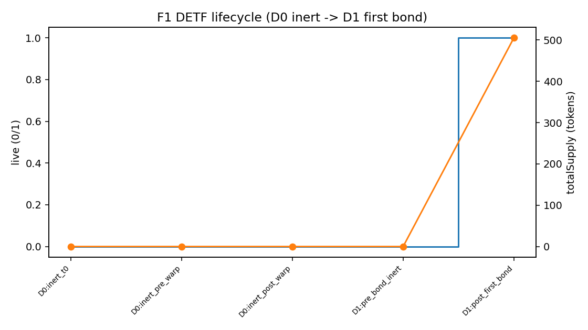
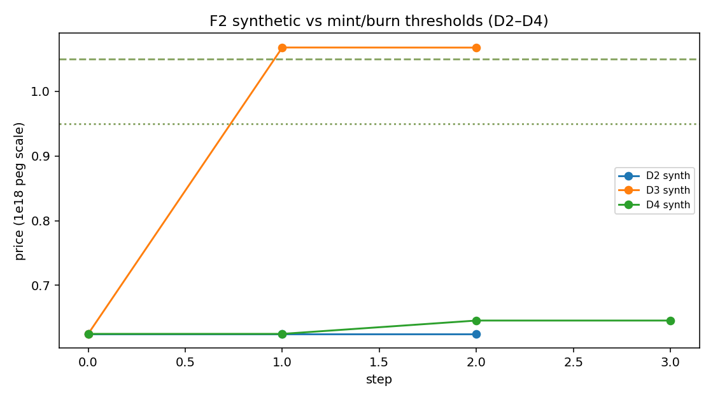
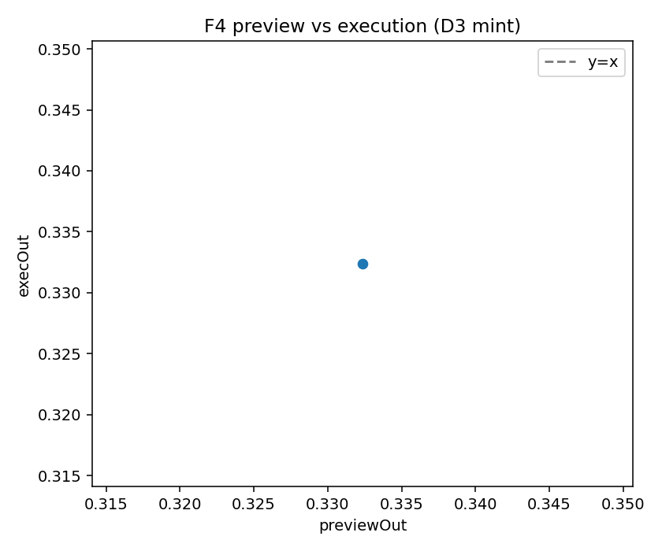
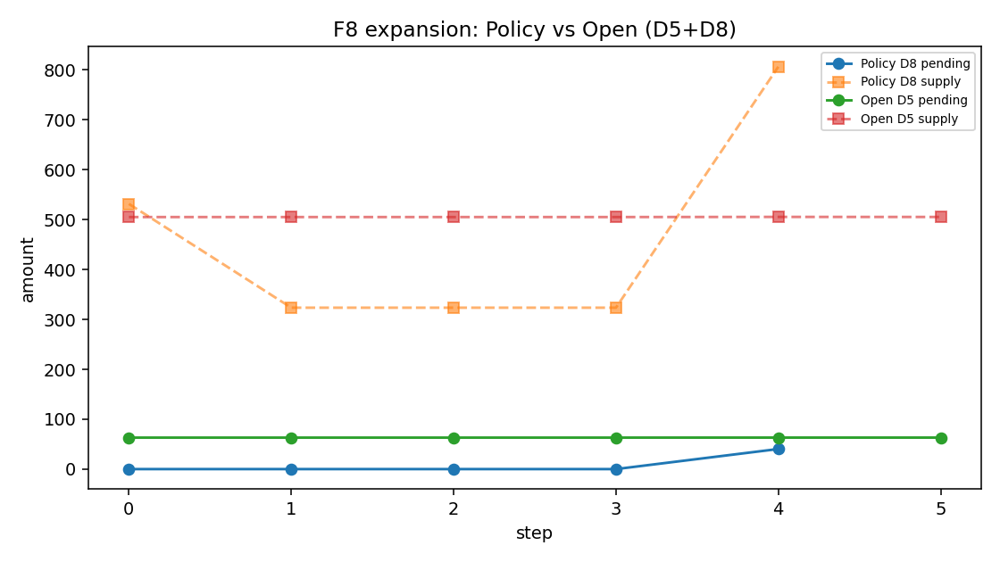
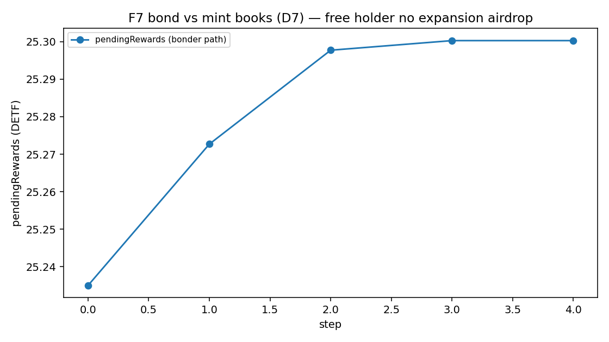
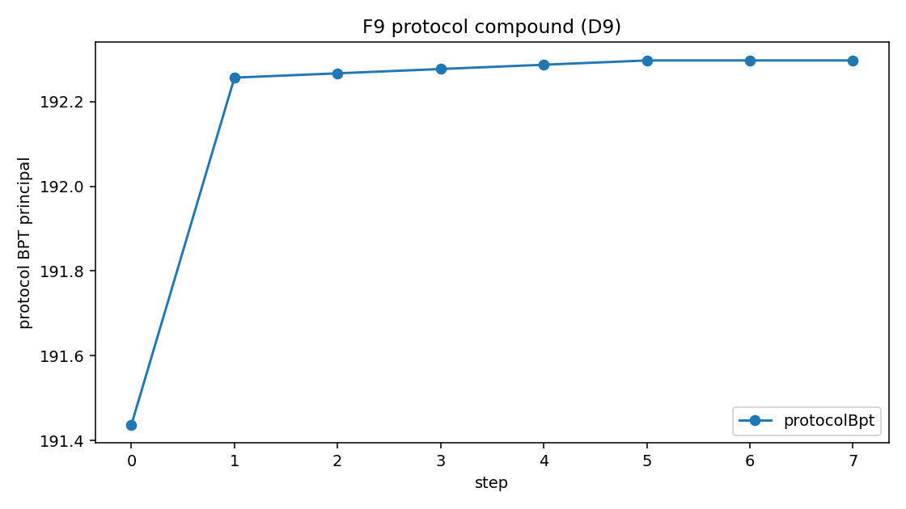
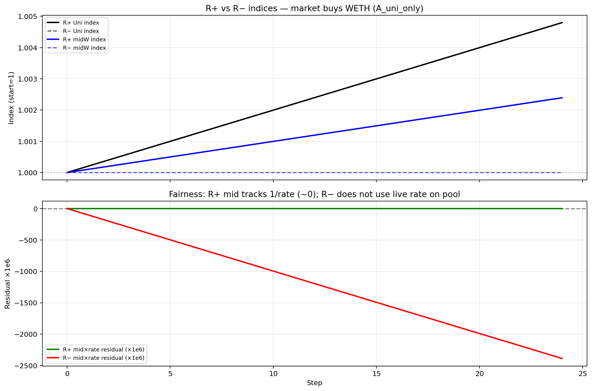
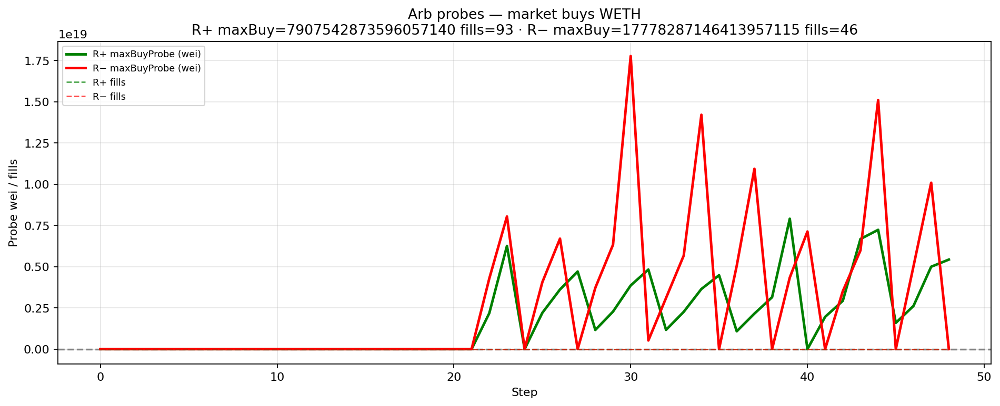
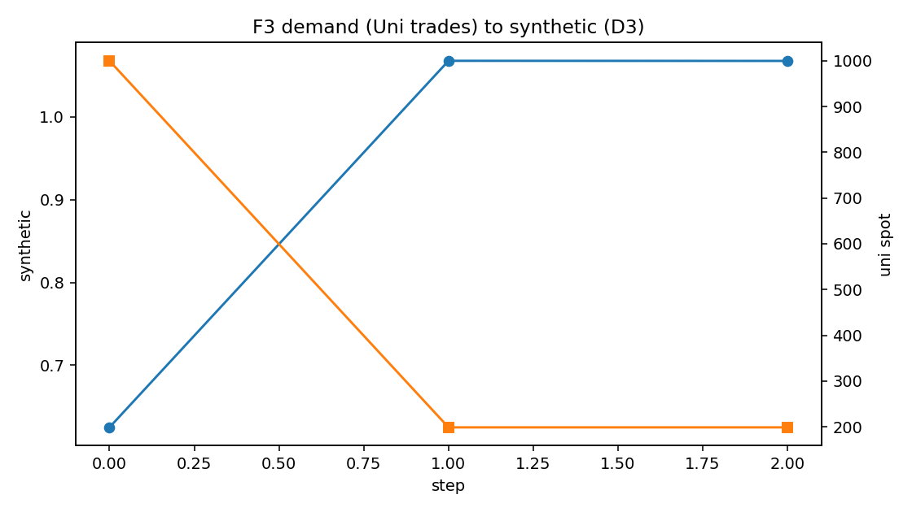

\newpage

# Abstract

A **DETF** (**D**ecentralized **ETF**) is an onchain product pattern: one ERC-20 share over a real multi-asset reserve, with mint, burn, and synthetic valuation derived from that same reserve—not from an admin spreadsheet.

Instances deploy **inert**, go **live** on first successful bond, and choose deploy-time **Policy** (synthetic price gates primary mint and burn) or **Open** (no price gates when live). Nested Standard Exchange (SE) legs can keep marks fair under underlying demand when rate providers are on. Residual lag under rates-off is real, but it is not free arbitrage once fees bind.

This paper formalizes synthetic price, Policy and Open gates, **natural supply expansion** (Policy and mint-rich only; bond ledger only), and **protocol compound** (protocol bond rewards sink into protocol-owned reserve BPT). Hermetic Single SE DETF scenarios and prior Uni V2 SE rate-provider matrices supply measured support.

**This is not a prospectus and not a yield forecast.** We do not claim mainnet APY, peg guarantees, registered-fund status, or expansion yields for free unlocked holders.

---

# 1. Introduction

ETF-shaped demand wants one transferable share over a basket. Onchain attempts often fail in predictable ways: discretionary managers, off-pool “NAV” that disagrees with the market, opaque rebalancers, or nested vault legs that freeze mid prices while underlyings move.

A DETF answers with:

- **Reserve-pool pricing** as the single engine for primary mint, burn, and synthetic valuation
- **Immutable, unowned instances** after deploy for normal operation
- An explicit **inert -> live** lifecycle via bonding
- Nested SE vaults plus Balancer rate providers for mark integrity on vault-share legs
- Bond-ledger rewards for capital seigniorage and (on Policy units) natural expansion
- Protocol compound that sinks protocol rewards into reserve BPT

Merits are stated as **properties**, not performance promises. Measured results come from production-first hermetic research—not mocks of the subject under test.

---

# 2. Background: nested Standard Exchange

Standard Exchange vaults wrap protocol liquidity (for example Uni V2 LP) behind deposit and redeem share interfaces. When a Balancer pool holds SE shares as legs, two deploy intents matter:

| Intent | Effect under Uni demand |
|--------|-------------------------|
| **Rates on (R+)** | Pool mids re-mark with SE redeem rates; residual approx  0 |
| **Rates off (R−)** | Mids can freeze while rates track Uni; residual grows |

**Residual** (research fairness metric):

```
residual approx  mid_index * rate_index − 1
```

Residual measures mark lag. It is **not** profit. A closer must clear Balancer swap fee, SE usage fee, impact, and dust. In the SE research package, the Balancer constant-product fee was **5%**—a hard economic filter.

Under baseline Uni-only demand: R+ residual approx  0; R− residual ~+/-0.24%. At extreme volume (size mul=25, 48 steps): R− residual ~10–12%, and Mode C fills appear once residual exceeds fee scale.

We cite industry work on LVR and adverse selection for *why* fees and inventory matter. We do not re-derive that theory here.

---

# 3. How a DETF works

## 3.1 Roles and reserve

The DETF diamond **is** the share ERC-20. A typical Single Standard Exchange composition:

- One **SE vault** and its **vault share**
- A Balancer V3 **weighted reserve** including the DETF self-leg and external legs
- A **bond NFT vault** for locked principal and reward accounting
- Optional **rebasing claim** on protocol-owned reserve BPT

Production DETF code talks to Standard Exchange interfaces, share ERC-20s, and Balancer—not venue brands baked into the product definition.

## 3.2 Synthetic price

```
p_syn = (rate-scaled claim of owned reserve BPT on pool balances)
        / (DETF totalSupply)
```

Bond-vault BPT is included when peer families do. The abstract Policy peg narrative is **1e18**. **All mint and burn threshold gates use synthetic price**—never spot alone.

## 3.3 Lifecycle: inert -> live

| State | User primary mint | Protocol depth |
|-------|-------------------|----------------|
| **Inert** | Blocked | Not live |
| **Live** (after first successful bond) | Subject to Policy or Open | Bond principal in protocol accounting |

First bond is **synthetically ungated**. Hermetic research confirms: inert deploy blocks mint; warp while inert does not enable mint; first bond takes the unit live and sets the reserve pool.

{ width=85% }

## 3.4 Policy vs Open

| | **Policy** (default) | **Open** |
|--|----------------------|----------|
| Mint when live | `p_syn > mintThreshold` | Always (route rules still apply) |
| Burn when live | `p_syn < burnThreshold` | Always |
| Defaults if args are zero | mint 1.05e18 / burn 0.95e18 | Same stored defaults; gates ignore them |
| Natural expansion | When mint-rich + time | **Never** |
| Zero args imply Open? | **No** | Mode must be explicit at deploy |

Hermetic Single SE results: after first bond, synthetic often sits burn-side of peg under default thresholds, so Policy mint is blocked until a rich path is established; Open mint and burn execute when live without synthetic gates.

{ width=85% }

## 3.5 Immutability

True DETF instances are **immutable and unowned** after deploy for normal operation: no instance owner, no discretionary diamond cut, no admin pause as the product model. Flawed config means abandon and redeploy—not silent rewrites of a live instance.

## 3.6 Routes and preview honesty

Preferred routes are closed-form **vault shares <-> DETF**. Rate-asset-as-mint-input is family-scoped only. Cross-share routes on the DETF surface are out of scope; use Balancer or the Standard Exchange router on the reserve pool.

On the measured capital mint path, **preview amount equaled execution amount exactly** (difference zero).

{ width=75% }

---

# 4. Rewards: three paths, three labels

Keep capital seigniorage, natural expansion, and protocol compound separate.

## 4.1 Capital seigniorage

External capital (SE shares) mints DETF when gates allow. Usage fees and inventory splits feed the **bond reward ledger** as the family defines. This is **not** expansion.

## 4.2 Natural supply expansion

When **Policy**, **live**, and **`p_syn > mintThreshold`**, free DETF may mint over time into the bond reward vault (premium-closure formula; deploy-time rate and catch-up caps). Distribution follows **bond effective shares**. Free unlocked DETF holders receive **none**. **Open never expands.** Inert and non-rich units do not expand.

Hermetic results: Open supply and pending rewards are unchanged over long warps; Policy expands when rich after time and a product touch; free-only holders do not receive expansion airdrops.

{ width=85% }

{ width=85% }

## 4.3 Protocol compound

Protocol-owned NFT free DETF rewards **auto-sink** into more **protocol-owned reserve BPT** via a single-sided DETF join (best-effort; also callable via public `compoundProtocolRewards`). Users still **claim free DETF** on their own bonds. Claim redemption **can** improve when protocol BPT rises—this is not a coupon.

Hermetic D9 shows protocol NFT BPT principal rising after compound.

{ width=85% }

---

# 5. Merits as properties

| Property | Evidence |
|----------|----------|
| ETF-shaped basket exposure without a discretionary PM | Design |
| Mint, burn, and synthetic share one pricing engine | Design + measured DETF |
| Clear inert/live; bonding builds protocol-owned depth | Measured DETF |
| Explicit monetary policy (Policy vs Open) at deploy | Product law + measured |
| No admin rewrite of a live instance as product model | Product law |
| Nested SE legs with rates on keep residual approx  0 under Uni demand | Measured SE |
| Lag invites reprice only after the fee stack clears | Measured SE |
| Liquid mint vs bond reward books | Measured DETF |
| Natural expansion when rich (Policy only) | Measured DETF |
| Protocol compound deepens protocol BPT | Measured DETF |
| Keeper-free accrual and compound | Product law + code |
| Composable package types for different baskets | Design taxonomy |
| Platform: many DETFs; optional protocol fee path | Product hierarchy |

---

# 6. Nested mark integrity (measured SE)

**Headline.** With rate providers on, Uni demand re-marks Balancer mids so midxrate residual approx  0. With rates off, residual scales with Uni stress. Residual is not free arb: under a 5% research pool fee, modest residual never filled; extreme residual did.

| Tier | R+ residual | R− residual | Mode C R− fills |
|------|-------------|-------------|-----------------|
| Baseline | approx  0 | ~+/-0.24% | 0 |
| mul10 | approx  0 | ~+/-2.4% | 0 (fee-drowned) |
| mul25 x 48 steps | approx  0 | ~+/-10–12% | Fills from ~step 22 |

{ width=90% }

{ width=90% }

**Transferability.** Hermetic only. The research Balancer fee is not every production fee tier. Cite mechanism, not universal fill rates.

---

# 7. DETF scenarios (measured Single SE + Uni V2)

**Harness.** Production-first CREATE3 and registry DFPkg path; Uni V2 WETH/USDC SE; Foundry default profile. One forge script per scenario D0–D9.

| ID | Result | One-line |
|----|--------|----------|
| D0 | PASS | Inert Policy; defaults 1.05/0.95; mint blocked; warp inert |
| D1 | PASS | First bond -> live |
| D2 | PASS | Post-bond burn-side synth; mint reverts; no expansion on warp |
| D3 | PASS | Mint-allowed after inventory path + Uni trades; preview = exec exact |
| D4 | PASS | Burn-allowed; burn executes |
| D5 | PASS | Open mint/burn live; no natural expansion over warp |
| D6 | PASS | Serial capital mints increase supply (not expansion) |
| D7 | PASS | Bonder reward path ≠ free-holder airdrop |
| D8 | PASS | Policy expansion when rich; Open twin none |
| D9 | PASS | Protocol compound raises protocol NFT BPT principal |

{ width=85% }

**Limitation (RQ5).** After first bond, hermetic synthetic often sits ~0.625 (far below mint threshold). **Uni trades alone** did not clear mint threshold in this fixture. The mint-allowed path used **production** free-DETF primary burns plus Uni trades (no Open mode, no deal-seed). Document as a research limitation of the post-bond book—not a product bug, and not a license to storage-hack synthetic.

---

# 8. Composition types

Four **live** families share the DETF pattern; only the reserve shape changes:

| Type | Choose when |
|------|-------------|
| Single Standard Exchange | Exactly one SE vault + DETF weighted reserve |
| Multi-vault weighted | Multiple SE legs that must keep distinct valuations |
| Multi-vault stable | Like-kind rate targets |
| Mixed-buffer multi-vault stable | Shared buffer rate asset; burn buffer only |

v1 empirics cover **Single SE only**. Other families are taxonomy and product law. Removed packages are out of research universe.

---

# 9. Product hierarchy

| Offer | Meaning |
|-------|---------|
| **Premier** | Create and deploy **your own DETFs** across package families |
| **Protocol DETF** | Same design class as a path to **share protocol fees** (amounts not guaranteed) |

Neither is a registered securities fund. Fee sizes are not promises.

---

# 10. Limitations and risks

1. **Hermetic only** — not mainnet TVL, APY, or reprice volume guarantees.
2. **Not a registered securities ETF** — no legal ownership of offchain underlyings.
3. **No peg, expansion APY, or claim coupon** — Policy bands and expansion are mechanisms, not guarantees.
4. **Open** removes price gates only — not fees, not returns, not expansion.
5. **IL and LVR** on underlying legs remain.
6. **Fee transferability** — SE research 5% fee is not every production pool.
7. **Post-bond synthetic** in hermetic Single SE may require inventory paths (not Uni alone) to re-enter mint-allowed.
8. **Protocol compound** single-sided join accepts self-leg weight skew in v1.
9. **Immutable instances** imply abandonment risk if misconfigured—not silent admin rescue.

---

# 11. Conclusion

A DETF is a reproducible onchain share over a real reserve, with one pricing engine, explicit Policy or Open rules, bonding into protocol-owned depth, bond-ledger rewards, Policy-only natural expansion when rich, and keeper-free protocol compounding into reserve BPT. Nested SE rate providers keep marks honest under demand when wired on.

Hermetic research supports the lifecycle, gates, preview honesty, expansion negatives on Open, and protocol BPT growth on compound—**without inventing yield**.

---

# Appendix A. Methodology

| Item | Value |
|------|--------|
| Profile | `FOUNDRY_PROFILE=default` |
| DETF runner | `./research/run_detf_single_se.sh` |
| DETF artifacts | `research/out/detf/singleSe/` |
| SE compare | `./research/run_rate_provider_compare.sh` |
| SE artifacts | `research/out/uniswapV2Se/rateProviderCompare/` |
| Telemetry | `series.jsonl`, stamped `meta.json`, `NOTES.md` per run |
| Production-first | CREATE3 facets; vault/DETF packages via manager registry; no mock SUT |
| Synthetic drive | Real Uni V2 trades (+ documented production inventory paths); no primary storage hacks |

Companion materials: scenario FINDINGS, formal definitions, and figure manifest under `research/papers/detf-litepaper/` and `research/scenarios/detf/singleSe/`.

---

# Appendix B. Claims map

| ID | Claim | Status |
|----|-------|--------|
| C1 | One share over reserve | Design |
| C2 | Pricing engine = reserve pool | Design + measured |
| C3 | Inert -> live via first bond | Measured D0–D1 |
| C4 | Policy / Open gates | Measured D2–D5 |
| C5 | Immutability after deploy | Product law |
| C6 | Preview honesty | Measured D3 (exact) |
| C7 | R+ residual approx  0 | Measured SE |
| C8 | Fee as arb threshold | Measured SE |
| C9 | Bond vs mint books | Measured D7 |
| C10 | Four live composition types | Taxonomy |
| C11 | Product hierarchy | Design |
| C12 | Natural expansion Policy-only | Measured D5, D8 |
| C13 | Protocol compound -> BPT | Measured D9 |

---

*IndexedEx Research · July 2026 · Hermetic findings; not financial advice.*
